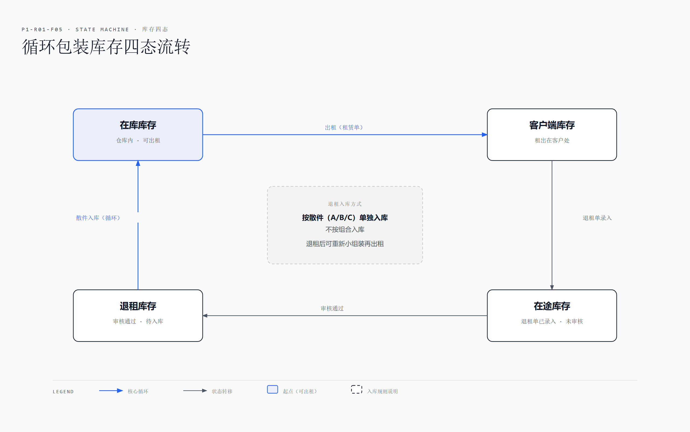
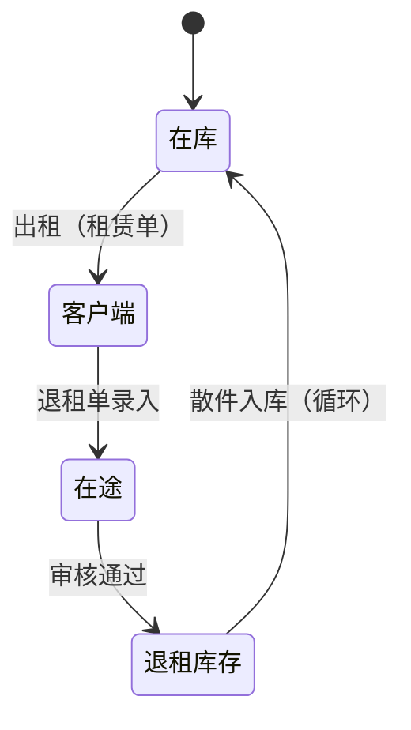
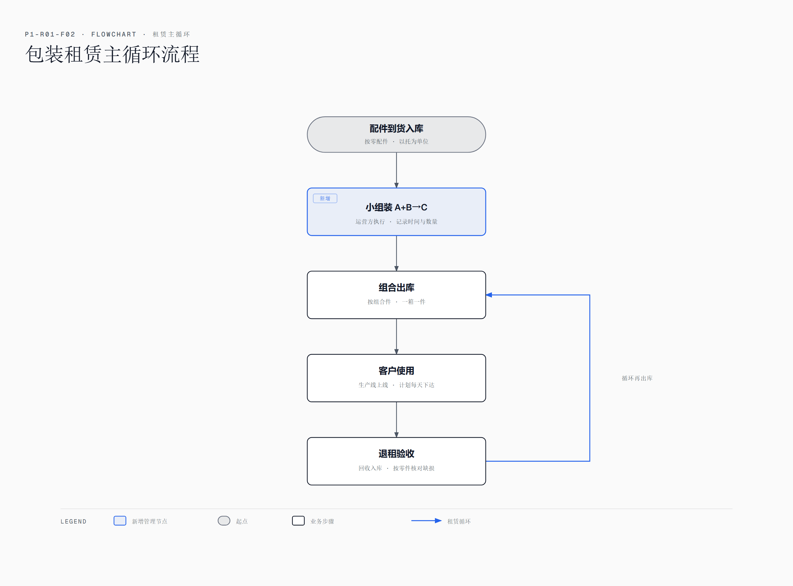
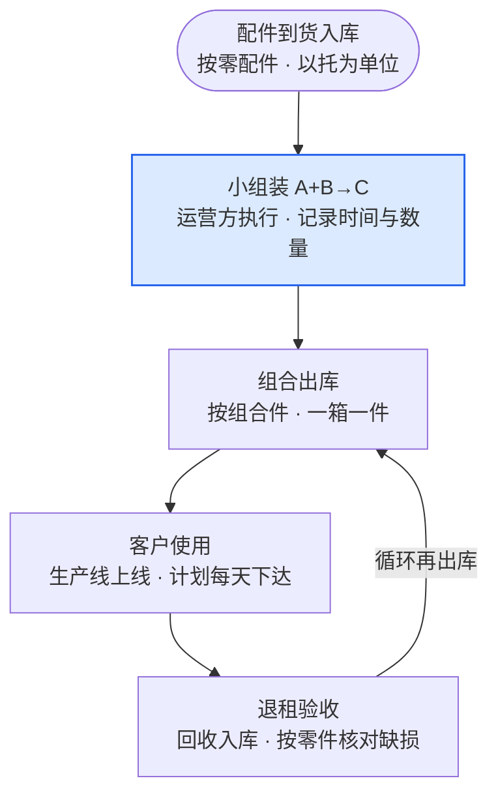
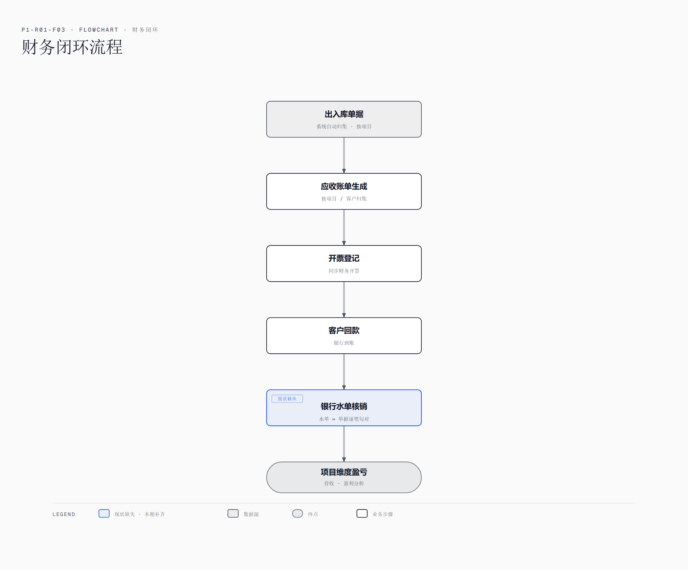
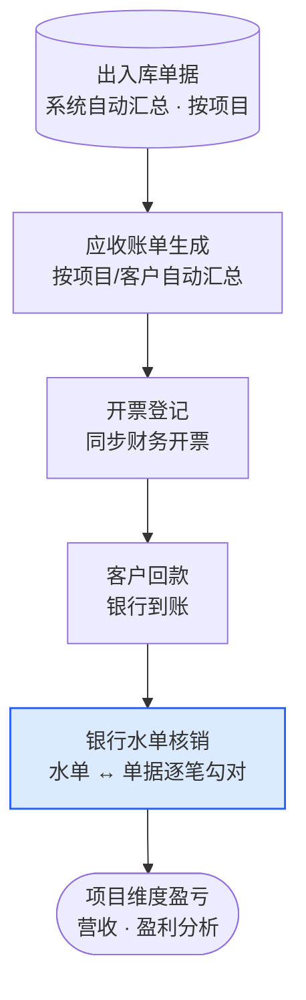
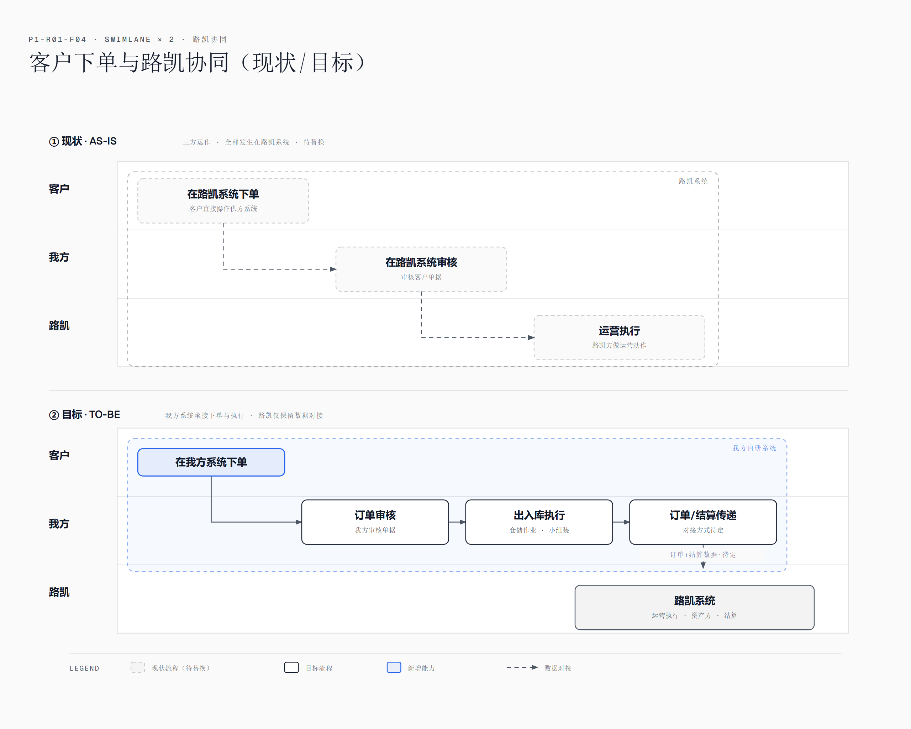
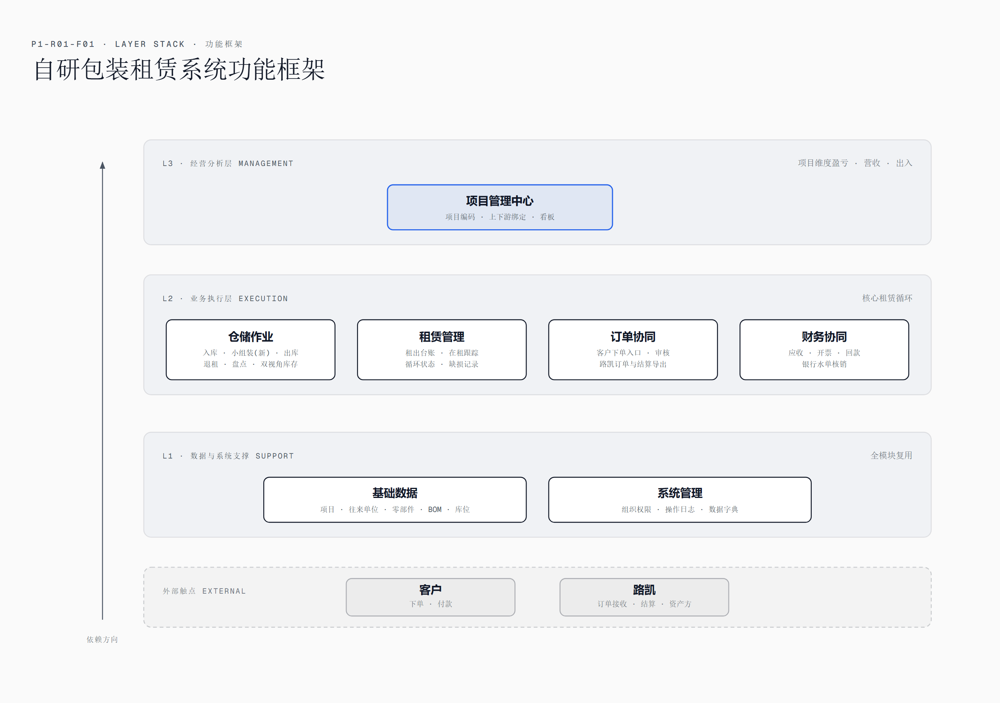
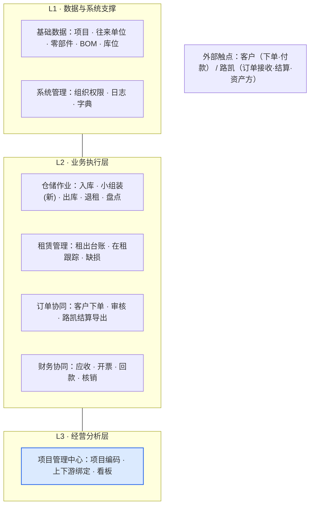

# P1-R01 需求梳理与功能框架

> **项目**：汽车物流包装租赁软件开发
> **版本**：V0.6（术语按行业标准定版：BOM/组装/客商管理/器具档案/在租台账/订单管理等 12 项更名；按第 2 次沟通结论：两条业务主线、新增采购/租赁单/审核状态流等 REQ-13~20）
> **日期**：2026-09-02
> **信息来源**：2026-08-31 第 1 次对接 + 2026-09-02 第 2 次沟通（原型演示+业务纠偏，纪要+转写+会后补充，见附录 10.2）
> **牵头**：陈金、道远共同推进

> **名称勘误**：会议转写中的语音误写（陆凯/极客云/集合云）已于 2026-08-31 在原始材料中就地修正为 **路凯**（供应商系统）、**吉客云**（自购 SaaS 系统）。第 2 次沟通补充材料出现"**瑞迅凯**"（袁丽晶会后补充，疑为我方客户公司名，待确认）。

---

## 一、项目背景与目标

### 1.1 背景

调研对象（客户）为一家汽车物流公司。2026-09-02 第 2 次沟通确认：客户业务为**两条独立主线**（此前理解混在一起，本次重大纠偏）：

| 主线 | 性质 | 内容 | 单据 |
|---|---|---|---|
| **① 零部件买卖** | 纯贸易 | 进 A 出 A（买什么卖什么），**不含组装** | 采购订单 → 采购入库 → 销售订单 → 销售出库 |
| **② 循环包装租赁** | 资产运营 | 租出围板箱/托盘及其附件（盖子、内衬、标签等辅料，**不含客户零件**）；A+B→C 组合**仅发生在租赁**（组合来源四种：整买/整租/买+租/零散买）；退租按散件入库、循环使用 | 采购入库单 → 组合 → 租赁单（客户出租单）→ 退租单 |

两条主线在系统里**分开管理**（客户做大后必然拆开，王琳总原话"包装是包装，零件是零件"），但共用项目管理、上下游关系、基础数据与财务模块。

**库存四态**（租赁业务，袁丽晶会后补充）：在库库存、在途库存（退租单已录入未审核）、客户端库存（租出在客户处）、退租库存（待入库）。

### 1.2 项目目标

1. **替换吉客云与路凯两套系统**，将包装租赁业务收归自研系统统一管理（客户原话："可以取代就取代掉，这套系统还是比较简单的"）。
2. 以此项目为切入点建立信任，后续承接对方更大的业务（运输 TMS 替换、生产线排程、售后备件物流等）。

### 1.3 范围与优先级

- **本期（P1）**：两条主线统一系统——项目管理 + 基础资料 + 采购管理（订单+入库）+ 仓储作业（小组装仅租赁域）+ 循环包装租赁（租赁单/退租/四态跟踪）+ 订单协同（销售+采购拆分，项目经理代下单）+ 财务（对账结算/开票/收款核销同步）。
- **暂缓**：非自有资产租入转租（袁丽晶"第三种情况可以先等等"）；运输 TMS 替换；仓库到工厂配送管理。
- **试点**：安波福、佛吉亚两个项目先进系统跑通。

### 1.4 术语表

| 术语 | 含义 |
|---|---|
| 围板箱 / 托盘 / 料箱 | 循环租赁的包装器具（包材），资产属客户自有 |
| 路凯 | 供应商（运营方）及其系统——管围板箱租赁，客户目前也在该系统直接下单 |
| 吉客云 | 客户全资采购的 SaaS，目前仅用其仓储模块（建品、出入库、开单发货） |
| BOM | 父项-子项配比关系（原"子母件"，2026-09-03 按行业标准更名为 BOM）；**仅用于租赁业务** |
| 组装 | 将多个包装组件（A+B）组合成租赁单元（C）的动作（原"小组装"，2026-09-03 更名），**仅发生在租赁业务**，退租后拆回散件入库 |
| 租赁单 | 客户的出租单（袁丽晶命名：也叫租赁单），向客户租出包装的单据 |
| 退租 | 租赁循环的回流动作，按散件（A/B/C 单独包材）入库，不按组合入库（袁丽晶会后补充） |
| 库存四态 | 在库 / 在途（退租未审核）/ 客户端（租出）/ 退租库存 |
| 银行水单核销 | 客户付款后的银行回单与出库单据逐笔勾对销账 |
| 审核状态流 | 全模块通用：待提交→待审核→待发货→已完成（袁丽晶会后补充） |

### 1.5 干系人

| 人 | 角色 |
|---|---|
| 王琳总 | 我方（开发方）牵头人，需求主导、对外谈判 |
| 陈金 | 开发方，方案与工期评估共同牵头 |
| 道远 | 开发方，方案与工期评估共同牵头 |
| 刘小钢 | 客户方决策人（第 1 次会参会） |
| 袁丽晶 | 客户方包装业务对接人（第 2 次会主讲业务模式，会后整理总结发群） |
| 姚宇涛 | 客户方（第 2 次会参与，说明客户 PO 下达方式与流程闭环诉求） |

---

## 二、现状系统盘点

| 系统 | 性质 | 在用功能 | 缺陷 |
|---|---|---|---|
| 吉客云 | 自购 SaaS | 仓储模块：商品建品、出入库、开单发货（托盘/料箱） | 未关联财务；无项目维度盈亏；无银行水单核销 |
| 路凯 | 供应商（运营方）系统 | 围板箱出库、退租 | 无数据/财务环节；客户直接在系统中下单，形成"客户—我方—路凯"三方模式 |
| 运输 TMS | SaaS | 合同车辆管控、散货运输、外部叫车录入、应收应付账单、开票 | 本期不替换，仅作参考 |

**路凯三方运作模式（现状）**：客户在路凯系统下单 → 我方审核单据 → 路凯（运营方）执行运营。资产部分属于路凯，故替换后仍需向路凯传递订单与结算数据。

---

## 三、业务流程梳理

### 3.1 两条业务主线流程（第 2 次会纠偏后）

**主线一：零部件买卖（纯贸易，无组装）**

```
客户销售订单 → 采购订单（先销后采，正常逻辑）→ 采购入库 → 销售出库 → 结算
（也支持先采后销囤货模式，双向互通）
```

**主线二：循环包装租赁（组合仅在此线）**

```
向N个供应商采购包材 → 采购入库 → 组装（A+B→C，仅租赁域）→ 租赁单（出租给客户）
    → 客户使用 → 退租单 → 按散件（A/B/C）单独入库 → 循环再出租
```

> 组合来源四种：整买整套 / 整租整套 / 买+租混合 / 零散买。第一期统一纳入循环包装管理，不严格区分自有/租入权属。

（原图 F02 主循环流程图仍适用主线二，退租入库方式已修正为散件入库。）

### 3.2 库存四态流转图（F05）



<details>
<summary>Mermaid 源码（底层维护信息，P1-R01-F05）</summary>



</details>

### 3.2 原包装租赁主循环图



<details>
<summary>Mermaid 源码（底层维护信息，P1-R01-F02）</summary>



</details>

### 3.3 组装（本次重点改造点；第 2 次会限定：仅租赁业务）

- **现状**：出库时才按组合记出库、按零配件减库存，"组装"动作本身不进系统 → 无法实时掌握"已组装成品 vs 散件"的库存分布；运营方可能提前组装占用库存。
- **目标**：组装动作作为独立管理节点记入系统（谁、何时、组装了多少），库存同时支持"零件视角"与"组合视角"。
- 已与客户达成共识：此改造不增加一线工作量，但提升管理粒度，便于应对客户日计划的频繁变更（改组合需拆件，可据此主张人工费）。

### 3.4 财务闭环



<details>
<summary>Mermaid 源码（底层维护信息，P1-R01-F03）</summary>



</details>

### 3.5 客户下单与路凯协同（目标态；第 2 次会改为项目经理代下单）



<details>
<summary>Mermaid 源码（底层维护信息，P1-R01-F04）</summary>


</details>

---

## 四、需求清单

| 编号 | 需求 | 说明 | 优先级 |
|---|---|---|---|
| REQ-01 | 多项目统一管理 | 所有项目整合进一个系统，按项目建立编码，绑定上下游关系 | 高 |
| REQ-02 | 项目维度经营分析 | 按项目看出入库、营收、盈利情况 | 高 |
| REQ-03 | 循环包装管理（原包材租赁；模块名待调研定名） | 租赁单/退租单/库存四态（在库/在途/客户端/退租）跟踪；**第一期不区分自有/租入权属** | 高（修订） |
| REQ-04 | 零部件级库存 | 零部件买卖线库存管理；配件多项目共用 | 高 |
| REQ-05 | BOM 管理 | 一个租赁单元含多个包装组件，组件来源四种（整买/整租/买+租/零散买）；**仅用于租赁业务** | 高（修订） |
| REQ-06 | 组装管理节点 | 记录 A+B→C 的组装时间与数量；库存两种视角（散件/组合）；**仅租赁业务** | 高（修订） |
| REQ-07 | 订单管理（代下单） | 客户发 PO 给项目经理、项目经理代下单；客户端并入订单协同做统一订单列表 | 高（修订） |
| REQ-08 | 财务开票同步 | 出入库数据同步财务端生成应收、开票；与前端单据完全绑定 | 高 |
| REQ-09 | 银行水单核销 | 客户付款后单据与银行回单勾对核销 | 高 |
| REQ-10 | 路凯数据对接 | 向路凯传订单与结算数据（方式待确认：自动传输/导出文件） | 中 |
| REQ-11 | 退租缺损核对 | 退租**按散件（A/B/C）入库**（不按组合入库），逐件核对缺损 | 高（修订） |
| REQ-12 | 盘点 | 支持散件/组合两种方式盘点 | 中 |
| **REQ-13** | **采购订单** | 向供应商下采购订单（买零件或买包装），支持先销后采与先采后销 | 高（新增） |
| **REQ-14** | **采购入库** | 采购到货入库（资产入库），关联采购订单 | 高（新增） |
| **REQ-15** | **租赁单** | 客户的出租单（袁丽晶命名），向客户租出包装 | 高（新增） |
| **REQ-16** | **销售/采购订单拆分** | 明确分销售订单与采购订单；客户端只分"购买订单"和"租赁订单" | 高（新增） |
| **REQ-17** | **库存四态跟踪** | 在库/在途（退租未审核）/客户端（租出）/退租库存，分别统计 | 高（新增） |
| **REQ-18** | **按数量结算+平均租期** | 对公结算按数量计费（非按次数）；增加"平均租期"指标 | 高（新增） |
| **REQ-19** | **全模块审核状态流** | 所有单据统一状态：待提交→待审核→待发货→已完成 | 高（新增） |
| **REQ-20** | **库位编号+扫码留口** | 编号+手工记录+留痕；扫描枪暂不支持，设计预留接口 | 中（新增） |
| **REQ-21** | **应付账单与付款** | 采购入库/租入资产自动生成应付供应商/路凯账单；付款登记与核销（第一期简化版：应付登记+付款记录，完整核销流二期） | 高（新增） |

---

## 五、功能框架（草案）



### 5.1 模块功能点明细（供工时评估）

> 编码规则：FPn-序号，n = 模块号。每个功能点有唯一编号（FP 码），便于开发分工与结果核对。

**1 基础资料**（WBS 编号 B1）

| 编码 | 功能点 | 要点说明 | 需求 |
|---|---|---|---|
| FP1-01 | 项目档案 | 项目编码、名称、状态、起止日期 | REQ-01 |
| FP1-02 | 客商管理 | 客户/供应商/运营方三类客商档案，联系人、开票资料（原「往来单位档案」，UI 已更名） | REQ-01 |
| FP1-03 | 器具档案 | 围板箱/托盘/料箱（可循环物流器具），规格、单位、资产标记 | REQ-03 |
| FP1-04 | 零部件档案 | 零件号、名称、供应商来源、多项目共用标记 | REQ-04 |
| FP1-05 | BOM | 父项-子项配比（A+B→C），版本管理 | REQ-05 |
| FP1-06 | 库位档案 | 仓库/库区/库位三级；编号+手工+留痕，预留扫码接口 | REQ-04/20 |

**2 项目管理中心**（WBS 编号 B2）

| 编码 | 功能点 | 要点说明 | 需求 |
|---|---|---|---|
| FP2-01 | 项目编码规则 | 自动编码、规则可配置 | REQ-01 |
| FP2-02 | 上下游绑定 | 项目↔客户↔运营方↔供应商关系维护 | REQ-01 |
| FP2-03 | 项目看板 | 出入库流量、营收、盈利汇总 | REQ-02 |
| FP2-04 | 项目明细查看 | 从看板点开查看对应单据 | REQ-02 |

**3 仓储作业 ★核心**（WBS 编号 B3）

| 编码 | 功能点 | 要点说明 | 需求 |
|---|---|---|---|
| FP3-01 | 采购入库单（执行） | 仓储执行层：按零配件/包材、以托为单位入库 | REQ-04 |
| FP3-02 | 组装单 ★新增 | A+B→C，记录运营方/时间/数量；组装后散件库存自动转为成品库存 | REQ-06 |
| FP3-03 | 组合出库单 | 按组合件出库（一箱一件），关联项目与订单 | REQ-03 |
| FP3-04 | 退租入库验收单 | 回收入库，按零件核对缺损并记明细 | REQ-11 |
| FP3-05 | 盘点单 | 按零件或组合两种方式盘点，盘盈亏自动调整 | REQ-12 |
| FP3-06 | 库存查询 | 零件/组合双视角实时库存，按项目/库位过滤 | REQ-06 |

**4 租赁管理**（WBS 编号 B4）

| 编码 | 功能点 | 要点说明 | 需求 |
|---|---|---|---|
| FP4-01 | 租出台账 | 按项目/客户/包材的在租记录 | REQ-03 |
| FP4-02 | 在租台账（四态统计） | 在库/在途/客户端/退租四态分别统计；在租数量、平均租期、循环次数 | REQ-03/17 |
| FP4-03 | 循环状态与计费 | 状态流转；按数量结算+平均租期指标 | REQ-03/18 |
| FP4-04 | 缺损与赔偿记录 | 退租缺损自动生成赔偿应收 | REQ-11 |
| FP4-05 | 租赁单（出租） | 向客户租出包装，生成租赁单（替代原"客户下单"），关联项目与客户 | REQ-15 |

**5 订单管理**（WBS 编号 B5）

| 编码 | 功能点 | 要点说明 | 需求 |
|---|---|---|---|
| FP5-01 | 订单管理（代下单） | 项目经理代客户下单（客户发 PO），统一订单列表，不再分客户端 | REQ-07 |
| FP5-02 | 订单审核 | 我方审核客户订单 | REQ-07 |
| FP5-03 | 订单同步 | 订单自动同步给路凯执行（原「路凯下发」，UI 已更名；对接方式待确认） | REQ-10 |
| FP5-04 | 结算数据导出 | 对路凯结算数据生成与传递 | REQ-10 |

**6 财务协同**（WBS 编号 B6）

| 编码 | 功能点 | 要点说明 | 需求 |
|---|---|---|---|
| FP6-01 | 应收账单生成 | 出入库数据按项目/客户自动汇总生成应收 | REQ-08 |
| FP6-02 | 开票登记与发票上传 | 发票信息登记、发票文件上传、与应收关联 | REQ-08 |
| FP6-03 | 回款登记 | 银行到账录入 | REQ-09 |
| FP6-04 | 银行水单核销 ★补缺 | 水单↔单据逐笔勾对，支持部分核销 | REQ-09 |
| FP6-05 | 项目盈亏报表 | 项目维度营收成本汇总 | REQ-02 |
| FP6-06 | 应付账单（供应商/路凯）★新增 | 采购入库/租入自动生成应付；付款登记与核销（第一期简化版） | REQ-21 |
| FP6-07 | 付款登记 ★新增 | 银行付款录入，关联应付账单 | REQ-21 |

**7 系统管理**（WBS 编号 B7）

| 编码 | 功能点 | 要点说明 | 需求 |
|---|---|---|---|
| FP7-01 | 组织与权限 | 用户/角色/数据权限（我方/客户区分） | — |
| FP7-02 | 操作日志 | 关键操作全程记录 | — |
| FP7-03 | 数据字典 | 常用选项与参数设置 | — |

**8 采购管理 ★第2次会新增**（WBS 编号 B8）

| 编码 | 功能点 | 要点说明 | 需求 |
|---|---|---|---|
| FP8-01 | 采购订单 | 向供应商下采购订单（买零件或买包装），支持先销后采与先采后销 | REQ-13 |
| FP8-02 | 采购订单审核 | 采购订单审核状态流（待提交/待审核/已完成） | REQ-13/19 |
| FP8-03 | 采购入库（发起） | 采购管理层：到货登记发起入库，关联采购订单（执行由 FP3-01 承接） | REQ-14 |
| FP8-04 | 销售订单（买卖线） | 客户购买订单（零部件买卖线），关联项目与客户；审核后走 FP3 出库 | REQ-16 |


### 5.2 用户故事与故事点（供理解业务价值）

> 故事点为相对工作量评级（1/2/3/5/8，数字越大越复杂），只用来比较大小，**不换算人日**；绝对工期以 P1-R03-工期评估表（Excel，待填）为准。

| 编号 | 用户故事 | 模块 | 需求 | 点 |
|---|---|---|---|---|
| US-01 | 作为**项目负责人**，我想按项目编码统一管理所有项目并绑定上下游，以便随时掌握每个项目独立的出入库与盈亏 | 项目管理 | REQ-01/02 | 3 |
| US-02 | 作为**仓管**，我想按零配件、以托为单位录入采购入库，以便库存精确到零件级 | 仓储 | REQ-04 | 2 |
| US-03 | 作为**仓管负责人**，我想为运营方的每次组装登记组装单，以便实时区分已组装成品与散件、杜绝提前无效组装 | 仓储 | REQ-06 | 5 |
| US-04 | 作为**仓管**，我想开出组合出库单并关联客户订单，以便客户按"一箱一件"收货 | 仓储 | REQ-03 | 3 |
| US-05 | 作为**仓管**，我想在退租回收时按零件核对缺损，以便主张赔偿并追溯资产完整度 | 仓储/租赁 | REQ-11 | 3 |
| US-06 | 作为**仓管**，我想用零件/组合双视角查询与盘点库存，以便不同场景对账 | 仓储 | REQ-12 | 3 |
| US-07 | 作为**商务**，我想维护子母件 BOM（一型号多配件、供应商不同），以便采购与组装有据可依 | 基础数据 | REQ-05 | 3 |
| US-08 | 作为**项目经理**，我想代替客户下单（客户发 PO 给我）并在此系统录入，以便不再登录路凯系统 | 订单协同 | REQ-07 | 5 |
| US-09 | 作为**商务**，我想审核订单后自动向路凯下发执行订单，以便摆脱三方混在一起运作的现状 | 订单协同 | REQ-10 | 5 |
| US-10 | 作为**财务**，我想让出入库数据自动生成应收并登记开票，以便告别手工对账 | 财务 | REQ-08 | 3 |
| US-11 | 作为**财务**，我想用银行水单与单据逐笔核销（支持部分核销），以便项目回款一目了然 | 财务 | REQ-09 | 5 |
| US-12 | 作为**总经理**，我想看各项目营收、盈利与出入趋势看板，以便经营决策 | 项目管理 | REQ-02 | 3 |
| US-13 | 作为**资产管理员**，我想跟踪每个器具的在租状态与循环次数，以便掌握资产利用率与缺损率 | 租赁 | REQ-03 | 3 |
| US-15 | 作为**采购员**，我想按销售订单生成采购订单并跟踪到货入库，以便买卖线闭环 | 采购 | REQ-13/14 | 5 |
| US-16 | 作为**资产管理员**，我想看到包装在库/在途/客户端/退租四种数量，以便随时掌握资产分布 | 租赁 | REQ-17 | 3 |
| US-17 | 作为**项目经理**，我想所有单据都有待提交→待审核→已完成的状态流，以便追踪每笔业务进度 | 全模块 | REQ-19 | 3 |
| US-18 | 作为**财务**，我想看到对供应商和路凯的应付账单并登记付款，以便项目损益算准（不漏成本侧） | 财务 | REQ-21 | 3 |
| — | **本期范围小计（17 条）** | | | **60** |
| US-14 | 作为**商务**，我想按可配置规则自动计算租金（按天/次/张），以便应收准确——**暂不计入本期范围**，规则待确认 #1，对应工期表中租赁管理模块的备注 | 租赁 | 待确认 | 5 |

> 本期范围合计 60 点（17 条）。故事点仅表相对规模；人日换算与绝对工期在第九章评估时统一进行。

<details>
<summary>Mermaid 源码（底层维护信息，P1-R01-F01）</summary>



</details>

---

## 六、关键设计决策（会上已达成共识）

| # | 决策 | 依据 |
|---|---|---|
| 1 | 组装作为独立管理节点记入系统，不能只在出库时扣零件库存 | 王琳总提出，刘小钢确认"正常的话应该是这样做"；规范运营方管理、杜绝提前无效组装 |
| 2 | 客户下单收归我方系统，剥离客户与路凯的直接交互 | 现状是"没系统才造成客户与路凯打交道"；替换后我方系统统一承接 |
| 3 | 路凯保留为数据对接对象（下单+结算），不追求其弃用自己的系统 | 部分资产属路凯，对方不一定愿意换用我方系统；未来转自投资产可彻底解决 |
| 4 | 吉客云直接替换 | 全资采购、阻力小 |
| 5 | 按项目组合的适配灵活处理 | 客户提示"不同项目模式不同，小组装管控方式可按项目参考适用"，组合需求随月份波动，需防库存被占用 |
| 6 | 业务分为两条独立主线：零部件买卖（无组装）+ 循环包装租赁（组合仅在此线） | 第 2 次会王琳总与袁丽晶逐条确认；系统必须分开管理（"包装是包装，零件是零件"） |
| 7 | 第一期不区分自有/租入权属，统一纳入循环包装管理 | 王琳总建议、道远拍板按纪要口径；客户内部另建台账区分权属 |
| 8 | 客户端并入订单协同，统一订单列表 | 客户实际为 PO→项目经理代下单，不愿自行下单（袁丽晶 16:42） |
| 9 | 退租按散件（A/B/C）入库，不按组合入库 | 袁丽晶会后补充明确 |
| 10 | 库位编号+手工记录，不上扫描枪，设计预留扫码接口 | 王琳总：成本做不到；道远拍板留口 |
| 11 | 全模块统一审核状态流（待提交→待审核→待发货→已完成） | 袁丽晶会后补充 |

---

## 七、明确不做（本期边界）

- 仓库到工厂的配送运输管理（客户明确"暂时不涉及"）
- 出库车辆车牌号管理（"问题不大，不用"）
- 运输 TMS 替换（二期，待包装模块做好后再谈）

---

## 八、待确认问题与所需支撑材料

### 已答（第 2 次沟通，2026-09-02）

| # | 原问题 | 答案 |
|---|---|---|
| 1 | 计费规则 | **按数量结算**（非按次数）；需增加"平均租期"指标；具体单价/押金/缺损标准仍属商务口径待给 |
| 2 | 权属是否区分 | **第一期不区分**（按纪要口径），统一纳入循环包装管理；客户内部另建台账区分权属 |
| 3 | 客户下单方式 | 客户发 PO 给项目经理、项目经理**代下单**；客户端并入订单协同 |
| 4 | 库位管理 | **不上扫描枪**（成本做不到）；编号+手工记录+留痕；设计预留扫码接口 |
| 5 | 退租入库方式 | **按散件（A/B/C）入库**，不按组合入库 |
| 6 | 库存状态模型 | 四态：在库/在途（退租未审核）/客户端/退租 |
| 7 | 试点范围 | 安波福 + 佛吉亚两个项目先上 |
| 8 | 审核状态流 | 全模块统一：待提交→待审核→待发货→已完成 |

### 仍待确认

| # | 待确认问题 | 所需材料 | 对接人 | 影响 |
|---|---|---|---|---|
| 1 | 计费单价/押金/缺损赔偿标准 | 租赁合同/报价单 | 刘小钢/袁丽晶 | REQ-18 细化 |
| 2 | 吉客云、路凯页面结构与字段 | 演示账号或页面截图+字段清单 | 袁丽晶 | 数据结构设计 |
| 3 | 基础资料：包材/零部件清单、BOM 配比 | 基础资料清单（Excel） | 袁丽晶 | REQ-04/05 |
| 4 | 单据样例：出库单/退租单/结算单/发票/银行回单 | 各 1-2 份样例 | 袁丽晶/财务 | 财务闭环 |
| 5 | 路凯对接方式：能否自动传输？格式？ | 对接说明/对账单格式 | 路凯方（待引荐） | REQ-10 |
| 6 | 项目清单与上下游关系 | 项目清单 | 刘小钢/袁丽晶 | 多项目架构 |
| 7 | 客户公司主体名称、开票主体、税率（含"瑞迅凯"名称核实） | 营业执照/开票信息 | 刘小钢 | 财务模块 |
| 8 | 路凯运营方主体（会议提及"万象"，待核实） | 合同 | 刘小钢 | 对接协议 |
| 9 | 开发人力（P1-R03 已重制为待评估版 2026-09-05，道远与开发逐行填写） | 内部确认 | 王琳总/陈金/道远 | **v2.8 工期评估** |
| 10 | 期望上线时间、预算范围 | 内部确认 | 王琳总 | 工期与方案 |
| 11 | **租赁管理行业调研**（金蝶/用友等 SaaS 的租赁业务模式） | 调研产出 P1-R07 | 开发方 | 菜单命名（包装管理 vs 租赁管理）、库存四态字段设计 |
| 12 | 吉客云/路凯老数据迁移方案 | 数据导出格式与量 | 道远/袁丽晶 | 上线切换 |

---

## 九、工期评估与版本规划

### 9.1 工期评估（Excel）

> 已摘出为独立 Excel：**P1-R03-工期评估表-20260906.xlsx**（**唯一维护处**，本档不重复维护工期数字）。
>
> 填表口径：待第八节 #9（人力投入）、#10（时间与预算）确认后，由陈金、道远组织开发在 Excel 中逐行认领评估；人日含概要设计 + 编码 + 自测；合计、含缓冲合计、日历工期由公式自动计算；前置未确认前不对外提供任何工期数字。评估表每行已标「版本」列（见 9.2），汇总表按版本出小计。

### 9.2 版本规划（方案 B·买卖先行，2026-09-05 道远拍板；命名 2026-09-07 澄清）

> **「方案」命名澄清（2026-09-07 道远）**：项目里有两层「方案」，此前易混淆——
> ① **工期口径**（开发在 sheet 内给的）：方案 1 = 不用 vibe coding（212 人日）/ 方案 2.0 = 3 全栈 + Claude Code vibe coding（149 人日，现行工期表名源）；
> ② **版本划分**（本项目拍板的）：现改用字母命名——**方案 A** = 试点先行（未采用）、**方案 B** = 买卖先行（已采用，即本章）、方案 C = 两版大步（未采用）。
> 工期表汇总「无AI对照（方案1·212人日）」列即 ① 的方案 1，与版本划分无关。

> 三版划分，菜单级明细维护在 P1-R03「版本」列（每任务行标 V1.0/V1.1/V2.0/前置/各版），此处记版本口径与上线标志。

| 版本 | 定位 | 页数 | 范围 | 上线标志 |
|---|---|---|---|---|
| **V1.0 买卖版** | 标准进销存，零新逻辑、出活最快 | 21 页 | 买卖全链（采购订单→采购入库→销售订单→销售出库）+ 库存（查询/盘点/调拨/其他出入库）+ 项目管理 + 基础数据（除 BOM）+ 应收账单/收款登记 + 用户权限 | 「采购→入库→销售→出库→应收→收款」全链跑通 |
| **V1.1 租赁版** | 租赁循环上线，新逻辑集中此版 | +16 → 37 页 | 组装★/拆卸/租赁出库/退租入库 + 包装管理整组（租赁单/退租申请/四态台账/丢损赔偿）+ BOM + 应付简化版 + 我的待办 | 「采购入库→组装→租赁单→退租→散件回库」租赁循环闭环 |
| **V2.0 深化版** | 生态对接与财务收口 | +8 → 45 页 | 租入三单（L3/L4：租入单/租入入库/租入归还）+ 路凯订单同步/结算导出 + 开票登记/收款核销★/项目损益 + 操作日志/数据字典 | 路凯协同线上化、财务全闭环 |

配套口径：
- **前置**（A1 需求调研 + A2 原型修订 + B0 技术底座）与 **各版**（测试/数据迁移/上线部署，每版上线前各跑一轮）不属单版，按版重复投入
- **未定依赖全部收在 V2.0**：计费规则（#1）、路凯对接（#6）、水单样例（#5）、开票主体（#8）
- **菜单可见性**：未上线菜单项直接隐藏（不留置灰死链），路线图放发布说明
- **可调点**：库存盘点可上提 V1.0；租入三单可从 V2.0 上提 V1.1（视第 3 次沟通客户态度）
- 已知取舍：试点项目（安波福/佛吉亚）为租赁业务，V1.0 上线时试点仍需旧系统支撑，租赁循环 V1.1 才闭环

---

## 十、附录

### 10.1 编码规则

本项目的编码规则沿用工作台统一约定（挂靠式），阶段语义声明如下：

- **P1 = 需求调研与方案分析**（R01=本文档，后续调研产出挂靠或续号）
- **P3 = 原型（已启用，2026-08-31）**：P3-R01 = 包装租赁管理后台全量 HTML 原型；其支撑材料挂靠为 `P3-R01-A01-*`，与页面同入 `P3-R01-包装租赁管理后台原型/` 文件夹（挂靠码 + 中文用途后缀）
- 预留：P2 = 功能调研/PRD；P4 = 技术方案；P5 = 开发与测试（启用时在此声明）

结构：阶段级 `Pn-R序号-中文标题` 置项目根目录；挂靠级 `Pn-挂靠文档码-{A|D|F}序号-中文标题` 入 `挂靠文档码/` 文件夹平铺。空号不复用，引用一律写全码。

### 10.2 文档清单

| 编码 | 路径 | 说明 |
|---|---|---|
| P1-R01 | ./P1-R01-需求梳理与功能框架.md | 本文档（另有同名 .html 外发版：图片 base64 内嵌、单文件离线可看，**2026-09-07 重导**对齐本版；MD 为维护源，外发前重导） |
| （已并入）P1-R02 | ./99-归档/P1-R02-工期评估.md | V0.1 草案框架已并入本文档第九章（其中预估数字未采用），原件归档，编码留空不复用 |
| （已归档）P1-R03 | ./99-归档/P1-R03-工期评估表.xlsx | 9-05 留白底稿版（66 行 + 版本列，人日未填），2026-09-07 归档让位方案 2.0 现行版，空号不占用 |
| P1-R04 | ./P1-R04-术语表.md | 术语表（行业标准对照：已规范 7 条 / 保留专名 13 条 / 页面内建议 3 条待拍板；新增术语先查表后使用） |
| P1-R05 | ./P1-R05-agent交接文档.md | AI Agent 交接文档（当前状态/历史事故真相/挂起决策/上手清单；重大变更后须同步更新） |
| （已归档）P1-R01-D01 | ./99-归档/P1-R01-D01-菜单方案对比图.html | 菜单方案对比（09-03 菜单定稿后使命完成，2026-09-07 归档），空号不占用 |
| P1-R01-D02 | ./P1-R01/P1-R01-D02-GLM-v2-ERP租赁流程调研.md | GLM-5.3 v2 调研原文归档（金蝶/用友单据级+套件Kit+组装拆卸+菜单树） |
| P1-R01-D03 | ./P1-R01/P1-R01-D03-K3-v2-垂直SaaS租赁调研.md | K3 v2 调研原文归档（myCHEP/傲蓝/路凯/睿池/汽车租赁/进销存） |
| （已归档）P3-R02 | ./99-归档/P3-R02-v2原型改造方案.md | v2 原型改造方案（已执行完毕并被 v2.7/v2.8 覆盖，2026-09-07 归档），空号不占用 |
| （已归档）P3-R03 | ./99-归档/P3-R03-v2.1修复方案.md | v2.1 修复方案（已执行完毕，2026-09-07 归档），空号不占用 |
| P3-R04 | ./P3-R04-演示场景覆盖梳理.md | 演示场景覆盖梳理（2026-09-05：76 场景全量清单——业务口吻场景×演示动线×数据覆盖判定；同晚修复复评 **76/76 全 ✅**（含赔偿减库存 A1-A5、库存口径 B、14⚠️ 逐条），P0×31 周一评审必演，作为演示验收口径；初版汇总 72/51/17/P0×24 为笔误以实测为准；**09-07 晚补 4 条**：月底对账/预收冲抵/预付冲抵（P1）＋在租台账「即将到期(7天)」页签（P0）→ **80 条全 ✅、P0×32**） |
| P1-R07 | ./P1-R07-租赁管理行业调研.md | 行业调研（GLM-5.3+K3 双模型：金蝶/用友不适用、行业SaaS对标、包装管理命名、三维度库存设计、BOM式组合、按天计费） |
| P1-R06 | ./P1-R06-演示问题清单.md | 业务演示 Q&A 口径（A 我答/B 挡回/C 共答/D 记录四类 15 条 + 动线速记 + 预检；**MD 为维护源，同名 HTML 为演示快照**） |
| （备份）P1-R03 | ./99-归档/P1-R03-工期评估表-20260901.xlsx | 排期完成后的三表备份（含移除前的「评估明细-待激活」84 行），空号不占用 |
| （备份）P1-R03 | ./99-归档/P1-R03-工期评估表-20260905.xlsx | 首轮评估与排期完成态备份（全栈 50 行已填，合计 59 人日、全跨度 09-02~11-16），重制前留档，空号不占用 |
| （已归档）P1-R03 原始版 | ./99-归档/P1-R03-工期评估表-方案2.0-20260906-原始版.xlsx | 方案 2.0 基底快照（人日 149 已填、无日期无评估人），2026-09-07 归档 |
| P1-R03（现行） | ./P1-R03-工期评估表-20260906.xlsx | **现行版（2026-09-07 定稿 + 审计修复）**：四表 = ①功能点评估·全栈 66 行（人日 149，I 列含缓冲 171.35；评估人：吕道远（产品 A1/A2）+ 徐蔚（开发测试 B0~C3））→ ②汇总（五区：WBS 小计 / 版本里程碑（日期已转 date 型）/ 按月负载（**2026-09-07 审计后改为行级排期逐日分摊口径**：59.2/48.5/57/6.7，9 月 109.6% 系 Claude 并行+徐蔚提前开工）/ AI 风险 / 参数折算）→ ③甘特图（WBS×版本 30 行概览）→ ④**甘特图-任务级**（66 任务行 × 75 工作日列，与全栈表 1:1；两甘特均条件格式自动画条、版本色、里程碑红列、今日线，快照需重排后刷新）。三表交叉审计通过（人日/WBS/版本/里程碑/甘特快照全对）。里程碑：V1.0 **10-16**、V1.1 **11-17**、V2.0 **12-07**、验收 **12-25 前** |
| P1-R03-F01 | ./P1-R03/P1-R03-F01-版本业务能力阶梯图.html | 版本×业务能力阶梯图（roadmap，2026-09-07 定稿·商务蓝版）：四级台阶=前置→V1.0 买卖→V1.1 租赁→V2.0 深化，每级写**业务能干什么 + 替代效应**（停用哪套旧系统）；蓝色三档明度递进=版本递进；顶部 KPI 条（149/171.35/交付周期/节奏）+ 底部执行口径·风险缓冲·外部依赖三卡；备选样式 B（极简线框）/C（时间轴泳道）已归档 99-归档/ |
| P1-R03-F02 | ./P1-R03/P1-R03-F02-业务流程导航图绘图信息.md | P3-R01-F01 业务流程导航图（v2.9）的机读绘图规格：双 SVG 画布、13 区泳道 76 可点节点清单（主标/副标/盒样式/跳转/坐标）、颜色/字号/盒样式/连线 token 表、SRC_DATA 溯源键、已知视觉问题（09-06 K3 评审）与演进史；由 `_scan_tmpdir/extract_f01_spec.py`+`gen_f02_md.py` 自动提取，供后续改图/重绘不必逆向解析 SVG |
| P1-R01-F01 | ./P1-R01/P1-R01-F01-功能框架图.html/.png | 功能框架图（分层架构，双格式） |
| P1-R01-F02 | ./P1-R01/P1-R01-F02-包装租赁主循环流程图.html/.png | 租赁主循环流程图（双格式） |
| P1-R01-F03 | ./P1-R01/P1-R01-F03-财务闭环流程图.html/.png | 财务闭环流程图（双格式） |
| P1-R01-F04 | ./P1-R01/P1-R01-F04-客户下单与路凯协同图.html/.png | 客户下单与路凯协同图·现状/目标双线路（双格式） |
| P1-R01-F05 | ./P1-R01/P1-R01-F05-库存四态流转图.html/.png | 库存四态流转图（在库→客户端→在途→退租→散件入库循环，双格式） |
| P3-R01 | ./P3-R01-包装租赁管理后台原型/ | 管理后台原型 v2.8（2026-09-04）：单系统 45 页 + 79 弹窗独立模板（可独立打开）；租入体系独立成单（租入单/租入入库/租入归还，L3/L4 第一期闭环）；我的待办聚合 18 类；5 个录单页从列表页按钮进入；admin-ui-spec 规范，file:// 直开；启动页 `首页/项目看板.html` 或 F01 导航图。**2026-09-04 交互修复完成（842→0）**：全站 ia-fix 兜底层（.tab 切换+死按钮反馈+重置清空）、133 处假下拉升真 select、弹窗去重 21 份+孤儿补触发、绑定块位次理顺。**09-04 晚 v2.8**：F01 按王琳总第3次沟通前意见改版（B1 销采双线+库存桥、L1/L2/L4 补采购订单、L4 补退租申请、入库凭单验收注记）、F02 归档、3 页轻量对齐（采购入库录单补关联采购订单号/销售出库新建补可用量/新建采购订单级联）、A04 标注重排重注。**09-04 详情落地页补齐（A/B/C/D 四组）**：31 个四段式详情弹窗（单据头/物料明细/关联单据互溯链/流转时间线，双层同步）+ 停用确认（6 页 40 钮）/重置密码/报废确认弹窗 + 权限配置 roleModal 补绑 5 处 + 在租台账退租跳转 + 录单页添加明细克隆行 + 回款登记 auto-open（待办 17→18 类）。**09-05 v2.9 系列**：F01 新增 T1 退租专项泳道（核对二分+四路归还）、L1-L4 泳道止于出库、L4 自购/租入双线并行、财务通道节点化 F1 应收/F2 应付、S1 采购应付并入财务+支线重排 S1-S6、编号体系 B/L/T/F/S+规则行、冗余清理与遗留清零；赔偿减库存+库存口径待落地（见 P3-R04）。**2026-09-07 菜单重组方案 B**：文件结构对齐演示菜单（09-05 方案 A 菜单排序的收尾）——`租赁单列表.html` 及其新建/审核/详情 3 弹窗 git mv 入 `销售管理/`；`包装管理/` 整体改名 `租赁管理/`（剩退租申请/在租台账/租出台账/丢损赔偿单及各自弹窗；租出台账归租赁运营台账不随租赁单走，默认决策）；BOM.html 与 BOM维护.html 不动（道远裁定）；全站引用三形态替换（专项 75＋../ 175＋../../ 19 内嵌＋href 6）＋注入标记注释 7 处；死链 0 为移动正确性证明（见 P1-R05 执行记录）。**09-07 晚·业务场景补充**：在租台账加「即将到期(7天)」页签＋口径注记；应收/应付账单加预收/预付示例行（详情时间线双层加冲抵节点）；水单核销加类型筛选与预收款示例行；F01 财务通道加预收/预付口径灰字；**标注层存量缺陷修复**——8 页（客商/器具/库位/零部件档案、数据字典、用户权限、项目档案、盘点列表）`proto-notes-style` 样式块缺失致便签裸露无交互，09-03 事故存量损伤非方案 B 回归，按技能标准块补注入 8/8（根因与防复发见 P1-R05）。**09-07 晚（二）·详情弹窗数据驱动**：新增 `_data/`（demo-data.js 全局演示数据集·单号即外键 + payable/receivable-bill-detail.js 双渲染器），应付/应收账单详情弹窗骨架化按行渲染（应收 11 行覆盖预收/销售费/租赁费/丢损赔偿，双层同步；改详情内容=改 demo-data.js 不改页面 HTML）；`_build/modals_build.py` 停用（模板已是整页，按片段注入会污染页面，无 --force 直接退出）；合流态全量审计 125 页：死链 0/JS 错 0/问题 12＝10 既有 readonly 豁免+2 modal-unreachable 已知误报（P1-R05 变更记录 09-07 晚（二））；**同日晚（三）**：财务下游 4 单据（付款/回款/开票/水单核销）详情同模式数据驱动——demo-data.js 增 payments/receipts/invoices/writeoffs 20 条 + 通用渲染器 detail-generic.js（页面一行 wireDetailModal 接线），4 页+4 模板双层骨架化；审计复跑 125 页 死链 0/JS 错 0（16 条＝10 readonly 豁免+6 modal-unreachable 误报）；快照重打 包装租赁管理后台原型-20260907-2.zip。**09-08·详情弹窗数据驱动全量推广（P1-R05 第十一节任务书三批连跑）**：剩余 25 个静态详情弹窗全部数据驱动——demo-data.js 增 26 实体 171 条（合计 33 实体 212 条，L3/L4 链单号跨实体贯通）；detail-generic.js 扩展 modalId/anchorText（库存流水 flowModal/出租履历与资产轨迹 trackModal/BOM版本 bomViewModal 特殊弹窗参数化接线）；25 列表页+24 模板双层骨架化（列表行零改动）；三批实点 176/176 全 PASS、每批全量审计 死链 0/JS 错 0/新增 0（modal-unreachable 32 条全为已知误报）；改详情内容=改 demo-data.js；详见 P1-R05 变更记录 2026-09-08。**09-08·列表数据驱动试点（2 页，P1-R05 第十二节）**：新增 `_data/list-generic.js`（renderListPage 行渲染+真筛选+stab 自动统计+pinsRefresh），租赁单列表/采购入库列表 tbody 改由数据集渲染（17 条既有实体补 row 字段，行 HTML 保留作无 JS 兜底）；audit_interaction.py 加 tbody 渲染等待；Playwright 18 断言全绿、全量审计与基线逐页 diff 零变化；全量推广（剩余 30 页）待拍板；**09-08·列表数据驱动全量推广（30 页，P1-R05 第十二节 D/F 节三批连跑）**：剩余 30 列表页 tbody 全部数据集渲染（批1 仓储 12/批2 财务买卖 9/批3 租赁基础 9，demo-data.js 增量 row 192 条，32 业务实体全覆盖）；list-generic.js 增强 5 项（无 row 键过滤/noCheckbox/keyHtml/stabField/detailFn，向后兼容）；水单核销驱动表③核销记录、BOM维护驱动版本表、在租台账/库存查询无复选布局等特殊页参数化处理（F 节注明）；verify_listfull.py 三批 233 断言全绿、三批全量审计死链 0/JS 错 0/新增 0；失败清单空|
| （已删除）P3-R01-A01 | — | 原型生成脚本（zip + 解压文件夹）。2026-09-02 其重跑导致页面改造被还原（35 页旧版覆盖），经确认后**永久删除**；此后原型一律手工维护，编码留空不复用 |
| （已废弃）P3-R01-A03 | ./P3-R01-包装租赁管理后台原型/P3-R01-A03-标注数据.json | 旧 FP/REQ 标注数据（2026-09-02 生成）——页面改名后键名失配已停用，保留归档；现行标注见 A04 |
| P3-R01-A04 | ./P3-R01-包装租赁管理后台原型/P3-R01-A04-流程链标注数据.json | **流程链标注数据（现行唯一维护处）**：23 页 43 条示例数据行「所属流程+步骤」紫色角标（B1/L1-L4/T1/F1·F2/S1-S6，?notes=1 / Alt+N / 右下角按钮开关）；改标注=改此 JSON 重跑「原型标注」技能注入；2026-09-07 菜单重组方案 B 后键名同步（`包装管理/租赁单列表.html`→`销售管理/`、其余 4 键→`租赁管理/`）并按技能流程全量重注，23 页 43 条全命中新路径 |
| （未编码） | ./_scan_tmpdir/ | 交互体检工具与报告（audit_interaction.py 91 页实测 / compile_report.py 汇总 / 交互体检报告-20260904.md 修复后复测版 0 问题 / fix_r*.py 修复脚本 + detail_modal_lib.py/fix_a1/fix_a2/fix_b/fix_c/fix_d.py 详情落地页补齐脚本留档）；复测命令：`python _scan_tmpdir/audit_interaction.py && python _scan_tmpdir/compile_report.py` |
| P3-R01-F01 | ./P3-R01-包装租赁管理后台原型/P3-R01-F01-业务流程导航图.html | 业务流程导航图 v2.8（**唯一演示图**）：B1 拆销售/采购两条独立线+库存桥（不以销定采，09-04 王琳总拍板）；L1/L2/L4 头部补采购订单节点、L4 补退租申请节点；入库凭单验收 4 来源注记；5 条主线泳道全部第一期实现（L3/L4 为 2026-09-04 拍板升级，保留决策变更痕迹与会议材料弹层）。**09-05 v2.9**：6 主线（+T1 退租专项两段式：核对要么赔偿要么继续→四路归还）+ 财务 F1/F2 节点化双行 + 支线 S1-S6 + 编号规则行 + 完整截图 PNG 同名配套。2026-09-07 菜单重组方案 B：图内 10 处 href 同步（租赁单列表→`销售管理/` ×4＝L1-L4 泳道节点，其余 `包装管理/`→`租赁管理/` ×6） |
| （已归档）P3-R01-F02 | ./99-归档/P3-R01-F02-演示流程图-20260904-已归档.html | 演示流程图（2026-09-03 建）：2026-09-04 起演示统一用 F01 导航图，本图归档不再维护，编码留空不复用 |
| P3-R01-A02 | ./P3-R01-包装租赁管理后台原型/P3-R01-A02-页面类型与入口对照表.md | 页面类型与入口对照（2026-09-02 重制：36 个 HTML 全量清单——类型分类/结构要点/入口路径、页内弹窗 5 个、菜单树与一对多菜单项；以原型文件实际结构为准，旧版《弹窗表单入口对照表》已归档） |
| （未编码） | ./2026-08-31 汽车物流包装租赁软件开发第1次对接/ | 原始输入：会议三件套（录音/转写/纪要）。建议后续移入 ./99-归档/ |
| （未编码） | ./2026-09-02 汽车物流包装租赁第2次沟通/ | 第 2 次沟通原始输入：视频/音频/转写/纪要 + 会后补充（袁丽晶群发要点）+ 落实计划（道远拍板与执行步骤） |
| （未来）P1-R01-A01 | ./P1-R01/P1-R01-A01-现状系统页面截图.md | 待取得吉客云/路凯账号后补充 |

### 10.3 更名历史

① 2026-08-31：`P1-R02-工期评估.md`（V0.1，含 AI 预估人日与工期数字）按指示并入本档第九章——框架保留、**预估数字不采用**，改为待填占位；原件移入 `./99-归档/`，P1-R02 编码留空不复用。
② 2026-08-31：第九章工期评估表按指示摘出为独立 Excel `P1-R03-工期评估表.xlsx`（阶段级 R 续号），第九章改为指引占位；工期数字唯一维护处自此为该 Excel。
③ 2026-09-01：原型 6 个独立表单页（采购入库/小组装/组合出库/退租验收/盘点录入/BOM维护）转为对应列表页 modal 弹窗后删除原文件，页面数 35→29；F01 关系图、P3-R01-A02 对照表同步更新。
④ 2026-09-01：全栈表完成评估与排期（新增开始/结束时间两列，按人并行、2026-09-02 起算、跳过双休与国庆）；排期后备份至 `99-归档/`，随后移除「评估明细-待激活」表，汇总表同步重建（全栈为唯一口径）。同日道远微调试运行人日 5→4，合计 59 人日，全跨度 2026-09-02 ~ 11-16。
⑤ 2026-09-02：核查确认原型页面文件实际保持 35 页结构——6 个录单/录入页仍为独立表单页，③ 所述"弹窗化改造"未落实在页面文件上（仅 F01 关系图与对照表按 29 页口径更新过）。`P3-R01-A02` 据此重制为《页面类型与入口对照表》（36 个 HTML 全量清单：类型/结构要点/入口路径/页内弹窗/菜单树，以实际文件为准），旧版《弹窗表单入口对照表》移入 `./99-归档/`；F01 关系图仍按 29 页口径绘制，待校准。
⑥ 2026-09-02：按第 2 次沟通结论升 V0.5——两条业务主线（买卖无组装/租赁组合）、REQ-03/05/06/07/11 修订、REQ-13~20 新增（采购/租赁单/四态/审核流等）、B8 采购管理模块、US-08 改代下单 + US-15~17 新增、§8 已答 7 项/待确认 11 项。
⑦ 2026-09-03：财务协同补充应付侧——REQ-21（应付账单/付款登记）、FP6-06/07、US-18；财务拆为应收+应付两条线。
⑧ 2026-09-04：道远拍板 L3（租入转租）/L4（混合转租）第一期闭环（推翻第2次会议“L3 暂缓”）——新建租入单/租入入库/租入归还 3 列表页+5 弹窗（独立单据体系，撤销此前公用采购入库“租入入库”与其他出库“归还租入”类型）；退租入库加拆散去向、组装加配方来源、租赁单/租出台账加资产来源、应付账单租金应付可跳租入单、待办 14→17 类；原型 42→45 页、39→44 弹窗；F01 升 v2.7。
⑨ 2026-09-05：P1-R03 按原型 v2.8（45 页/79 弹窗）+ F01 v2.8 重制为待评估版——旧首轮估算与排期（59 人日）备份归档；任务行 66 行 = §5.1 的 39 FP + 10 行原型已有但未编 FP 码的页面（销售出库/其他入库/其他出库/调拨/拆卸/租入入库/租入归还/租入单/退租申请/我的待办，标（待补）），**§5.1 需后续补编这 10 项 FP 码**；工期数字全留白，由道远与开发填写。
⑩ 2026-09-05：版本划分拍板——三方案对比后定**方案二·买卖先行**（V1.0 买卖版 21 页零新逻辑 → V1.1 租赁版 +16 页 → V2.0 深化版 +8 页）；未定依赖（#1/#5/#6/#8）全部收在 V2.0；本章升为「九、工期评估与版本规划」新增 9.2 版本规划；P1-R03 加「版本」列并汇总按版本小计。
⑫ 2026-09-07：「方案」命名体系澄清（道远）——开发在工期表 sheet 内写的「方案 1 / 方案 2.0」指 **vibe coding 有/无的工期口径对比**（212 vs 149 人日），与版本划分无关；为避免混淆，版本划分方案改用字母命名：原「方案一」→ **方案 A**（试点先行，未采用）、原「方案二」→ **方案 B**（买卖先行，采用）、原「方案三」→ 方案 C（两版大步，未采用）；⑩ 及更早记录中的「方案二」均指现方案 B。工期表汇总对照列头改「无AI对照（方案1·212人日）」；阶梯图副题同步改「方案 B · 买卖先行」。
⑪ 2026-09-07：文档批次归档（P3-R02/P3-R03 方案、D01 菜单对比、F01 完整截图 09-05 版、_scan_tmpdir 40 张调试 png）+ 工期表定稿重命名（去「方案2.0」）；P1-R01 外发版 HTML 重导对齐本版（5 图 base64 内嵌、976KB、单文件离线）。
⑨ 2026-09-04（晚）：按第3次沟通前内部沟通（王琳总）改版——F01 升 v2.8：B1 拆销售/采购两条独立线+库存桥（去“关联销售单生成”以销定采画法）、L1/L2/L4 头部补采购订单节点、L4 补退租申请节点、加入库凭单验收 4 来源注记与决策变更留痕；F02 演示流程图归档（演示统一走 F01）；采购入库录单补「关联采购订单号」必填、销售出库新建补「库存可用量」、新建采购订单物料类型改零部件/器具级联+关联销售订单话术弱化（数据列保留）；A04 标注按新节点数重排并重注（23 页 43 条）。王琳总所提「采购计划」暂缓，待第3次沟通客户确认。
⑩ 2026-09-04（晚·二次会话）：详情落地页补齐（P1-R05 第十节 A/B/C/D 四组执行完毕）——31 个四段式详情弹窗（单据头/物料明细/关联单据互溯链/流转时间线，页面内嵌+独立模板双层同步）；停用确认 6 页 ×40、重置密码 ×9、报废确认 ×9、权限配置角色列表补绑 5 处、在租台账退租跳转；录单页"添加明细"克隆行 ×2；回款登记 ?audit=1 auto-open+我的待办 17→18 类（收款确认）；弹窗 44→79；全量复测 126 页死链 0/JS 错 0/菜单一致。
⑬ 2026-09-07：**菜单重组方案 B——文件结构对齐演示菜单**（09-05 方案 A 菜单排序的收尾，道远 /goal 无人值守拍板）：`包装管理/租赁单列表.html`＋其新建/审核/详情 3 弹窗 git mv 入 `销售管理/`；`包装管理/` 整体改名 `租赁管理/`（退租申请/在租台账/租出台账/丢损赔偿单及各自弹窗，BOM 两页不动）；全站 125 页引用三形态精确替换（专项 75＋`../`175＋`../../`19 内嵌＋`href="`6）＋注入标记注释 7；A04 键名同步并重注（23 页 43 条全命中）；P1-R05/P3-R04/A02 台账同步；改前备份 `_scan_tmpdir/backup-menub-20260906/`（133 文件原相对路径）。
⑭ 2026-09-08：**详情弹窗数据驱动全量推广**（P1-R05 第十一节任务书，道远 goal 无人值守三批连跑）——剩余 25 个静态详情弹窗全部改为 `_data/` 数据驱动（demo-data.js 26 新实体 171 条、detail-generic.js modalId/anchorText 参数化扩展、25 列表页+24 弹窗模板双层骨架化、列表行零改动、09-07 补充行一并建实体）；三批 Playwright 实点 176/176 与每批全量审计硬门全过（死链 0/JS 错 0/新增 0；modal-unreachable 增至 32 条均为已接线页已知误报）；改详情内容＝改 demo-data.js 不改页面 HTML；台账与状态同步见 P1-R05（变更记录 2026-09-08、第十一节 A 表 25/25 ✅、E 节标已执行）。
