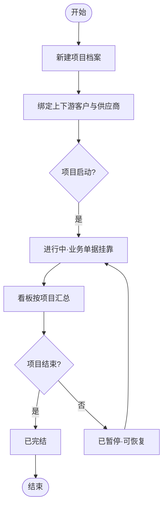
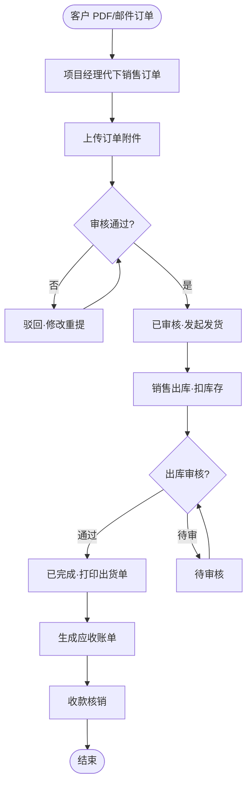
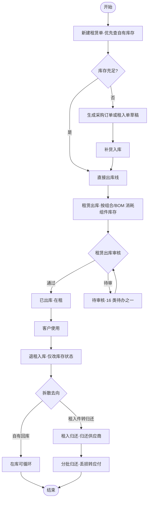
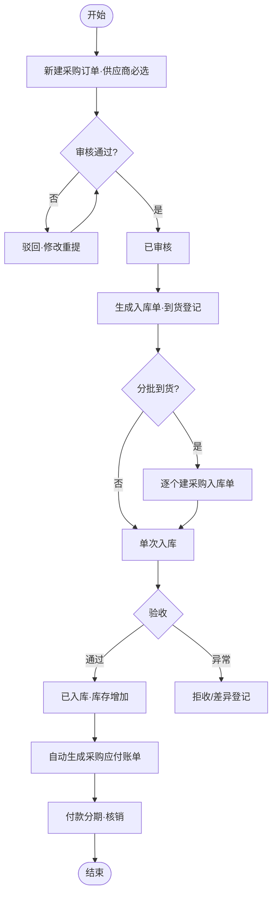
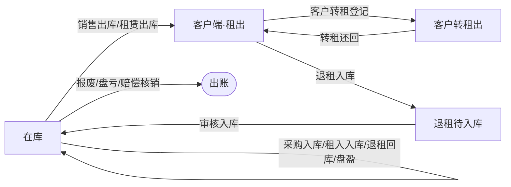
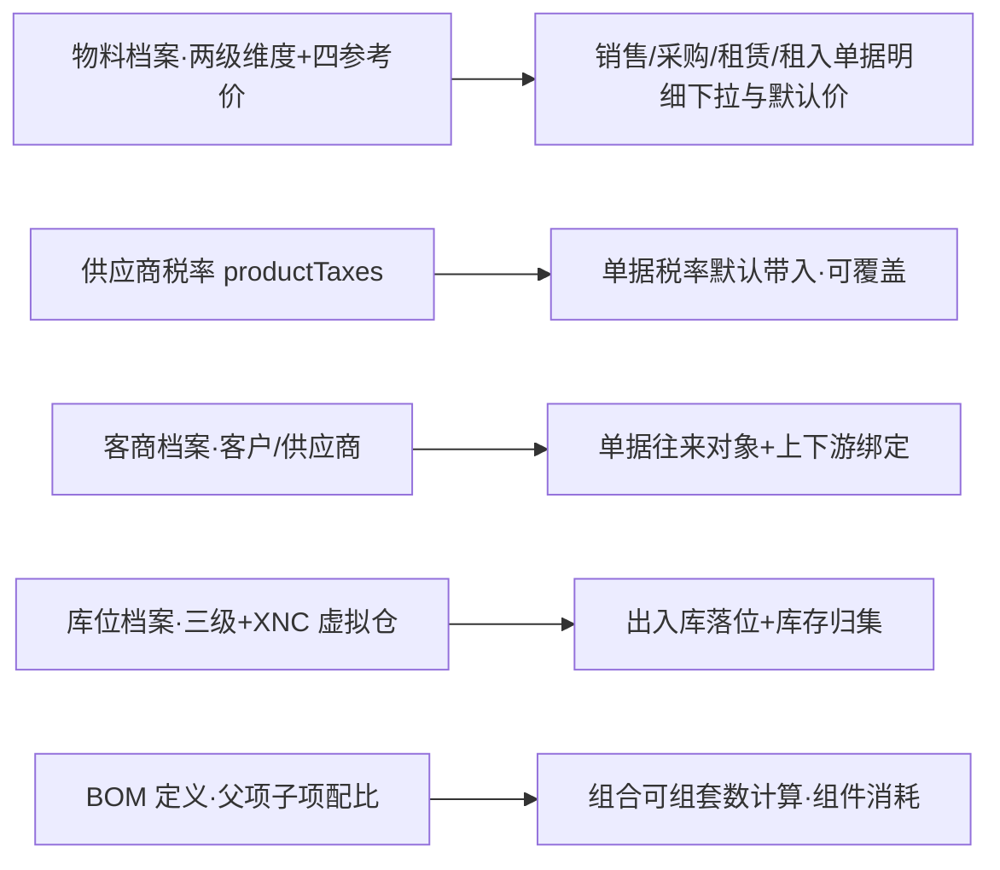
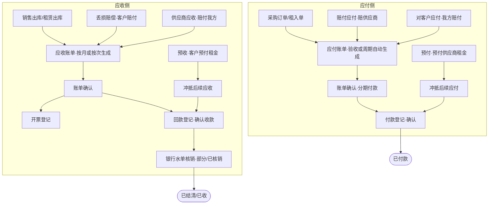
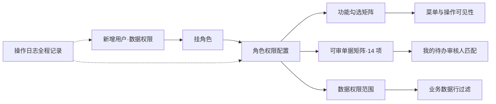
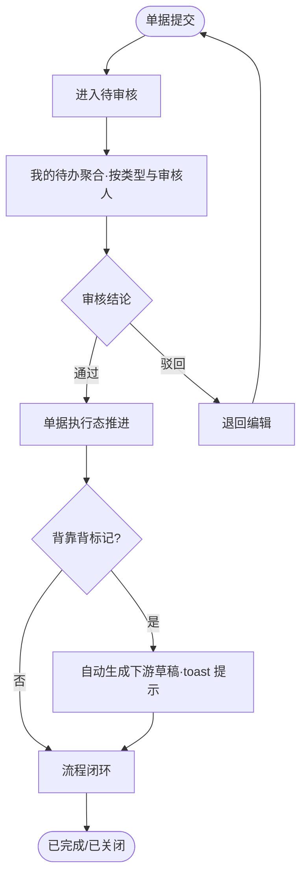
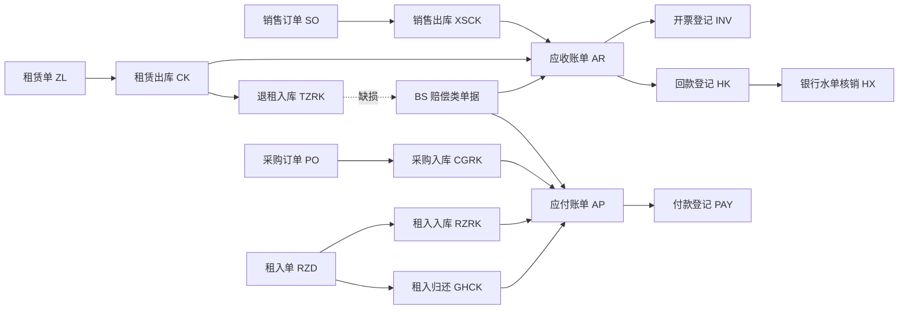

# 汽车物流包装租赁系统 · 产品需求文档（P2-R01）

> **版本**：V1.5（＋G41 文档收口 D-150）｜ **最后更新**：2026-09-16（**D-150 三任务成果回灌与文档全量收口（G41 执行）✅**；同日前值：**D-148 按天计租落地（G39 执行·D-145 承接）✅**；前值同日：**D-147 字段口径统一＋物料类型 10 值（G38 完成）✅**；前值 2026-09-15：**D-145 计费定案＋字段拍板归并（09-15 对话：直录日租金/按持有量计租/库龄不加/参考价六条/基本单位/虚拟仓不维护·G39/G38 承接）✅；出货单打印页＋录单简化（D-144）✅；前批 G36 B1 弹窗页面化＋C2 库存查询项目闭环（D-132／D-130）✅**；前批 **G34 表单组件与字典驱动整改·D-127 ✅**：物料/客商/库位三处表单 10 项·税率 SL+结算周期 JSQ 字典化；前批 G33 退货退款闭环 D-123 ✅·道远拍板方案 B·128 HTML 审计全绿）｜ **文档编码**：P2-R01（P2 = 功能调研/PRD，2026-09-12 启用）
> **需求基线快照**：G22 后原型（115 HTML · demo-data 38 实体 · 待办 16 类）＋ 2026-09-08 第 3 次沟通会议纪要最终版 ＋ 基线拍板至 2026-09-12
> **需求真值源优先级**：原型现状 ＞ 基线拍板清单 ＞ 09-08 会议纪要最终版 ＞ P1-R01 V0.7（历史需求档案）｜**决策溯源台账=附录 A（唯一活口，拍板先落账再改正文）**
> **原则**：一页纸讲清楚，图大于文，只写差异不写常识
> **原型目录**：`P3-R01-包装租赁管理后台原型/`（本文档对原型只读；正文引用的页面路径均为原型内相对路径，文件名与菜单名分离时以实际文件为准）
> **术语基线**：P1-R04-术语表 V0.6 现行词（废弃词不进本文档）；全量字段口径以 `P3-R01-包装租赁管理后台原型/P3-R01-A05-字段字典.md` 为准

---

## 一、范围边界

### 1.1 本次做（In Scope）

| 编号 | 模块 | 代号 | 功能点 | 优先级 | 说明（页面域） |
|------|------|:--:|--------|:--:|------|
| F-01 | 项目管理 | PRJ | 项目看板、项目列表、项目详情、上下游绑定 | P0 | `首页/项目看板.html`、`项目管理/项目档案.html`、`项目管理/项目详情.html`＋弹窗（新建项目/编码规则/上下游绑定） |
| F-02 | 销售管理 | SAL | 销售订单（新建/审核/详情/关闭/发货）、销售出库（新建/审核/打印出货单） | P0 | `销售管理/销售订单列表.html`、`销售管理/销售出库列表.html`＋弹窗 6 个 |
| F-03 | 租赁管理 | LEA | 租赁单（新建/审核/出库/退回对比/退租入口）、租赁出库（录单/审核）、退租入库（新建/审核）、租入单（新建/审核/草稿）、租入入库、租入归还（新建/关联租入单/分批） | P0 | `租赁管理/` 租赁单列表、租赁出库列表＋录单、退租入库列表、租入单列表、租入入库列表、租入归还列表＋弹窗 15 个；库存查询「客户在租」下钻与「资产轨迹」职能见 F-05 |
| F-04 | 采购管理 | PUR | 采购订单（新建/审核/生成入库单）、采购入库（录单/验收/打印/应付联动） | P0 | `采购管理/采购订单列表.html`、`采购管理/采购入库列表.html`＋`采购入库录单.html`＋弹窗 5 个 |
| F-05 | 仓储管理 | WHS | 库存查询（五态筛选＋客户在租下钻＋资产轨迹＋转租登记/还回＋库存流水）、盘点记录（录入/审核/盘盈亏生成其他出入库）、库存调拨、其他入库、其他出库（报废/盘亏/赔偿核销/其他） | P0 | `仓储作业/` 库存查询、盘点列表＋盘点录入、库存调拨列表、其他入库列表、其他出库列表＋弹窗 11 个；BOM 能力面（可组套数计算）消费 F-06 的 BOM 定义 |
| F-06 | 基础数据 | BAS | 物料档案（物料类型一级[原类型×分类两级合并·D-96·值域十值=围板箱/料箱/卡板箱/料架/塑料托盘/木托盘/金属托盘/内衬/组件/零部件·D-96 定六值→D-147 扩至十值（G38）]＋供应商税率维护区＋四参考价三段式租价）、客商管理（客户/供应商两类＋开票资料/收货信息行内维护·D-95）、库位档案（仓库→库区→库位三级＋XNC- 客户虚拟仓）、BOM（列表/维护/版本） | P0 | `基础数据/` 产品档案.html（菜单名=物料档案）、客商管理、库位档案、BOM.html＋BOM维护.html＋弹窗 8 个 |
| F-07 | 财务管理 | FIN | 财务看板（项目损益）、应收账单（四来源+预收行+生成）、应付账单（四来源+预付行+新建）、付款登记（分期+确认）、收款登记（确认收款）、开票登记（红冲/停用）、银行水单核销（含预收款/预付款类型+撤销核销） | P0 | `财务协同/` 盈亏报表.html（菜单名=财务看板）、应收账单、应付账单、付款登记、回款登记、开票登记、银行水单核销＋弹窗 12 个 |
| F-08 | 系统管理 | SYS | 用户权限（新增用户/重置密码/停用）、角色管理（权限配置矩阵+可审单据矩阵+数据权限）、数据字典（24 组业务字典 49→117 项·G30 枚举字典化）、操作日志 | P1 | `系统管理/` 用户权限、角色管理、数据字典、操作日志＋弹窗 6 个 |
| F-09 | 待办与审批 | WF | 我的待办（16 类单据聚合/审核人筛选/?audit=1 直达审核弹窗）、单据审核流（全模块统一状态流） | P0 | `我的待办.html`（一级菜单直达）；各单据列表 `?audit=1` 参数自动打开审核弹窗 |
| F-10 | 移动端与登录 | MOB | PC 登录页（预填/退出守卫）、移动端 H5 五页（登录/待办审批/审批详情/库存查询/我的·企微绑定·免二次登录） | P1 | `登录.html`＋`mobile/` M01-M05（`_m.css`/`_m.js` 共享件·底部 tab 待办/库存/我的） |

> 演示支撑页（不属交付模块）：F01 业务流程导航图（`P3-R01-F01-业务流程导航图.html`·7 泳道 76 节点）、A06 实体关系图渲染页（`P3-R01-A06-实体关系与状态机.html`·7 图）。69 个独立弹窗模板随所属模块交付，与页内弹层双层同步维护。

### 1.2 本次不做（Out of Scope）

- **退租申请**模块（09-08 拍板模块级移除：菜单/列表页与租赁单的关联关系均去掉，直接做退租入库）
- **组装**模块（本项目移除：入库按组件记录、出库直接扣减对应组件，系统按 BOM 关系计算可组套数，不管理中间组装过程）
- **拆卸**模块（本项目移除，与组装同拍板；退租入库按单一物料/拆后零件记录即记录粒度而非流程分支）
- **丢损赔偿单**独立模块（不走独立赔偿流程，按对象直接生成应收/应付账单，账单带费用类型；BS 前缀保留为赔偿类单据编号口径）
- 客户端自助下单（订单唯一来源＝项目经理代下销售订单；客户订单以 PDF＋年度订单分批邮件调拨两种形态，照单录入）
- 扫码作业（暂不支持，设计预留接口）
- 采购计划模块（「先有计划再下订单」暂缓，待客户确认后另议）
- 归属权字段（档案层退场——一物料可租可买，归属权＝库存实例层属性，由库存查询「资产来源」维度承载）
- 路凯系统替换（仅做数据对接：下单＋结算；路凯项目「库存运营在外赚差价」属特例基本不上系统）
- 维修流程（损坏可修复件不设维修，按损坏统一走赔偿/报废）
- 其他入库「期初」类型（期初存量走实施数据迁移直接导库，界面不做期初入口）
- 独立在租/租出统计台账页（已并入：租出跟踪＝租赁单列表「退回进度」列；在租明细＝库存查询「客户在租」下钻＋资产轨迹；无数据源/无动作驱动统计砍除——平均循环/平均租期/超期/即将到期/四态卡重复/台账编号）
- 即将到期提醒（租赁单去租期后无数据源；如客户需要须先恢复归还约定类字段——待确认清单 #8）
- 租金日单价（**无日租金**；租价＝计费方式（按时间周期/按次）＋周期单位（年/月/日·默认月）＋数值三段式）
- AI/自动导单（MCP 方向仅记录用于工期评估，不在本期交付范围）

### 1.3 待确认清单（影响需求口径 · 结论出来前不臆测）

| # | 事项 | 现状口径（原型按此表达） | 待确认点 |
|---|------|--------------------------|----------|
| 1 | 计费单价/押金/赔偿标准（商务口径） | 原型用演示值（如围板箱 45 元/只·月）表达形态 | 具体单价、押金收取方式、赔偿标准数值待客户方答复 |
| 2 | 租入资产入库方式 | 现按「资产入户」设计（租入资产进本系统库存） | ✅ 已确认（2026-09-14 第4次沟通：袁工完整接受 租入单→租入入库 流程＝资产入户；后续单据化深化见 D-105 立即转租） |
| 3 | 吉客云/路凯对接细节 | 系统边界已画（见「六、接口时序」） | 账号、基础资料清单、单据样例均未取得；「瑞迅凯」名称待核实 |
| 4 | 客户虚拟仓方案 | 库位档案已建 XNC- 前缀客户虚拟仓＋库存查询客户态行（on-hire 口径） | ✅ 已确认（2026-09-15 道远：**客户虚拟仓不维护**——D-145⑤；客户在租由库存状态维度表达） |
| 5 | 无订单预付款挂账侧 | 原型静态示例表达：应付账单「预付」行＋应收账单「预付款（保证金）」行，不做独立预付款模块/虚拟项目 | ✅ 已确认（2026-09-15：对客户与对供应商保证金均挂应付·D-139；退款场景由 G33 退款登记承载·D-123） |
| 6 | 财务流程细节（开票/收款登记/核销是否进系统） | 原型已含开票登记/收款登记/银行水单核销三页（静态演示态） | 客户财务系统名称与版本（金蝶？）待问；正式版范围待财务对接确认（纪要 T3） |
| 7 | 审核角色名单 | 原型按角色配置审核（角色管理·可审单据矩阵 **16 项**·审核人按角色匹配） | 矩阵部分 ✅ 已销（2026-09-14：G25 升 16 项=待办 16 类一一对应）；**角色人员名单仍待客户提供** |
| 8 | 即将到期提醒 | ✅ 已销（2026-09-14：改由站内信承载——D-85 四类消息含账单到期/续租跟进；「到期日字段从哪来」归入 D-122 单据计费梳理；类型筛选+字典化见 D-126） | — |
| 9 | BOM 共用库存重复计算 | 原型静态展示各 BOM 可组数（不做跨 BOM 并行汇总） | 同一子件被多个 BOM 共用时并行计算重复计入问题，✅ 已确认（2026-09-15 D-140①：BOM 视角已改「选一 BOM 查库存」，并行汇总口径不复存在，不需处理） |
| 10 | 物料档案命名 | ✅ 已销（2026-09-14：客户第 4 次会议全程口称「物料」零异议·G17 全站改名完成） | — |
| 11 | 库存「租入」与「退租库存」两态 | ✅ 已销（2026-09-14 道远拍板：租入态 G25 已补行+筛选；**退回货物不设独立状态**——验收后按结果进正品仓/次品仓，状态均算「在库」，靠仓库+资产来源区分，与袁工瑕疵品调拨口径一致） | — |
| 12 | 仓储（仓库）模块单独保留与否 | 现状＝仓储独立成组（菜单 v3.5「仓储管理」组 3 小标签 5 页） | ✅ 已确认（2026-09-14：独立成组保留，小标签取消见 D-114；G31 T1 执行） |

---

## 二.1 角色列表

> 内部角色源＝原型 `roles` 实体（6 角色［D-143 七→六：系统管理员/财务/商务/物流/采购/项目经理］，角色管理页数据驱动；2026-09-14 拍板：客户/供应商账号本版本不做，已从原型与数据移除——外部角色仅作为业务参与方/客商档案，不提供登录账号）。代号全局唯一，后续 UC/AC 与数据责任矩阵全部引用。

| 角色 | 代号 | 说明 |
|------|:--:|------|
| 系统管理员 | ADM | 全部功能＋系统管理（用户/角色/字典/日志） |
| 财务 | FNC | 财务管理（应收/应付/财务看板） |
| 财务主管 | FCS | 财务全模块＋付款/回款确认审核 |
| 商务 | BIZ | 订单/租赁全流程（录单主力） |
| 商务主管 | BZS | 订单/租赁全流程＋单据审核 |
| 物流 | LOG | 仓储作业＋库存查询 |
| 物流主管 | LGS | 仓储作业＋库存查询＋出/入库审核 |
| 客户（外部） | CUS | 租赁/买卖业务对象；订单由项目经理代下，客户不自助下单 |
| 供应商（外部） | SUP | 采购/租入业务对象；不同供应商对应不同税率与结算周期 |
| 路凯（外部） | LK | 围板箱供应商之一兼系统对接方（数据对接：下单＋结算，见「六、接口时序」） |

> 审核按角色配置（09-08 纪要十.1）：财务、商务、物流三类角色关联审批；具体单据审核权见「角色管理 → 权限配置（可审单据矩阵 14 项）」。审核人匹配示例（演示数据）：李静＝财务主管（付款/回款确认）、李国栋＝物流主管（出/入库审核）、王强＝商务主管（订单/租赁审核）。

---

## 二.PRJ.2 功能用例与验收

项目管理是全站业务挂靠基座：所有单据（销售/租赁/采购/租入）都挂项目，看板按项目汇总经营数据。对应原型页面：`首页/项目看板.html`（启动页）、`项目管理/项目档案.html`（菜单「项目管理 → 项目列表」）、`项目管理/项目详情.html`（菜单外·档案行内「详情」入口）、弹窗（新建项目/编码规则/上下游绑定，`项目管理/弹窗/`）。

**功能用例表**

| 编号 | 角色 | 场景 | 动作 | 预期结果 |
|------|------|------|------|----------|
| UC-PRJ-01 | BZS | 看板总览 | 登录后在项目看板查看各项目行 | 每项目一行：出库/退租件数、在租数量、本月营收、累计毛利 |
| UC-PRJ-02 | BZS | 看板下钻 | 点看板行「查看明细」 | 跳转项目详情页，单据按该项目过滤 |
| UC-PRJ-03 | BIZ | 新建项目 | 项目档案页点「新建项目」，填项目名称/客户/供应商/起止日期/负责人并保存 | 列表新增一行，状态「筹备中」，项目编码按规则自动生成 |
| UC-PRJ-04 | BIZ | 维护上下游绑定 | 点项目行「上下游绑定」，在弹窗中多选客户与供应商 | 绑定关系保存；新建租入单/采购订单选该项目时，供应商候选＝绑定集合 |
| UC-PRJ-05 | BZS | 查看项目详情 | 点项目行「详情」 | 进入项目详情页：档案文件区（合同/对账单等 11 行）与业务单据聚合 |
| UC-PRJ-06 | ADM | 查看编码规则 | 点「编码规则」按钮 | 弹窗展示 PRJ-xxxx 项目编码规则说明 |

**验收标准**

| 编号 | 对应用例 | Given | When | Then |
|------|:--------:|-------|------|------|
| AC-PRJ-01 | UC-PRJ-01 | 已登录且至少存在一个项目 | 打开项目看板 | 看板按项目列行，统计列（本月出库/本月退租/在租数量/本月营收/累计毛利）有值 |
| AC-PRJ-02 | UC-PRJ-03 | 项目档案页已打开 | 点「新建项目」，客户与起止日期留空直接提交 | 行内提示必填项，不生成项目 |
| AC-PRJ-03 | UC-PRJ-03 | 必填项齐全 | 提交新建项目 | 列表出现新行，状态「筹备中」，编码形如 PRJ-26xx |
| AC-PRJ-04 | UC-PRJ-04 | 项目已存在且已有客商档案 | 打开「上下游绑定」弹窗勾选多家供应商 | 绑定保存后，新建采购订单/租入单选本项目时供应商下拉只含绑定集合 |
| AC-PRJ-05 | UC-PRJ-02 | 看板行「查看明细」可点 | 点击跳转 | URL 进入项目详情页，展示该项目档案文件与单据聚合 |

#### 测试账号

| 账号 | 姓名 | 角色 | 状态 | 用途 |
|------|------|------|------|------|
| admin | 系统管理员 | ADM | 启用 | 全功能演示/系统管理 |
| wangqiang | 王强 | 商务主管 | 启用 | 销售/租赁单据审核（看板/档案维护） |
| chenjin | 陈金 | 商务 | 启用 | 项目/订单/租赁录单 |
| lijing | 李静 | 财务主管 | 启用 | 付款/回款确认审核、财务看板 |
| liguodong | 李国栋 | 物流主管 | 启用 | 出/入库审核、仓储作业 |
| zhaolei | 赵磊 | 物流 | 启用 | 仓储录单（租赁出库提交人） |

> 演示口径：原型无真实鉴权——`_data/pc-auth.js` 默认登录态直达（localStorage 键 `pc-logout`＝'1' 时业务页跳登录页，登录成功清键回看板）；登录页 `登录.html` 预填账号。完整账号清单（6 个我方演示账号）见 `系统管理/用户权限.html`（客户/供应商账号 2026-09-14 拍板不做，所属方维度已移除）。

## 三.PRJ 核心流程

### 3.PRJ.1 主流程

**文字补充**：项目编码由「编码规则」弹窗口径自动生成（PRJ- 前缀）；上下游绑定是多对多——一个项目可绑多家供应商，同一供应商服务多个项目。

### 3.PRJ.2 状态流转

| 对象 | 状态1 | → 状态2 | 触发条件 | 触发角色 | 守卫条件 |
|------|-------|---------|----------|----------|----------|
| 项目 | 筹备中 | 进行中 | 项目启动（首次单据挂靠或手工切换） | BZS | 至少绑定一个客户 |
| 项目 | 进行中 | 已暂停 | 手工暂停 | BZS | 无未完成审核单据挂起（演示态不拦截） |
| 项目 | 已暂停 | 进行中 | 恢复 | BZS | — |
| 项目 | 进行中/已暂停 | 已完结 | 项目结束 | BZS | 在租数量清零或客户确认结项 |

### 3.PRJ.3 异常与边界

**功能异常**：

| 异常场景 | 触发条件 | 处理方式 |
|----------|----------|----------|
| 新建项目必填缺失 | 客户/起止日期为空 | 行内提示，不生成档案 |
| 编码冲突 | 同期新建多个项目 | 编码规则保证序列号递增（演示态静态） |

**非功能**：

| 边界类型 | 场景 | 处理策略 |
|----------|------|----------|
| 一致性 | 项目完结后仍有在途单据 | 看板统计持续汇总至单据关闭；完结项目仍可查历史 |
| 数据权限 | 数据权限范围 | 按项目/区域数据权限过滤（用户权限页 scope 配置；客户账号本版本不做） |

## 四.PRJ 数据流向

项目档案由商务创建维护、绑定上下游后作为全站单据的挂靠维度；看板统计行由各业务模块单据数据实时汇总，不独立录入。

### 4.PRJ.1 数据责任

| 业务数据 | ADM | BIZ | BZS | FNC |
|----------|-----|-----|-----|-----|
| 项目档案 | 查看 | 创建/修改 | 查看/修改 | 查看 |
| 上下游绑定 | 查看 | 创建/修改 | 查看/修改 | — |
| 档案文件 | 查看 | 上传/修改 | 查看 | 查看 |
| 看板统计 | 查看 | 查看 | 查看 | 查看 |

### 4.PRJ.2 字段说明

> 全量字段以 `P3-R01-包装租赁管理后台原型/P3-R01-A05-字段字典.md` 为准。

| 字段中文名 | 字段名 | 类型 | 校验规则 | 取值范围 | 来源 | 去向 | 错误提示 | 说明 |
|-----------|--------|------|----------|----------|------|------|----------|------|
| 项目编码 | _key | string | 系统生成，唯一 | PRJ-26xx | 编码规则自动生成 | 全站单据「所属项目」下拉/筛选 | — | 单据互溯外键 |
| 项目名称 | name | string | 非空 | — | 商务输入 | 项目档案/看板/详情 | 请填写项目名称 | 含基地与器具描述 |
| 客户 | customer | enum | 非空，源=客商档案（类型=客户） | 一汽解放汽车有限公司 等 | 客商档案 | 上下游绑定区/看板 | 请选择客户 | 单选 |
| 供应商 | suppliers | string | — | 多供应商「·」拼接 | 上下游绑定弹窗多选 | 新建租入单/采购订单供应商候选集 | — | 多对多；正式版须建关系表（演示层为名字拼接，见 A05 缺口注记） |
| 状态 | status | enum | — | 筹备中/进行中/已暂停/已完结 | 商务维护 | 档案筛选/看板 | — | 档案类启停状态 |
| 起止日期 | start/end | date | 起止有序 | — | 商务输入 | 档案列表 | — | — |
| 负责人 | owner | enum | — | 我方用户（王强 等） | 用户权限档案 | 档案列表 | — | — |
| 本月出库(件) | m_out | number | — | ≥0 | 当月该项目销售出库＋租赁出库明细件数求和 | 看板列 | — | 统计口径：按出库单日期归月 |
| 本月退租(件) | m_back | number | — | ≥0 | 当月该项目退租入库明细件数求和 | 看板列 | — | 统计口径 |
| 在租数量(只) | on_rent | number | — | ≥0 | 该项目累计出库−累计退租−赔偿核销出库 | 看板列 | — | 统计口径：净在租 |
| 本月营收(元) | m_rev | number | — | ≥0 | 当月该项目应收账单金额求和 | 看板列 | — | 统计口径：应收发生制 |
| 累计毛利(元) | profit | number | — | 可为负 | 项目损益表毛利列累计 | 看板列 | — | 统计口径：收入合计−成本合计 |

---

## 二.SAL.2 功能用例与验收

销售管理承载零部件买卖线的订单与出库：项目经理照客户 PDF/邮件截图代下销售订单，审核后发货出库、扣库存、生成应收。对应原型页面：`销售管理/销售订单列表.html`（状态流范本页）、`销售管理/销售出库列表.html`＋弹窗 6 个（新建销售订单/销售订单审核/销售订单详情/销售出库新建/销售出库审核/销售出库单详情，`销售管理/弹窗/`）。

**功能用例表**

| 编号 | 角色 | 场景 | 动作 | 预期结果 |
|------|------|------|------|----------|
| UC-SAL-01 | BIZ | 代下销售订单 | 点「新建销售订单」，选客户/所属项目，录入明细（物料下拉·源=物料档案），上传客户 PDF/邮件截图附件，提交 | 订单进入「待审核」，明细行含数量/未税单价/税率/含税单价，逐行加总=订单总价 |
| UC-SAL-02 | BZS | 审核销售订单 | 从我的待办或列表 ops 点「审核」（列表页 `?audit=1` 自动打开审核弹窗） | 审核通过→「已审核」；驳回→退回编辑 |
| UC-SAL-03 | BIZ | 修改待审订单 | 待审核订单行点「编辑」 | 可改明细后重新提交 |
| UC-SAL-04 | BZS | 关闭订单 | 已完成收款核销的订单行点「关闭」 | 订单状态「已关闭」 |
| UC-SAL-05 | BZS | 发起发货 | 已审核订单行点「发货」 | 生成销售出库单（关联该订单） |
| UC-SAL-06 | BIZ | 新建销售出库 | 销售出库页「销售出库新建」，选关联销售订单带出明细 | 出库单「待审核」，明细与订单一致 |
| UC-SAL-07 | BZS | 审核销售出库 | 出库行点「审核」 | 审核通过→「已完成」，扣减库存 |
| UC-SAL-08 | LOG | 打印出货单 | 出库行点「打印出货单」 | 按出货单模板输出（按钮文案定版「打印出货单」，客户无验收单/收货单） |

**验收标准**

| 编号 | 对应用例 | Given | When | Then |
|------|:--------:|-------|------|------|
| AC-SAL-01 | UC-SAL-01 | 已登录且有客户与物料档案 | 填写必填项并上传 PDF 附件提交 | 订单入列表状态「待审核」，附件在详情可见 |
| AC-SAL-02 | UC-SAL-01 | 明细未税单价 100、税率 13% | 录入未税单价 | 含税单价自动算出 113（未税⇄含税双向换算，公式固定允许手改） |
| AC-SAL-03 | UC-SAL-01 | 明细物料未选择 | 提交 | 提示「请选择物料」，无法提交 |
| AC-SAL-04 | UC-SAL-02 | 存在待审核销售订单 | 我的待办行点击进入（`?audit=1`） | 列表页自动打开审核弹窗 |
| AC-SAL-05 | UC-SAL-07 | 销售出库单待审核 | 审核通过 | 状态「已完成」，库存查询对应物料在库数量扣减 |
| AC-SAL-06 | UC-SAL-08 | 出库单已完成 | 点「打印出货单」 | 打印出货单模板输出 |

> 测试账号见「二.PRJ.2 测试账号」。

## 三.SAL 核心流程

### 3.SAL.1 主流程

**文字补充**：销售订单不关联采购订单（关联是单向的：仅采购订单可关联销售订单）；客户现无验收单/收货单，出库只需送货单/出货单模板；订单关闭的守卫是收款核销完成。

### 3.SAL.2 状态流转

| 对象 | 状态1 | → 状态2 | 触发条件 | 触发角色 | 守卫条件 |
|------|-------|---------|----------|----------|----------|
| 销售订单 | 待审核 | 已审核 | 订单审核通过 | BZS | 必填明细齐全且未税⇄含税勾稽一致 |
| 销售订单 | 待审核 | （退回） | 审核驳回 | BZS | 必填驳回意见 |
| 销售订单 | 已审核 | 待发货 | 发起发货 | BZS | 已审核态 |
| 销售订单 | 待发货 | 已完成 | 出库完成且应收生成 | SYS | 关联销售出库「已完成」 |
| 销售订单 | 已完成 | 已关闭 | 收款核销后关闭 | BZS | 应收已结清 |
| 销售出库 | 待审核 | 已完成 | 出库审核通过 | BZS | 关联订单「已审核」且库存充足 |

### 3.SAL.3 异常与边界

**功能异常**：

| 异常场景 | 触发条件 | 处理方式 |
|----------|----------|----------|
| 含税手改与公式不符 | 手改含税单价偏离公式值 | 允许保存（改动自担风险），含税/未税两栏标签加大加粗防错 |
| 出库数量超订单量 | 出库明细大于订单数量 | 提交校验拦截 |
| 附件缺失 | 未上传 PDF/邮件截图 | 可提交（附件为辅证，不强制） |

**非功能**：

| 边界类型 | 场景 | 处理策略 |
|----------|------|----------|
| 并发 | 审核中订单被商务修改重提 | 审核弹窗展示最新明细（演示态静态） |
| 一致性 | 出库扣库存与订单数量 | 出库完成后订单进入已完成；差异走赔偿/盘点差异处理兜底 |

## 四.SAL 数据流向

销售订单由商务照客户 PDF 录入（唯一订单来源，无客户自助下单）；出库由商务/物流执行、商务主管审核；应收账单由出库数据自动汇总生成（财务模块承接）。

### 4.SAL.1 数据责任

| 业务数据 | ADM | BIZ | BZS | LOG | FNC |
|----------|-----|-----|-----|-----|-----|
| 销售订单 | 查看 | 创建/修改 | 审核/关闭/发货 | 查看 | 查看 |
| 销售出库单 | 查看 | 创建 | 审核 | 查看/打印 | 查看 |
| 订单附件 | 查看 | 上传 | 查看 | — | 查看 |

### 4.SAL.2 字段说明

> 全量字段以 `P3-R01-包装租赁管理后台原型/P3-R01-A05-字段字典.md` 为准。

| 字段中文名 | 字段名 | 类型 | 校验规则 | 取值范围 | 来源 | 去向 | 错误提示 | 说明 |
|-----------|--------|------|----------|----------|------|------|----------|------|
| 销售订单号 | _key | string | 系统生成，唯一 | SO-yyyymmdd-nnn | 编码规则自动生成 | 销售出库关联/应收账单 docs | — | 单据互溯外键 |
| 客户 | customer | enum | 非空，源=客商档案（类型=客户） | — | 客商档案下拉 | 详情/应收账单客户维度 | 请选择客户 | — |
| 所属项目 | project | enum | 非空 | PRJ-26xx | 项目档案下拉 | 项目维度筛选/看板 | 请选择所属项目 | — |
| 订单摘要 | summary | string | 非空 | — | 商务输入 | 列表摘要列 | — | 器具与数量概述 |
| 订单类型 | mode | enum | — | 购买/租赁（客户侧只分两种订单） | 商务选择 | 列表筛选 | — | 租赁类引导走租赁单 |
| 状态 | status | enum | — | 待发货/待审核/已审核/已完成/已关闭 | 审核流驱动 | 列表状态列/我的待办 | — | 全模块统一审核状态流的销售变体 |
| 经办人 | agent | enum | — | 我方用户 | 用户档案 | 列表 | — | — |
| 下单日期 | date | date | — | — | 系统生成 | 列表/详情 | — | — |
| 订单附件 | attachments | file | — | PDF/邮件截图 | 商务上传（假上传演示） | 详情附件区 | — | 客户订单以 PDF 为主+年度订单分批邮件调拨 |
| 出库单号 | _key(销售出库) | string | 系统生成，唯一 | XSCK-yyyymmdd-nnn | 编码规则自动生成 | 库存流水/应收账单引用 | — | — |
| 关联销售订单 | so | enum | 非空 | SO-yyyymmdd-nnn | 销售订单下拉 | 单据互溯链 | 请选择销售订单 | 出库凭单发货 |
| 出库库房 | warehouse | enum | 非空，源=库位档案 | 原料区 RA/成品区 RB 等 | 库位档案下拉 | 库存扣减落位 | 请选择出库库房 | — |
| 出库状态 | status(销售出库) | enum | — | 待审核/已完成 | 审核流驱动 | 列表状态列 | — | 审核通过即扣库存 |

---

## 二.LEA.2 功能用例与验收

租赁管理是循环包装租赁主业务，含租出（对客户）与租入（对供应商）两条链。对应原型页面（均在 `租赁管理/` 目录）：租赁单列表（原租出跟踪职能并入·退回进度列）、租赁出库列表＋租赁出库录单、退租入库列表（含新建页 `退租入库新建.html`·客户退租统一入口）、租入单列表、租入入库列表、租入归还列表，弹窗 16 个（租赁单新建/审核/详情、租赁出库确认/单详情、退租入库审核/单详情、租入单新建/审核/详情、租入入库确认/单详情、租入归还新建/审核/单详情、器具出租履历[G07 起挂靠库存查询]）。库存查询「客户在租」下钻与「资产轨迹」职能见「三.WHS」。

**功能用例表**

| 编号 | 角色 | 场景 | 动作 | 预期结果 |
|------|------|------|------|----------|
| UC-LEA-01 | BIZ | 新建租赁单·查库存 | 点「租赁单新建」，录入明细时行内显示「可用库存」 | 有货不租入不采购；库存不足时出现双按钮「生成采购订单草稿」「生成租入单草稿」 |
| UC-LEA-02 | BIZ | 新建背靠背租赁单 | 新建租赁单勾选「背靠背」类型标记 | 提交后系统识别可自动生成租入单草稿 |
| UC-LEA-03 | BZS | 审核租赁单 | 列表行「审核」（`?audit=1` 自动打开审核弹窗） | 通过→「已审核→在租」；若为背靠背单，确认后自动生成租入单草稿（背靠背 toast 提示） |
| UC-LEA-04 | BZS | 查看退回对比 | 在租单行点「退回对比」（cmpModal） | 弹窗按单展示出库量 vs 已退回量差异 |
| UC-LEA-05 | BIZ | 租赁出库录单 | 租赁出库列表「新增出库单」进录单页，选组合件/BOM | 行内「可用组合库存」实时显示，「可用量校验」拦截超量；审核通过消耗对应组件库存 |
| UC-LEA-06 | BZS | 审核租赁出库 | 待审核出库单行点「审核」（「租赁出库审核」弹窗） | 通过→「已出库」；租赁出库审核是 16 类待办之一 |
| UC-LEA-07 | LOG | 退租入库新建 | 退租入库列表「新建退租入库」（`退租入库新建.html`/页内弹窗） | 按单一物料/拆后零件录入，选拆散去向（自有回库/租入件转归还） |
| UC-LEA-08 | LGS | 审核退租入库 | 退租入库行「审核」 | 通过→「已入库」，**仅更新库存状态，与财务结算完全解耦**（客户的租金只要发出去就要收，还了也收） |
| UC-LEA-09 | BIZ | 新建租入单 | 租入单页「租入单新建」，多货品明细表格（物料下拉/数量/计费方式=按月或按次） | 提交后「待审核」；无日租金口径 |
| UC-LEA-10 | BIZ | 背靠背租入草稿流转 | 从租赁单审核自动生成的草稿（状态「新建(草稿)」·供应商待选） | 行内「选供应商」→「修改」→「提交」三步走完进入「待审核」 |
| UC-LEA-11 | LOG | 租入入库确认 | 租入入库行「入库确认」 | 关联租入单明细同步，状态→「已入库」；可跳「租金应付」生成 |
| UC-LEA-12 | BIZ | 租入归还 | 租入归还页「租入归还新建」，选关联租入单 | 明细自动同步（货品/租入数量/已归还），逐货品填本次归还数量，支持分批多单 |
| UC-LEA-13 | BZS | 审核租入归还 | 归还行「审核」 | 通过→「已归还」；归还中发现丢损转应付账单 |
| UC-LEA-14 | LOG | 客户转租登记/还回 | 库存查询客户态行「转租登记」/「转租还回」 | 拉表改状态（客户转租出）+可查（哪个客户/何时改的）+最终能还回；不做所有权变更逻辑 |

**验收标准**

| 编号 | 对应用例 | Given | When | Then |
|------|:--------:|-------|------|------|
| AC-LEA-01 | UC-LEA-01 | 租赁单新建弹窗已打开 | 录入物料行 | 行内显示可用库存数；不足时出现生成采购订单/租入单草稿双按钮 |
| AC-LEA-02 | UC-LEA-03 | 存在待审核租赁单 | 审核通过 | 状态流转「已审核」并可执行「出库」；背靠背单同时提示自动生成租入单草稿 |
| AC-LEA-03 | UC-LEA-04 | 存在在租单且有出库/退回记录 | 点「退回对比」 | 弹窗展示出库量与已退回量对比 |
| AC-LEA-04 | UC-LEA-05 | 录单页已选组合件 ZH-2601-A | 出库数量大于可用组合库存 | 「可用量校验」拦截提交 |
| AC-LEA-05 | UC-LEA-06 | 存在待审核租赁出库单（如 CK-20260910-022） | 我的待办点击进入（`?audit=1`） | 列表页自动打开「租赁出库审核」弹窗 |
| AC-LEA-06 | UC-LEA-07 | 客户退租场景 | 新建退租入库录拆后零件 | 单据按单一物料记录，拆散去向落「自有回库」或「租入件转归还」 |
| AC-LEA-07 | UC-LEA-08 | 退租入库单待审核 | 审核通过 | 状态「已入库」；不触发应收自动核减（租金照收） |
| AC-LEA-08 | UC-LEA-12 | 租入单已有部分归还 | 新建归还单并填本次数量 | 保存后租入单状态→「部分归还」；可再建下一批归还单 |
| AC-LEA-09 | UC-LEA-14 | 库存查询存在客户端(租出)行 | 点「转租登记」 | 该行状态→「客户转租出」；「转租还回」可逆 |

> 测试账号见「二.PRJ.2 测试账号」。

## 三.LEA 核心流程

### 3.LEA.1 主流程

**文字补充**：租入侧独立事件链＝租入单（静态/背靠背两种模式）→租入入库（凭单验收）→租入归还（关联+同步明细+分批）；未转租资产可从租入归还直接还；退租与归还是两个独立事件，按明细行归属组合（L4 模型）；应收独立生成（按月定期/按次套数），与租赁单不强关联。

### 3.LEA.2 状态流转

| 对象 | 状态1 | → 状态2 | 触发条件 | 触发角色 | 守卫条件 |
|------|-------|---------|----------|----------|----------|
| 租赁单 | 待审核 | 已审核 | 审核通过 | BZS | 明细税率三件套勾稽一致 |
| 租赁单 | 已审核 | 在租 | 首次租赁出库完成 | SYS | 存在关联出库单「已出库」 |
| 租赁单 | 在租 | 已退租 | 退租入库审核完成（全部退回） | LGS | 退回数量=出库数量（部分退回保持「在租」） |
| 租赁单 | 在租/已退租 | 已关闭 | 手工关闭 | BZS | 无未完成审核挂起 |
| 租赁出库 | 待审核 | 拣货中 | 审核通过进入拣货 | BZS | 可用量校验通过 |
| 租赁出库 | 拣货中 | 已出库 | 出库执行完成 | LOG | 组合库存扣减成功 |
| 退租入库 | 待审核 | 已入库 | 审核通过 | LGS | 验收结果（完好/缺损/丢失）已记录 |
| 租入单 | 新建(草稿) | 待审核 | 选供应商→修改→提交 | BIZ | 背靠背草稿须先选定供应商 |
| 租入单 | 待审核 | 履行中 | 审核通过且租入入库 | BZS | 关联租入入库「已入库」 |
| 租入单 | 履行中 | 部分归还 | 首批归还审核通过 | BZS | 归还数量<租入数量 |
| 租入单 | 部分归还/履行中 | 已归还 | 全部归还完成 | BZS | 累计归还=租入数量 |
| 租入单 | 履行中 | 已终止 | 提前终止 | BZS | 双方确认（演示态静态） |
| 租入归还 | 待审核 | 已归还 | 审核通过 | BZS | 本次归还数量≤剩余未归还 |

### 3.LEA.3 异常与边界

**功能异常**：

| 异常场景 | 触发条件 | 处理方式 |
|----------|----------|----------|
| 租赁出库超可用量 | 出库数量>可用组合库存 | 「可用量校验」拦截提交 |
| 退租数量>出库数量 | 退回对比差异为负 | 提示核对（自行盘点对账，不挂单据强关联） |
| 归还数量超租入量 | 本次归还>剩余未归还 | 提交校验拦截 |
| 背靠背草稿无供应商 | 未选供应商直接提交 | 拦截，提示先「选供应商」 |

**非功能**：

| 边界类型 | 场景 | 处理策略 |
|----------|------|----------|
| 一致性 | 出库量 vs 退回量差异（少退/丢损） | 按对比即知差异，强势客户场景自行盘点对账；缺损转赔偿（直接生成应收/应付，无独立赔偿单） |
| 解耦 | 退租入库与财务结算 | 退租只改库存状态；应收按月/按次独立生成 |
| 幂等 | 分批归还多单对一租入单 | 每单独立编号 GHCK-，租入单累计已归还数量防超 |

## 四.LEA 数据流向

租赁单由商务创建（优先查库存）、商务主管审核；租赁出库按组合/BOM 扣组件库存；退租入库把库存改回（与财务解耦）；租入链由租入单驱动入库与归还；客户在租/资产轨迹视图由库存查询承载（WHS 模块）。

### 4.LEA.1 数据责任

| 业务数据 | ADM | BIZ | BZS | LOG | LGS |
|----------|-----|-----|-----|-----|-----|
| 租赁单 | 查看 | 创建/修改 | 审核/关闭 | 查看 | — |
| 租赁出库单 | 查看 | 创建（录单） | 审核 | 查看/打印 | — |
| 退租入库单 | 查看 | 查看 | — | 创建 | 审核 |
| 租入单 | 查看 | 创建/修改/提交/选供应商 | 审核 | 查看 | — |
| 租入入库单 | 查看 | 查看 | — | 创建/入库确认 | — |
| 租入归还单 | 查看 | 创建 | 审核 | 查看 | — |

### 4.LEA.2 字段说明

> 全量字段以 `P3-R01-包装租赁管理后台原型/P3-R01-A05-字段字典.md` 为准。

| 字段中文名 | 字段名 | 类型 | 校验规则 | 取值范围 | 来源 | 去向 | 错误提示 | 说明 |
|-----------|--------|------|----------|----------|------|------|----------|------|
| 租赁单号 | _key(租赁单) | string | 系统生成，唯一 | ZL-yyyymmdd-nnn | 编码规则自动生成 | 租赁出库 zl/退租入库/应收账单引用 | — | 单据互溯外键 |
| 计费方式 | billing | enum | 非空 | 按月定期/按次套数 | 新建弹窗选择（值源=dictItems 计费方式大类） | 应收生成方式 | 请选择计费方式 | 按月=定期生成应收；按次=按实际使用量 |
| 客户 | customer | enum | 非空，源=客商档案 | — | 客商档案下拉 | 详情/应收账单 | 请选择客户 | — |
| 所属项目 | project | enum | 非空 | PRJ-26xx | 项目档案下拉 | 项目筛选/看板 | 请选择所属项目 | — |
| 状态 | status(租赁单) | enum | — | 已退租/待审核/已审核/在租/已关闭 | 审核流驱动 | 列表/我的待办 | — | — |
| 建单日期 | start | date | — | — | 系统生成 | 列表 | — | 租赁单去租期/归还规划，只留建单日期 |
| 退回进度 | backProgress | number | — | 已退回/出库数量 | 关联退租入库单汇总 | 列表「退回进度」列 | — | 原租出跟踪职能并入；退租入口按单直达退租入库 |
| 出库单号 | _key(租赁出库) | string | 系统生成，唯一 | CK-yyyymmdd-nnn | 编码规则自动生成 | 库存流水/应收引用 | — | 单据类型名=租赁出库单 |
| 关联租赁单 | zl | enum | 非空 | ZL-yyyymmdd-nnn | 租赁单下拉 | 单据互溯链 | 请选择租赁单 | — |
| 组合件 | combo | string | 非空 | ZH-26xx-x × N 套 | BOM 组合件选择（消耗对应组件库存） | 详情/打印 | 请选择组合件 | 出库直接选组合/BOM，无组装过程 |
| 关联销售订单 | so | enum | — | SO-… 或 —（租赁出库） | 销售订单下拉 | 单据互溯 | — | 租赁出库可不关联销售订单 |
| 出库状态 | status(租赁出库) | enum | — | 待审核/拣货中/已出库 | 审核流驱动 | 列表状态列/我的待办 | — | 待审核行为 16 类待办之一 |
| 退租入库单号 | _key(退租入库) | string | 系统生成，唯一 | TZRK-yyyymmdd-nnn | 编码规则自动生成 | 库存状态回写 | — | — |
| 物料（退租） | appliance | enum | 非空，源=物料档案 | 单一物料/拆后零件 | 物料下拉 | 拆散明细 | 请选择物料 | 按单一产品/拆后零件记录 |
| 拆散去向 | dest | enum | — | 自有回库/租入件转归还 | 新建表单选择 | 库存落位/租入归还联动 | — | 记录粒度非流程分支 |
| 验收结果 | result | enum | 非空 | 完好/缺损/丢失 | 验收录入 | 缺损转赔偿（直接生成应收/应付） | 请记录验收结果 | — |
| 租入单号 | _key(租入单) | string | 系统生成，唯一 | RZD-yyyymmdd-nnn | 编码规则自动生成 | 租入入库/归还/应付账单引用 | — | — |
| 供应商 | operator(租入) | enum | 非空（草稿态可待选） | 供应商客商 | 客商档案下拉（背靠背草稿=供应商待选） | 租入入库/归还/应付 | 请选择供应商 | — |
| 租入明细 | items | array | ≥1 行：物料/数量/计费方式/未税单价/税率/含税金额 | 计费方式=按月/按次 | 多货品明细表格 | 租金应付生成 | 请至少录入一行明细 | 无日租金；应付生成方式取决于租入单模式 |
| 租入状态 | status(租入单) | enum | — | 新建(草稿)/待审核/履行中/部分归还/已归还/已终止 | 三步流转+归还驱动 | 列表/我的待办 | — | 背靠背草稿=选供应商→修改→提交 |
| 归还单号 | _key(归还) | string | 系统生成，唯一 | GHCK-yyyymmdd-nnn | 编码规则自动生成 | 租入单累计已归还 | — | — |
| 关联租入单 | ref | enum | 非空 | RZD-yyyymmdd-nnn | 租入单下拉 | 明细同步（货品/租入数量/已归还） | 请选择租入单 | — |
| 归还类型 | rtype | enum | — | 整退归还/分流归还 | 新建表单选择 | 详情 | — | — |
| 本次归还数量 | returnQty | number | >0 且 ≤剩余未归还 | — | 逐货品填写 | 租入单部分归还状态 | 归还数量超出剩余 | 支持分批（多归还单对一租入单） |

---

## 二.PUR.2 功能用例与验收

采购管理承载向供应商的采购订单与到货入库（凭单验收），支撑买卖线与租赁线补货。对应原型页面：`采购管理/采购订单列表.html`、`采购管理/采购入库列表.html`（数据驱动试点页）、`采购管理/采购入库录单.html`（菜单外·列表「新增入库」入口）＋弹窗 5 个（新建采购订单/采购订单审核/采购订单详情/采购入库审核/采购入库单详情）。

**功能用例表**

| 编号 | 角色 | 场景 | 动作 | 预期结果 |
|------|------|------|------|----------|
| UC-PUR-01 | BIZ | 新建采购订单 | 点「新建采购订单」，供应商必选、关联销售订单选填（背靠背采购手动维护）、预计到货日期选填备注 | 订单「待审核」，明细税率按供应商档案默认带入且可手动覆盖 |
| UC-PUR-02 | BZS | 审核采购订单 | 列表行「审核」（`?audit=1`） | 通过→「已审核」，可「生成入库单」 |
| UC-PUR-03 | BIZ | 修改待审订单 | 待审核行「编辑」 | 可改明细后重提 |
| UC-PUR-04 | BZS | 关闭采购订单 | 已完成行「关闭」 | 状态「已关闭」 |
| UC-PUR-05 | BIZ | 生成入库单 | 已审核行「生成入库单」 | 发起采购入库（到货登记），关联该订单 |
| UC-PUR-06 | LOG | 采购入库录单 | 采购入库列表「新增入库」进录单页，按托录入（托数×每托数量=入库总数） | 入库单生成，带批次号与入库库位 |
| UC-PUR-07 | LGS | 到货验收 | 入库行「验收」 | 验收通过→「已入库」，库存增加；「应付账单」可跳转 |
| UC-PUR-08 | LOG | 打印入库单 | 入库行「打印」 | 入库单模板输出 |
| UC-PUR-09 | BZS | 查看入库记录 | 订单行「入库记录」 | 该订单的历次入库（支持分批到货·逐单验收） |

**验收标准**

| 编号 | 对应用例 | Given | When | Then |
|------|:--------:|-------|------|------|
| AC-PUR-01 | UC-PUR-01 | 物料档案已挂该供应商税率（如 13%） | 录入明细选物料 | 税率按供应商档案默认带入，可手动覆盖 |
| AC-PUR-02 | UC-PUR-01 | 供应商未选择 | 提交 | 提示「请选择供应商」，无法提交 |
| AC-PUR-03 | UC-PUR-05 | 订单「已审核」 | 点「生成入库单」 | 跳转入库录单，订单明细带出 |
| AC-PUR-04 | UC-PUR-06 | 录单页已选物料 | 填托数与每托数量 | 入库总数自动计算（托数×每托数量），未税/含税双向换算 |
| AC-PUR-05 | UC-PUR-07 | 采购入库单待验收 | 验收通过 | 状态「已入库」，库存查询对应物料在库数量增加 |

> 测试账号见「二.PRJ.2 测试账号」。

## 三.PUR 核心流程

### 3.PUR.1 主流程

**文字补充**：采购订单对销售订单的关联是选填的单向引用（销售订单不反向关联采购）；所有入库凭单验收（采购入库←采购订单）；应付账单由验收通过自动生成（按周期自动/验收联动，见 FIN 模块）。

### 3.PUR.2 状态流转

| 对象 | 状态1 | → 状态2 | 触发条件 | 触发角色 | 守卫条件 |
|------|-------|---------|----------|----------|----------|
| 采购订单 | 待审核 | 已审核 | 审核通过 | BZS | 供应商必选且明细税率三件套勾稽一致 |
| 采购订单 | 已审核 | 已完成 | 全部入库且应付生成 | SYS | 累计入库数量=订单数量 |
| 采购订单 | 已完成 | 已关闭 | 付清关闭 | BZS | 应付已结清 |
| 采购入库 | 待验收 | 已入库 | 验收通过 | LGS | 关联订单「已审核」 |

### 3.PUR.3 异常与边界

**功能异常**：

| 异常场景 | 触发条件 | 处理方式 |
|----------|----------|----------|
| 入库超订单量 | 累计入库>订单数量 | 校验拦截（分批总量封顶） |
| 到货差异 | 实收<应收 | 验收记录差异，按实收入库，差额挂订单待补 |

**非功能**：

| 边界类型 | 场景 | 处理策略 |
|----------|------|----------|
| 一致性 | 库存与应付 | 验收通过即生成应付（自动联动，金额=明细含税合计） |
| 数据缺口 | 采购订单实体缺所属项目投影字段 | 列表筛选/联动已具备（页面层），正式版补字段（A05 缺口 #1） |

## 四.PUR 数据流向

采购订单由商务创建（选项目→供应商候选=上下游绑定集合）、商务主管审核；入库由物流按单验收；应付账单由验收数据自动生成（FIN 承接）。

### 4.PUR.1 数据责任

| 业务数据 | ADM | BIZ | BZS | LOG | LGS | FNC |
|----------|-----|-----|-----|-----|-----|-----|
| 采购订单 | 查看 | 创建/修改 | 审核/关闭 | 查看 | — | 查看 |
| 采购入库单 | 查看 | 查看 | — | 创建/打印 | 验收 | 查看 |
| 应付联动 | 查看 | — | — | — | — | 生成/维护 |

### 4.PUR.2 字段说明

> 全量字段以 `P3-R01-包装租赁管理后台原型/P3-R01-A05-字段字典.md` 为准。

| 字段中文名 | 字段名 | 类型 | 校验规则 | 取值范围 | 来源 | 去向 | 错误提示 | 说明 |
|-----------|--------|------|----------|----------|------|------|----------|------|
| 采购订单号 | _key(采购订单) | string | 系统生成，唯一 | PO-yyyymmdd-nnn | 编码规则自动生成 | 采购入库/应付账单引用 | — | — |
| 供应商 | supplier | enum | 必选 | 供应商客商 | 客商档案下拉（选项目后候选=绑定集合） | 入库单/应付账单 | 请选择供应商 | 必填 |
| 物料类型 | mtype | enum | — | 器具/零部件 | dictItems 物料类型大类 | 列表筛选 | — | 两级制首级（次级=物料分类） |
| 订单摘要 | summary | string | 非空 | — | 商务输入 | 列表 | — | — |
| 关联销售订单 | so | enum | 选填 | SO-yyyymmdd-nnn | 销售订单下拉 | 背靠背采购互溯 | — | 手动维护，选填 |
| 预计到货日期 | eta | date | 选填 | — | 商务输入 | 备注 | — | 选填备注 |
| 状态 | status | enum | — | 待审核/已审核/已完成/已关闭 | 审核流驱动 | 列表/我的待办 | — | — |
| 入库单号 | _key(采购入库) | string | 系统生成，唯一 | CGRK-yyyymmdd-nnn | 编码规则自动生成 | 库存流水/应付账单 inbound | — | — |
| 关联采购订单 | po | enum | 非空 | PO-yyyymmdd-nnn | 采购订单下拉 | 凭单验收互溯 | 请选择采购订单 | — |
| 托数×每托数量 | trays/perTray | number | >0 | — | 录单输入 | 入库总数=托数×每托数量 | 请录入托数与每托数量 | 以托为单位入库 |
| 批次号 | batchNo | string | — | — | 录单输入/系统生成 | 库存流水 | — | — |
| 入库库位 | location | enum | 非空，源=库位档案 | — | 库位档案下拉 | 库存落位 | 请选择入库库位 | — |
| 入库状态 | status(采购入库) | enum | — | 待验收/已入库 | 验收驱动 | 列表/应付联动 | — | — |

---

## 二.WHS.2 功能用例与验收

仓储管理承载库存结果导向的库存账：库存查询（多态+下钻+轨迹）、盘点记录、库存调拨、其他出入库。对应原型页面（均在 `仓储作业/` 目录）：库存查询、盘点列表＋盘点录入（菜单外·「录入盘点」按钮入口）、库存调拨列表、其他入库列表、其他出库列表，弹窗 12 个（盘点审核/盘点单详情/调拨新建/调拨审核/调拨单详情/其他入库新建/其他入库审核/其他入库单详情/其他出库新建/其他出库审核/其他出库单详情/库存流水）。库存状态不带数量词（09-11 拍板口径）。

**功能用例表**

| 编号 | 角色 | 场景 | 动作 | 预期结果 |
|------|------|------|------|----------|
| UC-WHS-01 | LOG | 多态库存查询 | 库存查询页按库存状态筛选（在库/客户端(租出)/客户转租出/退租待入库） | 列表按态过滤；组合行与单品行同列 |
| UC-WHS-02 | LOG | 客户在租下钻 | 客户端(租出)行点「客户在租」 | 弹窗按客户/项目下钻在租明细（G07 前独立页职能并入） |
| UC-WHS-03 | LOG | 查看资产轨迹 | 行内「资产轨迹」（openTrack） | 弹窗展示该物料最近流转（资产轨迹·assetTracks） |
| UC-WHS-04 | LOG | 查看库存流水 | 行点「库存流水」 | 弹窗按物料展示进出流水（时间倒序） |
| UC-WHS-05 | LOG | 组合可组数视图 | 查看组合行（ZH- 前缀）可组套数 | 系统按 BOM 关系计算可组合套装数量（库存结果导向，无组装过程）；BOM 共用重复计算临时口径=只选一种组合计算 |
| UC-WHS-06 | LOG | 盘点录入 | 盘点记录页「录入盘点」进录入页，按库位录实盘数量 | 差异自动计算（实盘−账面），差异说明可填；盘点口径可选「正常/在租」 |
| UC-WHS-07 | LGS | 盘点审核 | 盘点单行「审核」 | 通过→「已完成」；存在盘盈/盘亏时出现「生成入库」「生成出库」 |
| UC-WHS-08 | LGS | 盘盈亏生成单据 | 差异行点「生成入库」/「生成出库」 | 自动生成其他入库（盘盈）/其他出库（盘亏），单据关联盘点单号（关联单据列） |
| UC-WHS-09 | LOG | 库存调拨 | 调拨页「调拨新建」，选调出/调入库房 | 调拨单「待审核」；审核通过→「已完成」，库存落位变更 |
| UC-WHS-10 | LOG | 其他入库 | 其他入库页「其他入库新建」，出/入库类型选盘盈/退货/其他 | 单据「待审核」（无「期初」类型——期初走数据迁移导库） |
| UC-WHS-11 | LOG | 其他出库 | 其他出库页「其他出库新建」，出库类型单选：报废/盘亏/赔偿核销/其他 | 单据「待审核」；赔偿核销从客户态出账（关联 BS 赔偿类单据编号） |

**验收标准**

| 编号 | 对应用例 | Given | When | Then |
|------|:--------:|-------|------|------|
| AC-WHS-01 | UC-WHS-01 | 库存查询已打开 | 筛选「客户端(租出)」 | 仅显示客户态行；XNC- 客户虚拟仓行在列 |
| AC-WHS-02 | UC-WHS-06 | 盘点录入页已选库位 | 实盘数量与账面不一致 | 差异列自动显示差值，可填差异说明 |
| AC-WHS-03 | UC-WHS-07 | 盘点单有盘亏差异 | 审核通过 | 状态「已完成」；「生成出库」入口可用 |
| AC-WHS-04 | UC-WHS-08 | 盘点单已完成且有盘亏 | 点「生成出库」 | 生成其他出库单（类型=盘亏），关联单据列含盘点单号 |
| AC-WHS-05 | UC-WHS-11 | 其他出库新建弹窗打开 | 查看出库类型单选组 | 四项：报废/盘亏/赔偿核销/其他（赔偿核销为补口后的完整口径） |
| AC-WHS-06 | UC-WHS-09 | 调拨单待审核 | 审核通过 | 状态「已完成」，调出库房减少、调入库房增加 |

> 测试账号见「二.PRJ.2 测试账号」。

## 三.WHS 核心流程

### 3.WHS.1 主流程（库存状态流转）

**文字补充**：入库按组件记录（10 箱体+10 内衬分开入账）；出库直接扣减对应组件；「租入」「退租库存」两态无演示行（待确认清单 #11）；客户虚拟仓（XNC- 前缀）承载 on-hire 口径的客户侧归集；租入归还与报废为库存出账路径（资产轨迹弹窗含「报废」操作）。

### 3.WHS.2 状态流转

| 对象 | 状态1 | → 状态2 | 触发条件 | 触发角色 | 守卫条件 |
|------|-------|---------|----------|----------|----------|
| 库存行 | 在库 | 客户端(租出) | 租赁出库审核通过 | SYS | 组合库存扣减成功 |
| 库存行 | 客户端(租出) | 退租待入库 | 退租入库单创建 | LOG | 关联客户与物料一致 |
| 库存行 | 退租待入库 | 在库 | 退租入库审核通过 | LGS | 验收结果已记录 |
| 库存行 | 客户端(租出) | 客户转租出 | 转租登记 | LOG | 该行属客户端态 |
| 库存行 | 客户转租出 | 客户端(租出) | 转租还回 | LOG | — |
| 盘点单 | 盘点中 | 待审核 | 录入完成提交 | LOG | 实盘数量全部填写 |
| 盘点单 | 待审核 | 已完成 | 审核通过 | LGS | 差异已处理（生成出入库或确认无差） |
| 调拨单 | 待审核 | 已完成 | 审核通过 | BZS | 调出库房库存充足 |
| 其他入库单 | 待审核 | 已入库 | 审核通过 | BZS | 类型与关联单据（盘盈关联盘点单）有效 |
| 其他出库单 | 待审核 | 已出库/已完成 | 审核通过 | BZS | 赔偿核销类型须关联 BS 赔偿类单据编号 |

### 3.WHS.3 异常与边界

**功能异常**：

| 异常场景 | 触发条件 | 处理方式 |
|----------|----------|----------|
| BOM 共用重复计算 | 同一子件被多个 BOM 共用，并行计算可组数重复计入 | 临时口径＝只选一种组合计算；优先级规则待下轮讨论（待确认清单 #9） |
| 盘点差异未处理 | 有差异但不生成出入库 | 审核弹窗提示确认，允许带差完结（差异留档） |
| 调拨超库存 | 调出量>调出库房在库量 | 校验拦截 |

**非功能**：

| 边界类型 | 场景 | 处理策略 |
|----------|------|----------|
| 一致性 | 库存账与单据流水 | 每笔库存变动都可回溯单据（库存流水弹窗）；无单据驱动的统计口径不产出 |
| 数据缺口 | stockFlows 无供应商维度 | 租入在库暂无法按供应商查；正式版补 supplier 字段（A05 缺口 #2） |

## 四.WHS 数据流向

库存账是全站单据的结果账：采购/租入/退租入库与销售/租赁/其他出库写入变动，库存查询聚合呈现；盘点单以账面为基准找差异、差异回写其他出入库。

### 4.WHS.1 数据责任

| 业务数据 | ADM | BIZ | LOG | LGS | BZS |
|----------|-----|-----|-----|-----|-----|
| 库存账（stockFlows） | 查看 | 查看 | 查看/转租登记/还回 | 查看 | — |
| 盘点单 | 查看 | — | 创建（录入） | 审核 | — |
| 调拨单 | 查看 | — | 创建 | — | 审核 |
| 其他入库单 | 查看 | — | 创建 | — | 审核 |
| 其他出库单 | 查看 | — | 创建 | — | 审核 |

### 4.WHS.2 字段说明

> 全量字段以 `P3-R01-包装租赁管理后台原型/P3-R01-A05-字段字典.md` 为准。

| 字段中文名 | 字段名 | 类型 | 校验规则 | 取值范围 | 来源 | 去向 | 错误提示 | 说明 |
|-----------|--------|------|----------|----------|------|------|----------|------|
| 物料编码 | _key(stockFlows) | string | 唯一 | WBX-/PLT-/BTC-/LJ-/XNC- 前缀 | 物料档案/虚拟仓编码 | 库存查询主键/流水聚合 | — | XNC-=客户虚拟仓行 |
| 库存状态 | status | enum | — | 在库/客户端(租出)/客户转租出/退租待入库 | 出入库单据驱动 | 筛选/统计 | — | 「租入」「退租库存」两态无演示行（待确认清单 #11） |
| 名称规格 | name | string | — | — | 物料档案带出 | 列表 | — | — |
| 物料类型 | cls | enum | — | 租赁器具/零部件 | 物料档案 | 筛选 | — | 两级制首级 |
| 适用项目 | project | enum | — | PRJ-26xx（可多项目） | 单据聚合 | 筛选 | — | — |
| 库区 | area | enum | — | 原料区 RA/成品区 RB/客户虚拟仓 等 | 库位档案 | 筛选/落位 | — | — |
| 盘点单号 | _key(stocktakes) | string | 系统生成，唯一 | PD-yyyymm-nn | 编码规则自动生成 | 盘盈亏单据关联 | — | — |
| 盘点范围 | scope | enum | 非空 | 全库区/指定库区 | 新建选择 | 列表 | 请选择盘点范围 | — |
| 盘点口径 | caliber | enum | — | 正常/在租 | 新建选择 | 列表筛选 | — | 该口径覆盖客户端在租资产 |
| 账面数量/实盘数量 | bookQty/actualQty | number | 实盘必填 | ≥0 | 账面取库存账/实盘人工录入 | 差异计算 | 请录入实盘数量 | 差异=实盘−账面 |
| 调拨单号 | _key(transfers) | string | 系统生成，唯一 | DB-yyyymmdd-nnn | 编码规则自动生成 | 库存落位变更 | — | — |
| 调出/调入库房 | frm/to | enum | 非空且互异，源=库位档案 | — | 库位档案下拉 | 库存两落位增减 | 调出与调入库房不能相同 | — |
| 其他出入库类型 | type | enum | 非空 | 入：盘盈/退货/其他；出：报废/盘亏/赔偿核销/其他 | 新建单选组 | 列表筛选/流水 | 请选择类型 | 入库无「期初」（数据迁移导库）；出库「赔偿核销」补口后完整 |
| 单据编号 | _key(其他出入库) | string | 系统生成，唯一 | QTRK-/QTCK- 前缀 | 编码规则自动生成 | 盘点联动关联/流水 | — | — |
| 入库库房/出库库房 | warehouse | enum | 非空，源=库位档案 | — | 库位档案下拉 | 库存落位 | 请选择库房 | — |
| 可组套数 | comboAvailable | number | — | ≥0 | 按 BOM 子项库存与配比计算（min(子项库存÷配比)） | 组合行展示 | — | 统计口径：库存结果导向；BOM 共用临时口径只选一种组合 |

---

## 二.BAS.2 功能用例与验收

基础数据是全站主数据源：物料档案（两级维度+供应商税率+四参考价）、客商、库位、BOM 定义。对应原型页面（均在 `基础数据/` 目录）：产品档案.html（**菜单名=物料档案**，文件名不属术语层）、客商管理、库位档案、BOM.html＋BOM维护.html（菜单外·BOM 行内「维护」入口），弹窗 8 个（新建产品/产品详情/停用确认/新建客商/客商详情/新建库位/库位详情/BOM版本查看）。

**功能用例表**

| 编号 | 角色 | 场景 | 动作 | 预期结果 |
|------|------|------|------|----------|
| UC-BAS-01 | BIZ | 新建物料 | 「新建产品」弹窗：物料类型（器具/零部件）→物料分类（围板箱/托盘/料箱/料架/组件）→规格/单位→四参考价 | 物料入列表；档案层不设归属权维度（一物料可租可买，归属权=库存实例层属性） |
| UC-BAS-02 | BIZ | 维护租价三段式 | 新建/编辑弹窗租价区：计费方式（按时间周期/按次）→周期单位（年/月/日·默认月）→数值 | 按次时周期单位隐藏不显示（2026-09-14 道远拍板·原禁用置灰）；后缀联动「元/单位·周期」；四参考价=参考未税采购价/销售价/租入价/租赁价 |
| UC-BAS-03 | BIZ | 维护供应商税率 | 弹窗「供应商税率」行编辑器：选供应商→税率→结算周期，「+添加一行」「删除」 | 同一物料可挂多供应商不同税率（预填演示如 WBX-1210L 两行）；税率维护区按 productTaxes 渲染；税率/结算周期均为字典下拉（SL/JSQ·D-127） |
| UC-BAS-04 | BZS | 停用物料 | 物料行「停用」→停用确认弹窗 | 状态「停用」，不可再被新单据引用 |
| UC-BAS-05 | BIZ | 新建客商 | 「新建客商」：类型选客户或供应商（仅两类，运营商角色已去掉）+联系人+开票资料 | 客商入列表，供全站单据下拉引用 |
| UC-BAS-06 | BIZ | 维护开票资料 | 客商行「开票资料」 | 弹窗维护开票信息 |
| UC-BAS-07 | LOG | 维护库位 | 「新建库位」：仓库→库区→库位三级；虚拟仓用 XNC- 前缀 | 库位入列表；XNC- 客户虚拟仓行承载 on-hire 客户侧归集 |
| UC-BAS-08 | BIZ | 维护 BOM | BOM 行「维护」进 BOM维护.html：父项-子项配比（A×配比+B×配比=C） | 保存生成新版本；「查看」版本历史；「复制为新版本」从既有版本派生 |
| UC-BAS-09 | BZS | 停用 BOM | BOM 行「停用」 | 版本停用，可组套数计算不再引用 |

**验收标准**

| 编号 | 对应用例 | Given | When | Then |
|------|:--------:|-------|------|------|
| AC-BAS-01 | UC-BAS-01 | 新建产品弹窗打开 | 依次选择物料类型与物料分类 | 两级联动；物料分类下拉值=围板箱/托盘/料箱/料架/组件 |
| AC-BAS-02 | UC-BAS-02 | 租价区计费方式选「按次」 | 查看周期单位控件 | 周期单位禁用（按次无周期） |
| AC-BAS-03 | UC-BAS-03 | 物料已有路凯税率行 | 「+添加一行」选宁波华塑 | 两行并存，各挂税率与结算周期 |
| AC-BAS-04 | UC-BAS-05 | 新建客商类型下拉打开 | 查看类型选项 | 仅客户/供应商两类 |
| AC-BAS-05 | UC-BAS-08 | BOM 已有 V1.0 版本 | 「复制为新版本」修改配比保存 | 生成 V2.x 新版本，历史版本保留可查 |

> 测试账号见「二.PRJ.2 测试账号」。

## 三.BAS 核心流程

### 3.BAS.1 主流程（主数据供给）

**文字补充**：物料档案命名已按 T7 定稿「物料」（2026-09-11 全站改名，文件名仍 `产品档案.html`）；归属权维度已从档案层退场，由库存查询「资产来源」维度（自购/租入/混合）承载；单据明细的产品字段为下拉框（数据来源=物料档案）。

### 3.BAS.2 状态流转

| 对象 | 状态1 | → 状态2 | 触发条件 | 触发角色 | 守卫条件 |
|------|-------|---------|----------|----------|----------|
| 物料 | 启用 | 停用 | 停用确认 | BZS | 无未完结单据引用（演示态静态） |
| 客商 | 启用 | 停用 | 编辑操作 | BIZ | 无未结账单 |
| 库位 | 启用 | 停用 | 停用操作 | LOG | 库位无在库数量 |
| BOM 版本 | 现行 | 停用 | 停用操作 | BZS | 无进行中单据引用该组合 |
| BOM 版本 | V n | V n+1 | 复制为新版本并修改保存 | BIZ | 父项编码一致，版本号递增 |

### 3.BAS.3 异常与边界

**功能异常**：

| 异常场景 | 触发条件 | 处理方式 |
|----------|----------|----------|
| 物料编码重复 | 新建编码与既有重复 | 唯一性校验拦截 |
| BOM 子项配比非法 | 配比为 0 或负数 | 保存校验拦截 |
| 税率行供应商重复 | 同物料同供应商两行 | 允许（不同结算周期并存），演示层不拦截 |

**非功能**：

| 边界类型 | 场景 | 处理策略 |
|----------|------|----------|
| 一致性 | 档案停用 vs 历史单据引用 | 历史单据保留原引用文本；仅新单据不可选 |
| 数据缺口 | partners 为公司名字符串非 DW- 编码外键 | 演示层名字匹配；正式版改编码外键（A05 缺口 #3） |

## 四.BAS 数据流向

主数据由商务/物流维护、作为全站单据的值源单向供给；productTaxes 行级维护供应商维度；BOM 定义供仓储组合计算消费。

### 4.BAS.1 数据责任

| 业务数据 | ADM | BIZ | BZS | LOG |
|----------|-----|-----|-----|-----|
| 物料档案 | 查看 | 创建/修改 | 停用 | 查看 |
| 供应商税率 | 查看 | 创建/修改/删除（行级） | — | — |
| 客商档案 | 查看 | 创建/修改 | 查看 | 查看 |
| 开票资料 | 查看 | 维护 | 查看 | — |
| 库位档案 | 查看 | — | — | 创建/修改/停用 |
| BOM/BOM 版本 | 查看 | 创建/维护 | 停用 | 查看 |

### 4.BAS.2 字段说明

> 全量字段以 `P3-R01-包装租赁管理后台原型/P3-R01-A05-字段字典.md` 为准。

| 字段中文名 | 字段名 | 类型 | 校验规则 | 取值范围 | 来源 | 去向 | 错误提示 | 说明 |
|-----------|--------|------|----------|----------|------|------|----------|------|
| 物料编码 | _key(products) | string | 唯一 | WBX-/PLT-/BTC-/LJ-/GB- 前缀 | 编码规则自动生成 | 全站明细下拉/BOM/库存 | 物料编码已存在 | — |
| 物料类型 | mtype | enum | 非空 | 器具/零部件 | dictItems 物料类型大类（WL-01/02） | 列表筛选/单据筛选 | 请选择物料类型 | 两级制首级 |
| 物料分类 | cls | enum | 非空 | 围板箱/托盘/料箱/料架/组件 | dictItems | 列表/单据 | 请选择物料分类 | 两级制次级 |
| 规格型号 | spec | string | — | 如 1200×1000×970 | 商务输入 | 列表/详情 | — | — |
| 单位 | unit | enum | — | 只/套/KIT 等 | 商务选择 | 单据明细 | — | KIT=组合件单位（一箱一件整箱交付） |
| 参考未税采购价 | purchasePrice | number | ≥0 | — | 商务输入 | 采购订单默认价 | — | 四参考价之一·物料粒度不落供应商 |
| 参考未税销售价 | salesPrice | number | ≥0 | — | 商务输入 | 销售订单默认价 | — | 组件类可售；租赁器具可不零售 |
| 参考未税租入价 | rentInMode/rentInPrice | enum+number | 方式非空时数值必填 | 按月/按次/null | 三段式控件 | 租入单默认价 | — | null=无租入来源 |
| 参考未税租赁价 | rentalMode/rentalPrice | enum+number | 方式非空时数值必填 | 按月/按次/null | 三段式控件 | 租赁单/应收生成 | — | 计费方式值源=dictItems（BF-01 按月/BF-02 按次 启用；BF-03~05 停用/备用） |
| 状态 | status(products) | enum | — | 启用/停用 | 停用确认操作 | 列表筛选 | — | — |
| 客商编码 | _key(partners) | string | 唯一 | DW- 前缀（演示层用名字） | 编码规则 | 单据往来对象 | — | 演示层为公司名字符串（A05 缺口 #3） |
| 客商类型 | type | enum | 非空 | 客户/供应商 | 新建选择 | 页签/筛选/税率行下拉 | 请选择类型 | 运营商角色已去掉（09-08 L6） |
| 联系人/开票资料 | contact | string | — | — | 商务维护 | 详情/开票弹窗 | — | — |
| 库房/库区/库位 | wh/area/ltype | enum | 三级联动 | 仓库→库区→库位 | 新建库位三级选择 | 出入库落位 | 请选择库位 | 三级架构释义保留；XNC-=客户虚拟仓 |
| 库位用途 | usage | enum | — | — | 新建选择 | 库存归集 | — | — |
| BOM 父项/子项 | parent/child | enum | 非空，源=物料档案 | 父项=ZH- 组合件编码；子项=WBX-/PLT-/BTC- | BOM维护表单 | 可组套数计算 | 请选择物料 | 父项由子项按配比组成 |
| 配比 | mix | string | >0 | 如 围板箱×1+底托×1 | BOM维护录入 | 组件消耗计算 | — | mix 文本含资产来源注记（租入） |
| 版本 | ver | enum | — | V1.0/V2.0/V2.1 | 版本管理 | 版本查看/复制派生 | — | 版本挂父项 |
| 税率行键 | _key(productTaxes) | string | 唯一 | TAX-001~005 | 系统生成 | 税率维护区渲染 | — | 供应商维度税率第 38 实体 |
| 税率 | taxRate | enum | 非空 | 13%（运费/杂费后续可能 6%/9%） | 行编辑器选择 | 单据税率默认带入 | 请选择税率 | 单据可手动覆盖 |
| 结算周期 | settleCycle | enum | — | 字典 JSQ 9 值（预付/货到付款/周结/半月结/月结/发票后 30~120 天） | 字典 JSQ 下拉（D-127） | 应付账期参考 | — | — |

---

## 二.FIN.2 功能用例与验收

财务管理承载应收/应付双向四来源账单、分期收付、开票、收款核销与项目损益看板。对应原型页面（均在 `财务协同/` 目录）：盈亏报表.html（**菜单名=财务看板**·组首普通项，页面标题仍「项目损益」）、应收账单、应付账单、开票登记、回款登记（收款登记）、银行水单核销（收款核销）、付款登记，弹窗 12 个（应收账单生成/详情、应付账单新建/详情、开票登记新建/详情、收款登记新建/回款登记详情、水单核销详情、付款登记新建/详情、付款确认）。

**功能用例表**

| 编号 | 角色 | 场景 | 动作 | 预期结果 |
|------|------|------|------|----------|
| UC-FIN-01 | FNC | 生成应收账单 | 应收账单页「应收账单生成」弹窗：选账期/项目，应收生成方式单选（按月定期/按次·按实际使用量） | 账单生成；费用类型=销售费（按销售出库自动汇总）或租赁费（按租赁出库自动汇总/按实际使用量） |
| UC-FIN-02 | FNC | 登记特殊应收 | 直接新建/登记：丢损赔偿（客户赔付我方·退租联动）、供应商应收（供应商赔付我方）、预收（客户预付租金冲抵后续应收） | 四来源齐备：销售费/租赁费/丢损赔偿/供应商应收＋预收行 |
| UC-FIN-03 | FNC | 账单确认 | 应收/应付行「账单确认」 | 账单锁定进入收付流程 |
| UC-FIN-04 | FNC | 新建应付账单 | 应付页「应付账单新建」：四来源（采购应付/租金应付/赔付应付/对客户应付）+预付款（无订单保证金·直接建单承载） | 账单生成；对客户应付=我方赔付客户（交付延误断产、回款违约金等），无独立赔偿单 |
| UC-FIN-05 | FNC | 分期付款设置 | 应付详情「分期付款」：添加一笔，填比例或金额 | 比例⇄金额双向互算（填一边自动算另一边·公式固定）；笔数自由（添加/删除/剩余全排）；金额超账单金额拦截 |
| UC-FIN-06 | FNC | 付款登记 | 「付款登记新建」：关联应付账单、付款账户 | 记录「待确认」；「确认」后状态「已确认」，应付已付金额累加 |
| UC-FIN-07 | FNC | 收款登记 | 「收款登记新建」：关联应收、银行账户、回单 | 记录生成；「确认收款」后进入核销流程；`?audit=1` 演示直达确认弹窗 |
| UC-FIN-08 | FNC | 银行水单核销 | 水单与账单逐笔勾对（支持部分核销）；类型筛选含预收款/预付款 | 核销记录（部分核销/已核销）；「撤销核销」可回退 |
| UC-FIN-09 | FNC | 开票登记 | 「开票登记新建」：发票号码/类型（专票/普票）/购方/关联应收 | 登记「已登记」；支持「已红冲」「停用」 |
| UC-FIN-10 | FCS | 查看财务看板 | 菜单「财务管理 → 财务看板」 | 项目损益表：各项目收入合计/成本合计/毛利/毛利率 |
| UC-FIN-11 | FNC | 查看账单互溯 | 账单详情「查看账单/回款」跳转 | 账单↔开票/回款互溯链可达 |

**验收标准**

| 编号 | 对应用例 | Given | When | Then |
|------|:--------:|-------|------|------|
| AC-FIN-01 | UC-FIN-01 | 存在某项目当月租赁出库记录 | 按月定期生成 | 账单费用类型=租赁费（按租赁出库自动汇总），金额=出库明细含税合计 |
| AC-FIN-02 | UC-FIN-05 | 账单金额 100,000 | 添加一笔填比例 30% | 金额自动算出 30,000；反向填金额比例同步 |
| AC-FIN-03 | UC-FIN-05 | 分期累计金额将超账单金额 | 再添加一笔超额 | 拦截并提示超出账单金额 |
| AC-FIN-04 | UC-FIN-04 | 无订单保证金场景（付供应商） | 直接建应付账单（预付） | 不建虚拟项目、不建独立预付款模块，账单类型=预付；挂账侧待财务确认（待确认清单 #5） |
| AC-FIN-05 | UC-FIN-06 | 应付账单金额 50,000、已付 20,000 | 登记付款 40,000 | 拦截（剩余金额 30,000，超出部分不允许） |
| AC-FIN-06 | UC-FIN-08 | 回款 10,000 对两笔应收各核 5,000 | 部分核销 | 两笔应收状态「部分收款/部分核销」，核销记录两条 |
| AC-FIN-07 | UC-FIN-10 | 至少一个项目有收入成本数据 | 打开财务看板 | 毛利=收入合计−成本合计，毛利率=毛利÷收入合计 |

> 测试账号见「二.PRJ.2 测试账号」。

## 三.FIN 核心流程

### 3.FIN.1 主流程（账单生命周期）

**文字补充**：预收＝客户预付租金冲抵后续应收、预付＝预付供应商租金冲抵后续应付——原型按静态示例表达（应收账单预收行/应付账单预付行/水单核销收付类型），**正式版做收付类型+冲抵逻辑**；开票/收款登记/核销是否进正式系统待客户财务确认（待确认清单 #6，原型三页为静态演示态）。

### 3.FIN.2 状态流转

| 对象 | 状态1 | → 状态2 | 触发条件 | 触发角色 | 守卫条件 |
|------|-------|---------|----------|----------|----------|
| 应收账单 | （生成） | 未开票 | 按月/按次/按实际使用量生成 | FNC/SYS | 来源单据已完成（出库完成/赔偿确认） |
| 应收账单 | 未开票 | 部分收款 | 部分核销发生 | FNC | 存在部分核销记录 |
| 应收账单 | 部分收款 | 已结清/已收 | 核销完成 | FNC | 已核销金额=账单金额（预收冲抵计入） |
| 应付账单 | （生成） | 未付款 | 验收通过/按周期自动/手动创建 | SYS/FNC | 采购入库已验收或租入计费到期 |
| 应付账单 | 未付款 | 部分付款 | 部分付款确认 | FNC | 累计已付<账单金额 |
| 应付账单 | 部分付款 | 已付款 | 付清 | FNC | 累计已付=账单金额 |
| 付款登记 | 待确认 | 已确认 | 付款确认 | FCS | 金额≤剩余金额（超额拦截） |
| 回款登记 | 待核销 | 部分核销/已核销 | 水单勾对 | FNC | 核销分配≤回款金额 |
| 开票登记 | 已登记 | 已红冲 | 红冲操作 | FNC | 发票作废场景 |
| 开票登记 | 已登记 | 停用 | 停用操作 | FNC | — |

### 3.FIN.3 异常与边界

**功能异常**：

| 异常场景 | 触发条件 | 处理方式 |
|----------|----------|----------|
| 付款超额 | 付款金额>剩余金额 | 拦截（账单金额/已付金额/剩余金额三值联动展示） |
| 分期比例≠100% | 各笔比例和不足/超出 | 末期自动补差；超出拦截 |
| 核销超额 | 分配金额>回款金额 | 拦截 |
| 误核销 | 核销记录有误 | 「撤销核销」回退后重新勾对 |

**非功能**：

| 边界类型 | 场景 | 处理策略 |
|----------|------|----------|
| 一致性 | 账单金额=费用明细合计 | 已付+未付=账单金额口径铁律（演示不露馅） |
| 幂等 | 重复确认收款/付款 | 终态校验忽略（演示态静态） |

## 四.FIN 数据流向

应收由销售/租赁出库与赔偿事件生成、应付由采购/租入与赔付事件生成；收付与核销把资金流勾回账单；项目损益按项目聚合收入成本。

### 4.FIN.1 数据责任

| 业务数据 | ADM | FNC | FCS | BZS |
|----------|-----|-----|-----|-----|
| 应收账单 | 查看 | 生成/登记/确认/核销 | 查看 | 查看 |
| 应付账单 | 查看 | 新建/确认/分期 | 查看 | 查看 |
| 付款/收款登记 | 查看 | 创建 | 确认 | — |
| 开票登记 | 查看 | 创建/红冲/停用 | 查看 | — |
| 水单核销 | 查看 | 核销/撤销 | 查看 | — |
| 项目损益 | 查看 | 查看 | 查看 | 查看 |

### 4.FIN.2 字段说明

> 全量字段以 `P3-R01-包装租赁管理后台原型/P3-R01-A05-字段字典.md` 为准。

| 字段中文名 | 字段名 | 类型 | 校验规则 | 取值范围 | 来源 | 去向 | 错误提示 | 说明 |
|-----------|--------|------|----------|----------|------|------|----------|------|
| 账单编号（应收） | _key(receivableBills) | string | 系统生成，唯一 | AR-… | 编码规则 | 开票/回款/核销引用 | — | 含按项目规则形态 AR-2026-09-PRJ26xx-* |
| 账期 | period | date | 非空 | 按月 | 生成时选择 | 筛选 | 请选择账期 | — |
| 客户/供应商 | customer/supplier | enum | 非空，源=客商档案 | — | 客商档案 | 收付款对象 | 请选择往来对象 | 应收挂客户（或供应商应收）、应付挂供应商（或对客户应付） |
| 账单类型 | btype | enum | 非空 | 应收：销售费/租赁费/丢损赔偿/供应商应收/预收；应付：采购应付/租金应付/赔付应付/对客户应付/预付 | 来源单据决定 | 筛选/统计 | — | 双向四来源+预收/预付 |
| 费用类型 | feeType | string | — | 销售费（按销售出库自动汇总）/租赁费（按租赁出库自动汇总）/租赁费（按实际使用量）/丢损赔偿（退租联动转应收）/预收 | 生成方式决定 | 详情/互溯 | — | — |
| 生成方式 | gen/genMode | enum | — | 自动生成/按周期自动/验收通过自动生成/直接生成/手动登记/赔偿联动/按实际使用量/手动创建（预付） | 来源决定 | 详情注记 | — | 应收生成方式单选=按月定期/按次·按实际使用量 |
| 账单金额 | amount | number | >0，=费用明细合计 | — | 来源单据明细含税合计（或手填） | 已付/剩余计算基数 | — | 已付+未付=账单金额 |
| 已付金额 | paid | number | ≥0 且 ≤amount | — | 付款确认累计 | 列表/剩余金额 | — | — |
| 剩余金额 | remain | number | — | =amount−paid | 计算字段 | 付款超额拦截 | 付款金额超出剩余金额 | 界面三值联动展示 |
| 分期笔次 | installments | array | 累计=账单金额 | 笔次/比例(%)/金额(元)/计划日期/状态 | 分期编辑（比例⇄金额双向互算） | 付款计划 | 分期累计超出账单金额 | 笔数自由；末期自动补差 |
| 核销状态 | status(writeoffs) | enum | — | 部分核销/已核销 | 水单勾对驱动 | 回款/账单状态联动 | — | 「撤销核销」可回退 |
| 收付类型（水单核销） | sdType | enum | — | 含预收款/预付款 | 核销登记 | 预收预付冲抵支线 | — | 预收冲应收、预付冲应付 |
| 发票类型 | itype | enum | 非空 | 专票/普票 | 开票登记选择 | 详情 | 请选择发票类型 | — |
| 发票状态 | status(invoices) | enum | — | 已登记/已红冲/停用 | 开票操作驱动 | 详情/应收互溯 | — | — |
| 租赁收入 | rentalIncome | number | — | ≥0 | 应收账单（租赁费）按项目求和 | 财务看板列 | — | 统计口径（损益行） |
| 组装服务收入 | assemblyIncome | number | — | ≥0 | 应收账单（服务类）按项目求和 | 财务看板列 | — | 统计口径；列名沿历史（组装模块已移除，收入科目保留） |
| 赔偿收入 | compIncome | number | — | ≥0 | 应收账单（丢损赔偿/供应商应收）按项目求和 | 财务看板列 | — | 统计口径 |
| 收入合计 | totalIncome | number | — | =租赁收入+组装服务收入+赔偿收入 | 计算字段 | 看板/毛利基数 | — | 统计口径 |
| 器具摊销 | depreciation | number | — | ≥0 | 成本侧录入（演示静态） | 成本合计组成 | — | 费用科目名沿术语表保留词 |
| 仓储+组装成本 | whCost | number | — | ≥0 | 成本侧录入（演示静态） | 成本合计组成 | — | 科目名沿历史 |
| 成本合计 | totalCost | number | — | =器具摊销+仓储+组装成本 | 计算字段 | 看板 | — | 统计口径 |
| 毛利 | profit | number | — | 可为负 | =收入合计−成本合计 | 看板/项目看板累计毛利 | — | 统计口径 |
| 毛利率 | profitRate | number | — | — | =毛利÷收入合计×100% | 看板 | — | 统计口径 |

---

## 二.SYS.2 功能用例与验收

系统管理承载账号、角色权限（含可审单据矩阵）、数据字典与操作日志。对应原型页面（均在 `系统管理/` 目录）：用户权限、角色管理（独立菜单）、数据字典、操作日志，弹窗 6 个（新增用户/重置密码确认/新增角色/权限配置/新增字典项/停用确认）。

**功能用例表**

| 编号 | 角色 | 场景 | 动作 | 预期结果 |
|------|------|------|------|----------|
| UC-SYS-01 | ADM | 新增用户 | 「新增用户」：账号/姓名/角色/数据权限范围 | 用户入列表「启用」，权限按角色继承 |
| UC-SYS-02 | ADM | 重置密码 | 用户行「重置密码」→确认弹窗 | 密码重置（确认弹窗） |
| UC-SYS-03 | ADM | 停用用户 | 用户行「停用」 | 状态「停用」，不可登录 |
| UC-SYS-04 | ADM | 新增角色 | 「新增角色」表单 | 角色入列表（roles 数据驱动 6 角色·D-143） |
| UC-SYS-05 | ADM | 权限配置 | 角色行「权限配置」：功能勾选矩阵＋数据权限＋可审单据矩阵（14 项·三层勾选） | 保存后该角色账号的菜单/操作/可审单据生效 |
| UC-SYS-06 | ADM | 维护数据字典 | 数据字典页「新增字典项」/行内「编辑」「停用」 | 字典项（49 项）维护；物料类型/计费方式等大类作为全站值源 |
| UC-SYS-07 | ADM | 查询操作日志 | 操作日志页按所属模块/操作类型筛选 | 日志行含操作人/模块/内容关键字/时间；模块枚举与菜单组名一致 |

**验收标准**

| 编号 | 对应用例 | Given | When | Then |
|------|:--------:|-------|------|------|
| AC-SYS-01 | UC-SYS-01 | 新增用户弹窗打开 | 选择角色「商务主管」与数据权限「华东区」 | 保存后该用户仅见华东区数据（数据权限生效口径） |
| AC-SYS-02 | UC-SYS-05 | 权限配置弹窗打开 | 查看可审单据矩阵 | 14 项单据三层勾选（含租赁出库）；审核人按角色匹配注记展示 |
| AC-SYS-03 | UC-SYS-06 | 数据字典已打开 | 筛选「计费方式」大类 | BF-01 按月/BF-02 按次为启用，BF-03 按张为停用（值源口径） |
| AC-SYS-04 | UC-SYS-07 | 操作日志页已打开 | 按所属模块筛「租赁管理」 | 命中该模块日志行（模块枚举含：系统管理/项目管理/基础数据/财务管理/仓储管理/销售管理/租赁管理） |

> 测试账号见「二.PRJ.2 测试账号」。

## 三.SYS 核心流程

### 3.SYS.1 主流程（账号-角色-权限）

**文字补充**：可审单据矩阵 14 项与待办 16 类存在租入单差异（矩阵暂无租入单项）——是否补入待拍板（遗留）；操作日志模块枚举已随菜单组名统一（五组映射）。

### 3.SYS.2 状态流转

| 对象 | 状态1 | → 状态2 | 触发条件 | 触发角色 | 守卫条件 |
|------|-------|---------|----------|----------|----------|
| 用户 | 启用 | 停用 | 停用操作 | ADM | 无进行中待办（演示态静态） |
| 角色 | 启用 | 停用 | 停用操作 | ADM | 关联账号数=0 |
| 字典项 | 启用 | 停用 | 停用确认 | ADM | 无启用单据引用该值 |

### 3.SYS.3 异常与边界

**功能异常**：

| 异常场景 | 触发条件 | 处理方式 |
|----------|----------|----------|
| 账号重复 | 新增账号与既有重复 | 唯一性校验拦截 |
| 角色删除阻断 | 角色仍有关联账号 | 提示先转移账号（演示态停用代替删除） |

**非功能**：

| 边界类型 | 场景 | 处理策略 |
|----------|------|----------|
| 审计 | 关键操作全程记录 | 操作日志覆盖登录/新增/编辑/审核/删除五类操作 |
| 一致性 | 矩阵与待办口径 | 可审单据矩阵 14 项 vs 待办 16 类的租入单差异待拍板（记入基线遗留） |

## 四.SYS 数据流向

账号挂角色、角色带权限与数据范围，权限变更即时生效到菜单/待办/数据行三层；字典项作为全站枚举值源；操作日志只增不改。

### 4.SYS.1 数据责任

| 业务数据 | ADM | BZS | 其他内部角色 |
|----------|-----|-----|------|
| 用户 | 创建/修改/停用/重置密码 | 查看 | — |
| 角色与权限 | 创建/配置 | 查看 | — |
| 数据字典 | 创建/修改/停用 | 查看 | 查看（值源消费） |
| 操作日志 | 查看 | 查看 | 查看（本人操作） |

### 4.SYS.2 字段说明

> 全量字段以 `P3-R01-包装租赁管理后台原型/P3-R01-A05-字段字典.md` 为准。

| 字段中文名 | 字段名 | 类型 | 校验规则 | 取值范围 | 来源 | 去向 | 错误提示 | 说明 |
|-----------|--------|------|----------|----------|------|------|----------|------|
| 用户账号 | _key(users) | string | 唯一 | admin/wangqiang 等 | 新增用户录入 | 登录/操作日志 user | 账号已存在 | — |
| 姓名 | name | string | 非空 | — | 新增录入 | 全站经办人下拉 | 请填写姓名 | — |
| 角色 | role | enum | 非空 | 6 角色枚举（D-143） | 角色档案 | 权限继承/审核人匹配 | 请选择角色 | — |
| 数据权限范围 | scope | enum | 非空 | 全部数据/华东区/华东中心仓/一汽解放可见/东风锂电可见/路凯包装可见/华塑包装可见 | 新增选择 | 业务数据行过滤 | 请选择数据权限范围 | — |
| 状态 | status(users) | enum | — | 启用/停用 | 停用操作 | 登录拦截 | — | — |
| 角色编码 | _key(roles) | string | 唯一 | RL-01~RL-09 | 编码规则 | 角色档案主键 | — | — |
| 角色名称 | name(roles) | string | 非空 | 系统管理员/财务/财务主管/商务/商务主管/物流/物流主管 | 新增角色录入 | 用户挂靠下拉 | 请填写角色名称 | — |
| 描述 | desc | string | — | — | 新增录入 | 列表 | — | — |
| 数据权限 | scope(roles) | enum | — | 全部项目/所属客户/所属供应商 | 权限配置 | 行过滤 | — | — |
| 关联账号数 | accts | number | — | 1~7 | 用户挂角色统计 | 列表 | — | 统计口径：按 role 字段计数 |
| 可审单据矩阵 | auditMatrix | array | — | 14 项单据×三层勾选 | 权限配置弹窗 | 待办审核人匹配 | — | 与待办 16 类的租入单差异待拍板 |
| 字典大类 | category | enum | 非空 | 物料类型/计费方式/单据类型 等 | 新增字典项选择 | 值源分组 | 请选择大类 | 49 项 |
| 简码 | abbr | string | — | WL-01/BF-01/CK 等 | 新增录入 | 值源引用 | — | — |
| 名称 | name(dictItems) | string | 非空 | 器具/零部件/按月/按次/租赁出库单 等 | 新增录入 | 下拉选项文本 | 请填写名称 | CK 行=租赁出库单（前缀保留） |
| 状态 | status(dictItems) | enum | — | 启用/停用 | 停用确认 | 值源过滤 | — | — |
| 操作人 | user(opLogs) | enum | — | 我方用户+王琳 | 系统记录 | 日志筛选 | — | — |
| 所属模块 | module | enum | — | 系统管理/项目管理/基础数据/财务管理/仓储管理/销售管理/租赁管理 | 系统记录 | 日志筛选 | — | 与菜单组名一致（五组映射后） |
| 操作类型 | opType | enum | — | 登录/新增/编辑/审核/删除 | 系统记录 | 日志筛选 | — | — |
| 内容关键字 | summary | string | — | 如「审核通过…」 | 系统记录 | 日志正文 | — | — |

---

## 二.WF.2 功能用例与验收

待办与审批是全模块审核流的统一入口：所有单据按统一状态流推进，待审事项聚合到「我的待办」（16 类单据）。对应原型页面：`我的待办.html`（一级菜单直达）；审核动作落回各单据列表页（`?audit=1` 参数直达审核弹窗）；移动端待办审批见「二.MOB.2」。

**功能用例表**

| 编号 | 角色 | 场景 | 动作 | 预期结果 |
|------|------|------|------|----------|
| UC-WF-01 | BZS | 查看待办聚合 | 打开「我的待办」 | 16 类单据待办按时间聚合展示（销售订单/采购订单/租赁单/租赁出库/退租入库/采购入库/租入单/租入入库/租入归还/销售出库/盘点/付款登记/收款确认/其他入库/其他出库/库存调拨） |
| UC-WF-02 | BZS | 类型筛选 | 待办类型下拉选「租赁出库」 | 仅显示租赁出库审核待办（如 CK-20260910-022） |
| UC-WF-03 | BZS | 审核人筛选 | 按审核人（如李国栋）筛选 | 仅显示该审核人名下待办 |
| UC-WF-04 | BZS | 直达审核弹窗 | 点待办行 | 跳转对应单据列表页并自动打开审核弹窗（`?audit=1`） |
| UC-WF-05 | BZS | 审核通过 | 审核弹窗填结论/意见后通过 | 单据状态推进（如租赁出库：待审核→拣货中）；待办行消除 |
| UC-WF-06 | BZS | 审核驳回 | 填驳回意见提交 | 单据退回编辑态；待办保留至重新提交 |
| UC-WF-07 | SYS | 背靠背联动 | 租赁单（背靠背标记）审核通过 | 自动生成租入单草稿并提示；新草稿进入租入单三步流转 |

**验收标准**

| 编号 | 对应用例 | Given | When | Then |
|------|:--------:|-------|------|------|
| AC-WF-01 | UC-WF-01 | 存在多类待审单据 | 打开我的待办 | 待办类型筛选含 16 类选项；列表行含审核人/提交人/摘要/所属项目/时间 |
| AC-WF-02 | UC-WF-04 | 待办行 link 指向列表页 | 点击待办行 | 目标页自动打开对应审核弹窗（auto-open 机制） |
| AC-WF-03 | UC-WF-05 | 租赁出库待审核单 | 审核通过 | 状态离开「待审核」，该待办不再出现在列表 |
| AC-WF-04 | UC-WF-07 | 背靠背租赁单审核通过 | 查看租入单列表 | 出现「新建(草稿)」行，供应商待选 |

> 测试账号见「二.PRJ.2 测试账号」。

## 三.WF 核心流程

### 3.WF.1 主流程

**文字补充**：全模块统一审核状态流骨架＝待提交→待审核→待发货→已完成→已关闭（各单据有执行态变体，见各模块状态流转表）；审核按角色配置（可审单据矩阵 14 项·SYS 模块），待办审核人按角色匹配。

### 3.WF.2 状态流转

| 对象 | 状态1 | → 状态2 | 触发条件 | 触发角色 | 守卫条件 |
|------|-------|---------|----------|----------|----------|
| 待办行 | 待处理 | 已完成 | 审核动作落地（通过/驳回） | 对应审核角色 | 审核人匹配（矩阵配置） |
| 待办行 | — | （新增） | 单据进入待审核态 | SYS | 单据类型属 16 类聚合范围 |

### 3.WF.3 异常与边界

**功能异常**：

| 异常场景 | 触发条件 | 处理方式 |
|----------|----------|----------|
| 待办单据被他人先审 | 两审核人同时处理 | 后到者打开时状态已变（演示态静态） |
| 审核人离职 | 账号停用 | 待办按角色重新匹配审核人（正式版） |

**非功能**：

| 边界类型 | 场景 | 处理策略 |
|----------|------|----------|
| 一致性 | 待办 16 类 vs 可审单据矩阵 14 项 | 租入单差异待拍板（基线遗留，SYS 模块注记） |
| 实时性 | 待办产生与消除 | 与单据状态机同步驱动（无推送，页面刷新可见——实时通信判定见「七」） |

## 四.WF 数据流向

待办行是各单据状态机的投影视图（docNo 弱引用来源单据编号），不独立成档；审核动作写回单据实体。

### 4.WF.1 数据责任

| 业务数据 | ADM | BZS | LGS | FCS | 对应提交角色 |
|----------|-----|-----|-----|-----|------|
| 待办行 | 查看 | 处理（订单/租赁/仓储审核类） | 处理（出入库审核类） | 处理（付款/收款确认类） | — |
| 审核结论/意见 | 查看 | 创建 | 创建 | 创建 | — |

### 4.WF.2 字段说明

> 全量字段以 `P3-R01-包装租赁管理后台原型/P3-R01-A05-字段字典.md` 为准。

| 字段中文名 | 字段名 | 类型 | 校验规则 | 取值范围 | 来源 | 去向 | 错误提示 | 说明 |
|-----------|--------|------|----------|----------|------|------|----------|------|
| 单据编号 | docNo(_key) | string | 唯一，=来源单据编号 | SO-/PO-/ZL-/CK-/TZRK-/RZD-/… | 单据提交时生成 | 跳转目标定位 | — | 待办主键即单据编号 |
| 审核人 | auditor | enum | 非空 | 王琳/徐蔚/陈金/袁明/李国栋/袁丽晶/王强 等 | 按角色匹配 | 审核人筛选 | — | 按角色匹配（可审单据矩阵） |
| 类型 | type | enum | 非空 | 16 类单据类型 | 单据类型 | 类型筛选 | — | 16 类=G22 终态 |
| 摘要 | summary | string | — | — | 单据带出 | 列表展示 | — | — |
| 所属项目 | project | enum | — | PRJ-26xx/华东中心仓 | 单据带出 | 列表展示 | — | — |
| 提交人 | submitter | enum | — | 我方用户 | 单据提交人 | 列表展示 | — | — |
| 时间 | time | string | — | MM-DD HH:mm | 提交时间 | 列表排序 | — | — |
| 操作 | action | enum | — | 待审核/待验收/待入库/待确认 | 单据状态决定 | 列表徽标 | — | — |
| 链接 | link | string | — | 模块/页面.html?audit=1 | 系统生成 | 直达审核弹窗 | — | auto-open 机制 |

---

## 二.MOB.2 功能用例与验收

移动端与登录承载 PC 登录守卫与企微 H5 移动审批：PC 端 38 业务页默认登录态直达、退出守卫；移动端五页绑定企业微信、免二次登录、待办即点即审。对应原型页面：`登录.html`（项目根·PC 登录页）＋`mobile/` 五页——M01 登录、M02 待办审批、M03 审批详情、M04 库存查询、M05 我的（共享件 `_m.css`/`_m.js`·底部 tab 三项：待办/库存/我的；只读复用 `../_data/demo-data.js`）。

**功能用例表**

| 编号 | 角色 | 场景 | 动作 | 预期结果 |
|------|------|------|------|----------|
| UC-MOB-01 | 全部 | PC 登录 | 登录页账号密码（预填演示账号）提交，空值行内提示 | 登录成功清 `pc-logout` 键回项目看板；企微风格 toast 反馈 |
| UC-MOB-02 | 全部 | PC 退出登录 | 顶栏头像下拉「退出登录」 | 写 `pc-logout`='1'，业务页守卫跳登录页；再登录清键直达 |
| UC-MOB-03 | 全部 | 移动端登录 | M01 登录页提交 | 写 localStorage `m-auth`；受护页守卫放行；免二次登录（首次登录后记忆） |
| UC-MOB-04 | BZS | 移动端待办列表 | M02 待办 tab | 待办 16 行聚合（审核人/时间/状态）；底部 tab 切换 |
| UC-MOB-05 | BZS | 移动端审批 | M02 点待办卡片进 M03（`?id=` 单据编号），点「通过/驳回」 | 写 `m-done` 回显审批结论；返回列表状态更新（企微收消息点开即审形态） |
| UC-MOB-06 | LOG | 移动端库存查询 | M04 库存 tab，搜索+状态 chips（含「客户转租出」） | 卡片列表按条件过滤（消费 stockFlows 有效行） |
| UC-MOB-07 | 全部 | 移动端我的 | M05 我的 tab | 角色信息展示；「退出登录」清 `m-auth` 回 M01 |

**验收标准**

| 编号 | 对应用例 | Given | When | Then |
|------|:--------:|-------|------|------|
| AC-MOB-01 | UC-MOB-01 | 登录页账号留空 | 点登录 | 行内提示「请输入账号」，不跳转 |
| AC-MOB-02 | UC-MOB-02 | 业务页已登录态 | 头像下拉点「退出登录」 | 跳转登录页；刷新业务页不再直达（守卫生效） |
| AC-MOB-03 | UC-MOB-03 | 移动端已登录过（m-auth 有值） | 再次打开 M02/M04 | 不再要求登录（免二次登录）；键域独立，不读写 PC `pc-logout` |
| AC-MOB-04 | UC-MOB-05 | M03 打开某待审单 | 点「通过」 | 按钮态变已处理（m-done 回显），再进不重复处理 |

> 测试账号见「二.PRJ.2 测试账号」。

## 三.MOB 核心流程

### 3.MOB.1 主流程（登录态双键域）

**文字补充**：企微 H5 基于开源框架（若依 RuoYi·自带审批流）开发并绑定企业微信——企微收消息点开即审；免二次登录＝首次登录后记忆（绑定手机端）；移动端样式为企微 H5 风（375 视口·max-width 480 居中·主色沿 PC #1677ff·企微绿 #07c160）；`go()` 全局跳转+600ms 延迟守卫防跳转中断。

### 3.MOB.2 状态流转

| 对象 | 状态1 | → 状态2 | 触发条件 | 触发角色 | 守卫条件 |
|------|-------|---------|----------|----------|----------|
| PC 登录态 | 已退出（pc-logout=1） | 已登录（无键） | 登录成功 | 全部 | 账号密码校验（演示态预填） |
| PC 登录态 | 已登录 | 已退出 | 退出登录 | 全部 | — |
| 移动端登录态 | 未登录 | 已登录（m-auth） | M01 登录成功 | 全部 | 账号校验 |
| 移动审批单 | 待处理 | 已处理（m-done） | 通过/驳回点击 | 审核角色 | 单据未处理过 |

### 3.MOB.3 异常与边界

**功能异常**：

| 异常场景 | 触发条件 | 处理方式 |
|----------|----------|----------|
| 跳转中断 | 页面切换过快 | `go()` 600ms 延迟守卫兜底 |
| 双端键域串扰 | PC 与移动端同时在线 | 键域独立互不读写（pc-logout 与 m-auth） |

**非功能**：

| 边界类型 | 场景 | 处理策略 |
|----------|------|----------|
| 兼容 | 企微内嵌浏览器 | H5 形态企微/飞书均可（纪要十.2）；375 视口适配 |
| 数据消费 | 移动端只读 | 复用 demo-data 不新增实体；审批结果写本地回显（正式版落库） |

## 四.MOB 数据流向

移动端只读消费 PC 同源数据（待办/库存/角色），审批动作本地回显（演示态）；PC 登录态由 pc-auth.js 统一挂载守卫。

### 4.MOB.1 数据责任

| 业务数据 | ADM | BZS | LOG |
|----------|-----|-----|-----|
| 待办列表（移动端） | 查看 | 查看/处理（审批） | 查看 |
| 库存查询（移动端） | 查看 | 查看 | 查看 |
| 审批结论（移动端） | 查看 | 创建 | — |
| 登录态 | 维护 | 维护 | 维护 |

### 4.MOB.2 字段说明

> 全量字段以 `P3-R01-包装租赁管理后台原型/P3-R01-A05-字段字典.md` 为准。

| 字段中文名 | 字段名 | 类型 | 校验规则 | 取值范围 | 来源 | 去向 | 错误提示 | 说明 |
|-----------|--------|------|----------|----------|------|------|----------|------|
| 登录账号 | account | string | 非空 | 预填演示账号 | 登录表单 | 登录态建立 | 请输入账号 | PC 登录页预填 |
| PC 登录态键 | pc-logout | string | — | 无键/='1' | 退出登录写入/登录清除 | 38 业务页守卫 | — | 无键=已登录直达；mobile 不读写本键 |
| 移动登录态键 | m-auth | string | — | — | M01 登录写入/M05 退出清除 | mobile 受护页守卫 | — | 免二次登录载体；与 pc-logout 键域独立 |
| 审批回显键 | m-done | string | — | 单据编号集合 | M03 通过/驳回写入 | M03 回显已处理态 | — | 演示态本地存储 |
| 待办卡片 | todoItems | array | — | 16 行（docNo 即键） | demo-data 同源消费 | M02 列表 | — | 与 PC 我的待办同源 |
| 库存卡片 | stockFlows | array | — | 13 有效行（ZH- 组合行无状态不计） | demo-data 同源消费 | M04 列表+状态 chips | — | chips 含「客户转租出」 |
| 我的角色 | roles | array | — | 角色名 | demo-data 同源消费 | M05 展示 | — | users 无王琳（王琳=待办审核人） |

---

## 五、单据流转

全站核心单据链三条（买卖线/租赁线/采购租入线），以单据编号互溯（单据编号即外键，不复制数据）；预收/预付为冲抵支线。

### 5.1 买卖线

销售订单（SO-·项目经理代下·PDF 附件）→审核→销售出库（XSCK-·扣库存·打印出货单）→应收账单（AR-·销售费按销售出库自动汇总）→开票登记（INV-）/回款登记（HK-）→银行水单核销（HX-）→已结清→订单关闭。

### 5.2 租赁线

租赁单（ZL-·优先查库存·计费方式按月/按次）→审核[背靠背联动]→租赁出库（CK-·按组合/BOM 消耗组件库存·16 类待办之一）→客户使用→退租入库（TZRK-·仅改库存状态·按单一物料/拆后零件·验收结果完好/缺损/丢失）→库存回库；应收独立生成（按月定期或按次实际使用量，与租赁单不强关联）；缺损走赔偿线：BS 赔偿类单据编号→直接生成应收（客户赔付）或应付（供应商赔付）→回款/付款→水单核销。

### 5.3 采购与租入线

采购订单（PO-·供应商必选·可关联销售订单）→审核→采购入库（CGRK-·分批逐单·验收）→应付账单（AP-·采购应付·验收通过自动生成）→付款登记（PAY-·分期比例⇄金额互算）→已付款→订单关闭。

租入单（RZD-·静态/背靠背两种模式·多货品明细·月租/按次无日租金）→租入入库（RZRK-·凭单验收）→租入归还（GHCK-·关联租入单+同步明细+分批·丢损转应付）→应付账单（租金应付·按周期自动/归还联动）。

### 5.4 单据流转总图

### 5.5 预收/预付冲抵支线

> 原型按静态示例表达（应收账单预收行/应付账单预付行/水单核销收付类型）；正式版做收付类型+冲抵逻辑；无订单保证金/预付款直接建单承载（挂账侧待财务确认，待确认清单 #5）。

## 六、接口时序

跨系统对接两方：路凯（围板箱供应商兼系统对接方）与吉客云（客户自购 SaaS·托盘/料箱库存，**本期替换对象**）。仅按会议纪要与基线注记口径记录；**对接细节待客户方答复（账号/基础资料清单/单据样例未取得，见待确认清单 #3）**。

### 6.1 路凯数据对接

| # | 对接点 | 方向 | 触发场景 | 数据内容 | 待确认 |
|---|--------|------|----------|----------|--------|
| 1 | 订单下发 | 本系统 → 路凯 | 租入单/采购订单确认后 | 订单与结算数据（REQ-10） | 传输方式：自动传输 vs 导出文件 |
| 2 | 结算对账 | 本系统 ↔ 路凯 | 周期结算 | 应付账单（租金应付）与路凯结算单勾稽 | 结算数据样例未取得 |

> 口径注记：路凯作为供应商参与业务（租入单/应付/上下游绑定）；路凯项目自身「库存运营在外赚差价」属特例基本不上系统——对接仅为数据同步，不做系统替换。术语口径：订单同步（原「路凯下发」已更名）、对账结算（原「结算导出」已更名）。

### 6.2 吉客云替换

| # | 事项 | 口径 |
|---|------|------|
| 1 | 定位 | 客户自购 SaaS（托盘/料箱库存管理），本系统建成后被替换 |
| 2 | 迁移内容 | 基础资料清单、历史单据样例——均待客户提供 |
| 3 | 替换节奏 | 随本系统分模块上线逐步替换（无既定接口，本期不开发对接） |

## 七、实时通信

**判定不产出**：全系统无 WebSocket/长连接推送场景——待办产生与消除由单据状态机同步驱动、页面刷新可见（见「三.WF.3」），企微消息触达由企业微信平台侧能力承载（应用内不实现推送协议），故本节不设连接协议与 Action 协议表。

---

## 附录 A · 决策台账（需求溯源 · 唯一活口）

> **用途**：每条需求口径一行——来源/现行状态。**新拍板先落此表再改正文**；被覆盖的改状态不删行。
> **完整证据链**（页面命中词/单号锚点/检查细节）：D-01~D-77 见 P2-R02（2026-09-12 时点检查底稿·只读）；D-78 起见各 G 号任务文档（agent-handoff/）。
> **状态枚举**：✅ 现行落实 ｜ ⚠ 部分落实/挂起中 ｜ ⏸ 待客户答复 ｜ ⊘ 已废止/被覆盖 ｜ ❌ 未落实
> **冲突裁决**：时间新者覆盖旧者——被覆盖行标 ⊘ 并注明覆盖条目编号。
> 建立：2026-09-14 G27（道远拍板「最下游需求来源文档」收敛方案）。

### A.1 第 3 次沟通纪要条目（D-01~D-52 · 2026-09-08）

| 编号 | 决策内容（摘） | 来源 | 状态 |
|---|---|---|---|
| D-01 | 器具档案+零部件档案合并为「产品档案」，以分类维度区分、不分两模块 | 纪要 §二.1 | ✅ |
| D-02 | 档案以「分类+归属权」两维度区分 | 纪要 §二.1 | ⊘ |
| D-03 | 产品档案挂供应商维度信息（不同供应商不同税率） | 纪要 §二.2 | ✅ |
| D-04 | 单据明细产品字段改下拉框（数据源=产品档案）；档案命名调研后定（T7） | 纪要 §二.3 + L11 | ✅ |
| D-05 | 客商角色仅 2 种（客户/供应商），运营商去掉；路凯=供应商之一 | 纪要 §二.4 + L6 | ✅ |
| D-06 | 库位档案与虚拟仓方案（客户虚拟仓为行业主流方向） | 纪要 §二.5 + M1 | ⊘（2026-09-15 道远拍板：**客户虚拟仓不维护**——库位档案 XNC 行退场，客户在租由库存状态「客户端(租出)」维度表达·D-145⑤） | |
| D-07 | 采购订单：供应商必选；关联销售订单号=选填；预计到货日期=选填备注 | 纪要 §三.1 | ✅ |
| D-08 | 销售订单去掉「关联采购订单」字段（关联单向：仅采购→销售） | 纪要 §三.2 + L1 | ✅ |
| D-09 | 明细字段：数量/未税单价/税率/含税单价自动换算，未税为录入基准 | 纪要 §三.3 | ✅ |
| D-10 | 税率：档案按供应商维护默认税率、单据可手动覆盖；租金常规 13% | 纪要 §三.4 + L11 | ✅ |
| D-11 | 分批到货：逐个建采购入库单 | 纪要 §三.5 | ✅ |
| D-12 | 采购入库归入采购模块 | 纪要 §三.6 | ✅ |
| D-13 | 应收 4 种来源（销售订单/租赁单/客户赔付/对供应商的应收） | 纪要 §四.1 + M8 + L5 | ✅（更正 09-12：供应商应收演示行 AR-20260904-015 已在（G24 漏检误判·G25 实测）） |
| D-14 | 应付 4 种来源（采购订单/租入单/赔付供应商/对客户的应付） | 纪要 §四.2 + M8 + L5 | ✅ |
| D-15 | 分期付款：比例⇄金额双向互算（填一边出右边·公式固定） | 纪要 §四.3 + M2 | ✅ |
| D-16 | 无订单保证金/预付款直接建单承载（不做独立模块/虚拟项目）；需考虑退款场景 | 纪要 §四.4 + M3 | ✅（更正 09-14：退款场景已落（见 D-83）） |
| D-17 | 应付账单界面体现 账单金额/已付/剩余；付款选金额、超出账单金额拦截 | 纪要 §四.5 | ✅ |
| D-18 | 开票/收款登记/核销是否进系统：待定（客户财务系统对接后确认） | 纪要 §四.6 + L13 | ⏸ |
| D-19 | 项目经理代下单；客户端自助下单去掉 | 纪要 §五.1 + M4 + 基线「订单唯一来源」 | ✅ |
| D-20 | 客户订单 PDF 为主+年度订单分批邮件两形态；销售订单支持上传附件 | 纪要 §五.2 | ✅ |
| D-21 | 流程：销售订单（审核）→销售出库（发货扣库存）→生成应收→收款核销后关闭 | 纪要 §五.3 | ✅ |
| D-22 | 出库打印按钮文案定为「打印出货单」 | 纪要 §五.4 + L9 | ✅ |
| D-23 | 销售出库归入销售模块 | 纪要 §五.5 | ✅ |
| D-24 | 模块按纪要四块划分：采购（含采购入库）/销售（含销售出库）/租赁（租入单·租入入库·租赁单·租赁出库[纪要原文旧称见映射表]·退租入库·归还单）/财务 | 纪要 §六.1 + M7 | ✅ |
| D-25 | 仓储（仓库）模块是否单独保留：待进一步确认 | 纪要 §六.2 + M7 | ✅（2026-09-14 第4次沟通确认：仓储独立成组·去小标签只留大模块——即 D-114） | |
| D-26 | 菜单原则：尽可能合并不分散；采购买卖类放最上、租入/退租类放下 | 纪要 §六.3 | ✅ |
| D-27 | 租入两种模式：静态租入+背靠背租入（租赁单确认后自动生成租入单草稿·租赁单加「背靠背」标记） | 纪要 §七.1.1 | ✅ |
| D-28 | 租入计费：月租金+按套数单价结算；无日租金（本期不设） | 纪要 §七.1.2 | ✅ |
| D-29 | 租入单=多货品明细表格（产品/数量/计费方式可选：月租/按套） | 纪要 §七.1.3 | ✅ |
| D-30 | 租入归还单：关联租入单→同步订单明细→逐货品填归还数量→支持分批；归还丢损转应付 | 纪要 §七.1.4 + L3 | ✅ |
| D-31 | 创建租赁单优先检查自有库存：有货不租不入不采购；不足提示生成租入单/采购单草稿 | 纪要 §七.2.1 | ✅ |
| D-32 | 租出计费两种：按月定期生成应收；按次/套数（对账量或现场反馈） | 纪要 §七.2.2 | ✅ |
| D-33 | 租赁单去租期/归还规划字段，只留建单日期；明细=数量/未税单价/税率/含税金额逐行加总 | 纪要 §七.2.3 + L4 | ✅ |
| D-34 | 未税⇄含税双向换算不设选项；两栏标签加大加粗防错 | 纪要 §七.2.4 | ✅ |
| D-35 | 租赁出库（纪要 §7.2.5 原文用旧称·G22 已改名）：出库时直接选组合/BOM，消耗对应组件库存 | 纪要 §七.2.5 | ✅ |
| D-36 | 退租申请模块级移除（菜单/列表页+关联关系去掉），直接做退租入库；按拆后零件（单一产品）记录 | 纪要 §八.1 + M5 | ✅ |
| D-37 | 退租入库仅更新库存状态，与财务结算完全解耦（退租只干一件事——把库存改了） | 纪要 §八.2 | ✅ |
| D-38 | 应收独立生成：按月定期或按实际使用量，与租赁单不强关联 | 纪要 §八.3 | ✅ |
| D-39 | 少退/丢损核对：出库量 vs 退回量对比即知差异，不挂单据关联 | 纪要 §八.4 | ✅ |
| D-40 | 客户转租终端用户：单独菜单「客户转租」最简化——拉表改状态+可查+能还回；库存视角加一种状态 | 纪要 §八.5 | ✅（更正 09-12：拍板降级为最简化口径（见 D-78），按降级口径已满足） |
| D-41 | 丢损赔偿简化：不走独立赔偿单，直接发起应付/应收（带费用分类） | 纪要 §八.6 + L2 + 基线「按对象直接转」（09-04 道远） | ✅ |
| D-42 | 本项目移除组装、拆卸环节（入库出库都不做组装拆卸） | 纪要 §九.1 + M6 | ✅ |
| D-43 | 库存结果导向：入库按组件记录；出库直接扣组件；后台按 BOM 计算可组套装数 | 纪要 §九.2 | ✅ |
| D-44 | 查询两视角：单品库存可见+组合视图可见能配成多少套 | 纪要 §九.3 | ✅ |
| D-45 | BOM 共用库存重复计算问题：待下轮讨论（临时口径只选一种组合计算） | 纪要 §九.4 + L12 | ⏸（2026-09-14 注记：袁工称按物料+项目预先区分「不会冲突」，但跨 BOM 并行汇总是否重复计入未正面回答——维持挂起） | |
| D-46 | 审核按角色配置（财务/商务/物流三角色）；角色名单待定；哪些单据需审核会后核对 | 纪要 §十.1 + L14 | ✅（更正 09-12：矩阵 16=待办 16 一一对应（见 D-79）） |
| D-47 | 移动端：开源框架（RuoYi）H5 页面+绑定企业微信 | 纪要 §十.2 | ✅ |
| D-48 | 免二次登录：首次登录后记忆（绑定手机端） | 纪要 §十.3 | ✅ |
| D-49 | AI/自动导单（MCP）方向：开发层面记录，用于工期评估 | 纪要 §十.4 + L7 | ✅ |
| D-50 | 供应链背景：面向循环包装租赁子公司业务；设计勿过度复杂 | 纪要 §十.5 | ✅ |
| D-51 | 客户提供旧系统账号/PDF 订单样本/邮件样本/财务系统版本（字段拿到后下版调整单据明细字段） | 纪要 L8 + 行动表 1-4 | ⏸ |
| D-52 | 路凯项目（库存运营在外赚差价）基本不上系统 | 纪要 L10 | ✅ |
### A.2 第 1/2 次会议决策（D-53~D-66 · 历史档案口径）

| 编号 | 决策内容（摘） | 来源 | 状态 |
|---|---|---|---|
| D-53 | 组装作为独立管理节点记入系统，不能只在出库时扣零件库存 | P1-R01 六章 #1 | ⊘ |
| D-54 | 客户下单收归我方系统，剥离客户与路凯的直接交互 | P1-R01 六章 #2 | ✅ |
| D-55 | 路凯保留为数据对接对象（下单+结算），不追求其弃用自己的系统 | P1-R01 六章 #3 | ✅ |
| D-56 | 吉客云直接替换（全资采购·阻力小） | P1-R01 六章 #4 | ✅ |
| D-57 | 按项目组合的适配灵活处理（组合需求随月份波动·防库存占用） | P1-R01 六章 #5 | ✅ |
| D-58 | 业务分两条独立主线：零部件买卖（无组装）+循环包装租赁（组合仅在此线） | P1-R01 六章 #6 | ✅ |
| D-59 | 第一期不区分自有/租入权属，统一纳入循环包装管理 | P1-R01 六章 #7 | ⊘ |
| D-60 | 客户端并入订单协同，统一订单列表 | P1-R01 六章 #8 | ⊘ |
| D-61 | 退租按散件（A/B/C）入库，不按组合入库 | P1-R01 六章 #9 | ✅ |
| D-62 | 库位编号+手工记录，不上扫描枪，设计预留扫码接口 | P1-R01 六章 #10 | ✅ |
| D-63 | 全模块统一审核状态流（待提交→待审核→待发货→已完成） | P1-R01 六章 #11 | ✅ |
| D-64 | 明确不做：仓库到工厂的配送运输管理 | P1-R01 七章 | ✅ |
| D-65 | 明确不做：出库车辆车牌号管理 | P1-R01 七章 | ✅ |
| D-66 | 明确不做：运输 TMS 替换（二期，待包装模块做好后再谈） | P1-R01 七章 | ✅ |
### A.3 基线拍板（D-67~D-77 · 2026-09-04~09-11）

| 编号 | 决策内容（摘） | 来源 | 状态 |
|---|---|---|---|
| D-67 | 菜单顺序方案 A 拍板+方案 B 完成（文件结构对齐菜单：租赁单入销售管理/·包装管理改名租赁管理/·菜单组名 UI 文案不动） | 基线已拍板 1 | ✅ |
| D-68 | 权属第一期不区分（A1）+09-04 道远升级 L3/L4 第一期即闭环（推翻「L3 暂缓」） | 基线已拍板 2 | ✅ |
| D-69 | 销售/采购两条独立线+中间库存缓冲+不以销定采；所有入库凭单验收（采购入库←采购订单/租入入库←租入单/退租入库←退租直接录入/其他入库←手工例外）；退租专项 T1 泳道 | 基线已拍板 4 | ⊘（2026-09-14 第4次沟通 D-104 覆盖「不以销定采」→并行；两条独立线与凭单验收仍维持） |
| D-70 | 复合条：扫码暂不支持但留口（=D-62）/客户端取消代下单（=D-19）/退租按散件入库（=D-61）/库存四态/全模块审核状态流（=D-63）/财务拆应收+应付 | 基线已拍板 6 | ✅ |
| D-71 | 损坏可修复件不设维修流程，按损坏统一走赔偿/报废（2026-09-06 道远） | 基线已拍板 7 | ✅ |
| D-72 | 退租两事件模型（2026-09-10 道远）：退租入库=客户退租统一入口（全部资产·按明细行归属）；租入归还=归还供应商独立事件（关联租入单+分批；未转租可直还）；L4=两事件按明细行归属组合 | 基线已拍板 8 | ✅ |
| D-73 | 台账合并（2026-09-10 道远）：租出台账并入租赁单列表（退回进度列）、在租台账并入库存查询（客户在租下钻）；无数据源统计砍除 | 基线已拍板 9 | ✅ |
| D-74 | 预收=客户预付租金冲抵后续应收；预付=预付运营方[现供应商]租金冲抵后续应付（原型按静态示例表达） | 基线已拍板 10 | ✅ |
| D-75 | 租期到期提醒=在租台账「即将到期(7天)」页签 | 基线已拍板 11（2026-09-06 补充） | ⊘（注：页签形态废止；到期提醒新形态=站内信（见 D-85）） |
| D-76 | 复合纪律条：上下文页不进菜单/原型与标注分离/原型手工维护/工期术语数字只认唯一维护处 | 基线已拍板 12 | ✅ |
| D-77 | 其他入库不设「期初」类型——期初存量走实施数据迁移直接导库，界面不做期初入口（2026-09-11 道远拍板） | 基线已拍板 13 | ✅ |
### A.4 检查后新增拍板（D-78~ · 2026-09-12 起）

| 编号 | 决策内容（摘） | 来源 | 状态 |
|---|---|---|---|
| D-78 | 客户转租=降级采纳：不建独立菜单、不升审核，维持最简化——库存查询行内「转租登记/转租还回」承载 | 道远 09-12 拍板（G25·覆盖 D-40 独立菜单期待） | ⊘（**已被 D-146 覆盖**〔09-15 道远拍板转租登记退场〕：行内两弹窗删除·改由转移出库单承载·库存状态「客户转租出」保留） |
| D-79 | 可审单据矩阵对齐待办 16 类：+付款登记/收款确认（矩阵 16 项=待办 16 类一一对应） | 道远 09-12 拍板（G25·销账 D-46 差异） | ✅ |
| D-80 | 库存「租入」态选 A：补演示行+筛选选项，维持五态口径；租入=从供应商租入、在库未转租 | 道远 09-12 拍板（G25） | ✅ |
| D-81 | F01 演示入口页旧术语清理：零部件买卖→物料买卖/向供应商租入/第 3 次纪要口径/器具单指概念→物料 | 道远 09-12 拍板（G25·执行 12 处） | ✅ |
| D-82 | 押金入/退均落应收应付账单承载（应收押金行 AR-2026-09-10-PRJ2601-YJ＋对客户应付押金退还行 AP-20260912-PRJ2601-YJT·筛选/新建类型双层同步） | 道远 09-14 拍板（P3-R04 三节） | ✅ |
| D-83 | 预付退款与预付冲抵同口径表达（AP-20260905-012 时间线+退款节点 ¥10,000）——销账 D-16 退款缺口 | 道远 09-14 拍板（P3-R04 三节） | ✅ |
| D-84 | 超期计费/维修/坏账 3 条不处理（明确不做） | 道远 09-14 拍板（P3-R04 三节） | ✅ |
| D-85 | 到期提醒=站内信承载（pc-msg.js·38 业务页顶栏铃铛·账单到期/分期付款/押金应退/续租跟进四类）——D-75 页签形态废止后的新形态 | 道远 09-14 拍板（P3-R04 三节） | ✅（2026-09-14 注记：到期日字段来源归 D-122 梳理；类型筛选+字典化见 D-126） |
| D-86 | 优先级圈定：移动端审批=P0、库存不足双按钮（生成采购订单/租入单）=P0 | 道远 09-14 拍板（P3-R04 二节） | ✅ |
| D-87 | 供应商对账通用化（不为单一供应商单设数据）；背靠背/按实际使用量场景行不加（流程可跑通即可） | 道远 09-14 拍板（P3-R04 二节） | ✅ |
| D-88 | 无客户登录：客户不登录系统（否决客户登录入口） | 道远 09-14 拍板（P3-R04 二节） | ✅ |
| D-89 | 客户/供应商账号功能本版本不做：users 12→6、roles 9→7、用户权限去所属方轴、操作日志相应行移除（PRD/A05 同步） | 道远 09-14 补拍板 | ✅ |
| D-90 | P3-R04 二节执行层采纳 7 条：四来源口径×2/在租口径盘点/分批归还注记/订单关闭+提前终止/到货差异⚠ 细目见 P3-R04 更新记录 | 道远 09-14 拍板（P3-R04 二节） | ✅ |
| D-91 | 租价三段式：计费方式选「按次」时周期单位控件隐藏（不显示），非禁用置灰——新建/编辑物料弹窗双层联动 | 道远 09-14 拍板（新建物料弹窗目检·修订 UC-BAS-02） | ✅ |
| D-92 | 全站弹窗禁滚动条规范：弹窗不得出现上下/左右滚动条——新建物料弹窗 900px 两列表单；详情弹窗 1080px 四段双列（信息+费用 ‖ 关联链+时间线）；全站 modal max-height 92vh（152 弹窗扫描 0 溢出） | 道远 09-14 拍板（新建物料弹窗宽度目检+全量样式检查指令） | ✅ |
| D-94 | 工期评估表全量重估 工期评估表全量重估（P1-R03 V20260914）：149→141.25 人日（含缓冲 162.44）——删组装/拆卸/丢损赔偿单/退租申请/两台账（-15.5），两档案合并产品档案；增移动端 H5 2.5/站内信 0.5/登录页 0.75/字典矩阵押金扩展（+8）；三版节点不变（10-16/11-17/12-07）·V1.1 增移动端 | 道远 09-14 指示（依 115 页现状与 P2-R01 V1.1 重估） | ✅ |
| D-93 | 枚举值字典化收敛（道远「写死枚举值收录数据字典管理」）：13 组 65 项收录 dictItems（库存状态 KC-01~05/入库类型 RKU-01~03[RK 前缀避采购入库单号撞加长 1 位]/出库类型 CKU-01~04/应收账单类型 ARB-01~06/应付账单类型 APB-01~05/费用分类 FY-01~07/发票类型 FP-01~02/客商类型 KST-01~03/数据权限范围 SJQ-01~03/盘点口径 PDK-01~02/周期单位 ZQ-01~03/物料分类 FL-01~06/待办单据类型 DJ-01~16=todoItems 实读序·审核矩阵同值源）；双源统一 3 处（计量单位+DW-07 托 6→7/支付方式 ZF-02 银行承兑→承兑+ZF-03 现金+ZF-04 票据 2→4/库位档案「平面库位·立体库位·待定选项」占位→KW 4 值）；主数据引用型 20 组不进字典（差集档 _scan_tmpdir/g30_接线差集.md·留后续「下拉随实体渲染」立项）；计费方式两层口径（表单分组 vs BF 5 项值源）注记零改动；dictItems 49→117 项 24 组 | 道远 09-14 对话拍板（全站 135 组枚举盘点 g29_enum_scan.json 结论·G30 执行） | ✅ |
| D-95 | 客商收货信息独立维护：客商管理列表操作列新增「收货信息」入口（详情/编辑/开票资料/收货信息四操作·参照开票资料先例），独立弹窗维护收货人/收货电话/收货地址——与联系人/联系电话（商务联系）两套信息区分互不混用；partners ops×8+静态行×8+recvInfoModal 弹窗+弹窗/客商收货信息.html 模板（双层） | 道远 09-14 对话拍板（区分商务联系与收货信息·列表按钮+独立弹窗维护） | ✅ |
| D-96 | 物料类型与物料分类合并（道远「两组重复·名称取物料类型·值取物料分类」）：字典 WL/FL 二组合一——WL-01~06=分类 6 值[器具/零部件退役·FL 删除]·dictItems 117→115 项 24→23 组；产品档案筛选/列头/cfg/新建弹窗双层两级→一级「物料类型」6 值（筛选原 5 值「托盘」口径一并统一）；products.cls「托盘」2 行按 name 拆 塑料托盘/木托盘·info「分类」→物料类型×12；单据/派生域旧二元值域零改动挂注记（purchaseOrders.mtype/stockFlows.cls/productTaxes.cls·接线任务统一） | 道远 09-14 对话拍板 | ✅ |
### A.5 第 4 次沟通拍板（D-97~D-126 · 2026-09-14）

> 材料：`2026-09-14 汽车物流包装租赁第4次会议原型演示/`（视频纪要 docx＋音频转写 txt·commit ae63fec）；转写为判定基准，AI 纪要摘要与转写冲突处按转写落账并注记。存疑条目经道远两批逐条确认（计费按天挂起=D-122／移动端不改=D-121／以销定采并行=D-104／菜单 v4=D-114／租期两层=D-117／不加按周=D-122 行内／转移退租不勾稽=D-106／退货退款先竞品调研=D-123）。

| 编号 | 决策内容（摘） | 来源 | 状态 |
|---|---|---|---|
| D-97 | 客商信息补充：收款账号（非必填·收付款与开票账号可不一致）＋收货联系人电话/银行账号/税收编码/开户行（细化 D-95 收货信息） | 第4次沟通 2:58-3:59 | ✅ |
| D-98 | 客户兼供应商类型保留 | 第4次沟通 4:14 | ✅ |
| D-99 | 物料档案加「型号」＋「内部编码」（供应商/客户方产品编码，汽车类客户有内部系统编码） | 第4次沟通 4:31-5:33 | ✅ |
| D-100 | 结算周期改下拉选择（月结/发票后 30/60/90/120 天·与发票时间匹配） | 第4次沟通 6:02-6:59 | ✅ |
| D-101 | BOM「损耗率」字段移除；实际损耗走库位区分（次品仓/破损仓·库存调拨移入并锁定·不参与拣货） | 第4次沟通 11:01-11:56 | ✅ |
| D-102 | 库位档案简化：去库区层级只留「仓库」一层（正品仓/次品仓等·以后做大了再加） | 第4次沟通 15:53-16:31 | ✅ |
| D-103 | BOM 版本/变更记录保留（显示谁更新+变更说明）＋子项目信息字体突出 | 第4次沟通 13:31-14:11 | ✅ |
| D-104 | **以销定采/先采后销并行**（推翻 D-69「不以销定采」）：采购订单关联销售订单=搜索下拉组件·带出客户与销售明细·不强制可手输；库存不足可直接生成采购/租入单（D-86 印证）；**道远 09-15 复核确认：以销定采与先采后销「并行」**（纪要摘要「以销定采」不采纳） | 第4次沟通 17:02-19:53＋道远确认＋道远 09-15 复核 | ✅ |
| D-105 | **背靠背「立即转租」**：租入入库环节登记同时可转租→自动生成租赁出库单（供应商直发终端客户·无需实物入库再出库·不重复填单·租赁出库可查该单）；自有+租入混合出库待袁工问领导（⏸） | 第4次沟通 36:11-41:50·王琳总裁定 | ✅ |
| D-106 | **「转移出库」新功能**：租赁出库后·直接客户→终端客户分批转移＋贵箱追踪；**转移与退租均不勾稽原单**（袁工会后确认 2026-09-14＋道远 09-14 确认）；库存查询行内「转租登记」保留不动（D-78 落法不变·沿革：转写 43:01 吕曾议「这里的这个转租直接去掉」·终态以 49:08 段客户确认在用为准）；**道远 09-15 补充：操作入口＝库存查询（已落地）＋袁工确认不需与租赁单勾稽**；**09-15 G32-T2 调研结论注记**：路凯/CHEP/金蝶调拨/通用 ERP 4 家×6 维度对照·推荐方案 A「转移出库单·一步式·不勾稽」（+1 菜单）·**遗留待拍板=转移后租金责任归属（标准转户 vs 直接客户代付）**·文档 `_scan_tmpdir/g32_t2_转移出库调研.md`（形态拍板前零原型改动） | 第4次沟通 41:50-47:46＋会后确认 | ✅（**形态＋租金责任均定案**：09-15 道远拍板＝转移出库单·方案 A·遗留议题由 D-146 结算方式两值收口·G37 落地） |
| D-107 | 退租入库：从终端客户或直接客户退回均入同一库位 | 第4次沟通 47:59-48:25 | ✅ |
| D-108 | 转租客户：客商管理不加新模块，转租时直接输入客户简称/全称 | 第4次沟通 49:07-49:28 | ✅ |
| D-109 | 不做红冲：审批中发现→驳回修改；已审核单据不可改，走后续单据（退货单/盘盈盘亏）调整做平 | 第4次沟通 25:44-28:11 | ✅ |
| D-110 | 盘点：每物料行内「生成其他入库/出库」按钮→跳创建页自动带物料；支持破损/自然损耗等类型备注 | 第4次沟通 59:05-1:01:12 | ✅ |
| D-111 | 组合视图保留，改造为按选 BOM 显示可组成套数（按物料+项目预先区分用途·同一物料跨项目以名称/标签区分） | 第4次沟通 49:36-51:50 | ✅ |
| D-112 | **物料编码禁带项目编码**（王琳总：带项目编码会管不过来）；库存查询提供「物料+项目」组合查询；现场标签须打齐项目编号 | 第4次沟通 55:39-57:32·王琳总 | ✅ |
| D-113 | 库存查询筛选增强：按库位/仓库（良品/不良品仓）选择性查询＋查询条件加多 | 第4次沟通 58:14-58:59 | ✅ |
| D-114 | **菜单 v4：小标签取消，租入管理升一级菜单**（租赁管理/租入管理平级·仓储管理组小标签同废）；财务组小标签未涉及维持现状 | 第4次沟通 30:56-31:17＋1:02:20＋道远确认 | ✅ |
| D-115 | 免费借用=租赁/销售单价填 0 不结算（形态认可；财务合规袁工问财务·⏸） | 第4次沟通 1:01:33-1:02:20 | ✅ |
| D-116 | 押金保留（租入可能有支付押金——印证 D-82 方向） | 第4次沟通 35:26 | ✅ |
| D-117 | 租期字段区分两层：**合同起止时间**（框架合同一签两三年）与**单据起止时间**（租赁单/租入单只填开始时间·后续天数自算·无结束日期） | 第4次沟通 33:54-35:26＋道远确认 | ✅ |
| D-118 | BOM 维护时点：物料建档后即可维护，采购前或采购后均可（按实际情况；转写原文为准·纪要摘要「应在采购前」措辞不采纳）；**道远 09-15 复核：都可以（采购按物料采购）** | 第4次沟通 12:42-13:26＋道远 09-15 复核 | ✅ |
| D-119 | 前端先行：原型完善至八九成、界面齐全可演示后再动后端开发 | 第4次沟通 1:04:34-1:05:03·王琳总 | ✅ |
| D-120 | 企微/飞书组织架构同步=刚性需求（开源工作流引擎不支持的自行开发·接口成熟）；H5 审批流与引擎兼容性评估——均需工期评估 | 第4次沟通 1:06:39-1:10:42·王琳总 | ✅ |
| D-121 | 移动端暂不改（转写「收敛到仅审批+库存跳 PC」的讨论不采纳·mobile 5 页维持现状） | 道远确认 2026-09-14 | ✅ |
| D-122 | **计费改按天挂起待核实**（转写 32:37-33:32 袁工三提「按月改按天·日单价·账单天数自输」——与 G21 三段式/G20 无日租金冲突；值域「按周」不加） | 第4次沟通＋道远确认 | ✅（2026-09-16 G41 同步：原诉求「按天·日单价·账单天数」已由 **D-148 按天计租** 落地定案——单据侧直录日租金／按次录次单价·天数＝max(2, 止租日−起租日+1)·期段账单（起租日｜止租日｜天数｜日单价｜小计）。沿革：⏸ 道远 09-14 二次确认先做计费梳理（G31 T0 产出）·09-15 复核需调研→G39 承接落地） | |
| D-123 | 采购退货退款＋销售退货退款的菜单闭环设计：先做竞品调研（评估需加什么菜单/单据）再定形态 | 第4次沟通 20:32-29:33＋道远指示 | ✅（2026-09-14 启动竞品调研→09-15 G32-T1 调研产出：5 家×6 维度对照＋必答四问＋方案 A/B/C·文档 `_scan_tmpdir/g32_t1_退货退款调研.md`→**09-15 道远拍板形态＝方案 B（双退货单＋独立退款单据）**·方向映射固定：采购退货↔应付退款（对供应商）/销售退货↔应收退款（对客户）→**09-15 G33 原型落地完成**：采购退货/销售退货/退款登记 3 列表页+8 弹窗+菜单 v5 36 项+三实体演示数据+待办/矩阵 19 类+dictItems THC/TKL 组·128 HTML 审计 0/0/0·任务书 `agent-handoff/20260915-G33-退货退款闭环落地.md`） | |
| D-124 | 周末前交「现有管理不合理清单」（编码混项目/企微未用等）供王琳总与客户高层沟通——我方行动项 | 第4次沟通 1:11:12-1:12:03·王琳总 | ✅ |
| D-125 | 库存展示规则（租出后库存显示/库龄/在库时长列）——袁工先给需要哪些列的规则再实现（⏸）；历史数据迁移做不做待客户确认（⏸·倾向不做则按新规范开发） | 第4次沟通 7:21-9:35＋1:10:49 | ⏸｜09-15：库龄/在库时长列**不加**（D-145②关闭）；历史数据迁移仍待客户确认（倾向不做） |
| D-126 | 站内信增强：消息面板+类型筛选下拉（按 tag 四类）；「消息类型」值组维护进数据字典 dictItems（现写死 pc-msg.js） | 道远 09-14 确认（待确认 #8 核查中发现） | ✅（G31 T8 已落地：消息面板+类型筛选+dictItems MSG 组；**道远 09-15 确认已完成·状态由 ⏳ 更正**） |
| D-127 | 表单组件与字典驱动整改 10 项：①新建物料弹窗字段顺序=编码→名称→类型→供应商内部编码→物料型号→规格→单位；②字段改名「内部编码→供应商内部编码」「型号→物料型号」（修订 D-99·只改标签不动数据键名）；③单位/规格/参考未税采购价/参考未税销售价改短占位 220px；④物料备注改 textarea 限 200 字带计数；⑤修复新建物料弹窗样式错乱（div 标签配平）；⑥供应商默认税率改字典下拉（新组 SL 6 值）；⑦结算周期统一字典驱动（新组 JSQ 9 值·客商开票资料与物料供应商税率区共用·修订 D-100 扩值）；⑧仓库名称改用户自定义输入框；⑨库位类型按字典 KW 渲染并清脏占位；⑩库位备注改 textarea（不限字数） | 道远 2026-09-15 会话指示（G34） | ✅ |
| D-128 | **库存查询视角术语统一**：「散件」→「物料」、「组合」→「BOM」（与 G17 命名统一口径一致；页面内视角切换名同步） | 道远 09-15 指示 | ✅ |
| D-129 | **采购入库去掉「业务类型」字段**：该字段与字段值（零部件采购／器具采购）已过时——列表列头＋筛选项＋录单表单＋详情一并移除 | 道远 09-15 指示 | ✅ |
| D-130 | **库存查询按项目闭环**：选定项目后只展示与该项目关联的库存数量（现为全站合计口径）；「客户在租」维度同步调整；演示数据需造出项目级闭环 | 道远 09-15 指示 | ✅（G36 B1·C2 落地：qtyByProject 项目分摊＋总量口径修正＋客户在租下钻同步＋14 行全项目对平） |
| D-131 | **库龄项并入计费议题**：库龄（在库时长／库龄列）不单独处理，随计费梳理一并讨论（并入 D-122／D-125） | 道远 09-15 指示 | ✅（09-15 关闭·D-145②：库龄不加） |
| D-132 | **转租结算两种模式并存**（袁工 09-15 回复「两种情况」）：**主流＝按租出数据向直接客户结算**（转移至终端不改变应收对象·转移单不入财务链路）；**特例＝个别早期项目按终端客户结算**（租金责任随转移转给终端）——两种都真实存在，系统需**均支持**而非二选一 | 袁工 09-15 回复（经道远转达） | ✅（业务事实已确认；落地形态已由 G37 承载：projects.settle＋转移出库单覆盖）。〔编号沿革注记·G41 T9：本行与「全量弹窗页面化」行撞号同占 D-132——系 09-15 两批落账先后所致，两行均有效；引用时以内容区分（D-132·结算两模式／D-132·弹窗页面化）。重编号将破坏全库既有引用，不执行〕 |
| D-133 | **列表数据驱动全量推广启动**（剩余 30 页）——试点 2 页已验证通过，道远 09-15 拍板同意铺开 | 道远 09-15 | ✅（待执行·另立任务） |
| D-134 | **枚举接线任务立项**：主数据引用型 20 组下拉随实体渲染＋已入字典未接线 17 组字典渲染（底稿 ） | 道远 09-15 拍板同意 | ✅（待执行·另立任务） |
| D-135 | 工期评估表范围重估——道远 09-15 拍板**暂不处理**（维持现行 P1-R03 数字） | 道远 09-15 | ⏸（不处理） |
| D-136 | 采购计划模块——道远 09-15 拍板**不需要**（不做，非暂缓） | 道远 09-15 | ⊘（不处理） |
| D-137 | **客户转租独立菜单——由转移出库单承载**（G37 独立菜单·道远 09-15 确认「转租出库不是独立菜单吗·上一轮已确认」）；原 09-10 G05 登记项就此关闭 | 道远 09-15 | ✅（已由 G37 承载） |
| D-138 | **审核角色按「N+1」模式设立**：以公司部门为基准设 N 个部门角色＋1（管理/审批层）；部门来源已核实＝第3次沟通（09-08）转写 1:45:57-1:46:46 王琳总问「整个公司有哪些部门」袁丽晶答：**财务／商务（含客服·销售）／物流（外包包达物流）／采购／项目经理**＝**5 个部门**；按 N+1＝5 部门各设 1 角色 ＋ 1（系统管理员）＝**6 个角色**；现有 roles 7 个＝管理员＋财务/商务/物流 各分专员与主管（缺采购、项目经理）——处置待定（替换为 6 个 or 在此基础上补齐） | 道远 09-15 | ⏳（部门清单待补） |
| D-139 | **保证金挂账口径**：**对客户的保证金挂应付、对供应商的保证金也挂应付**（应付应收均可手动生成）——原「无订单预付款挂应收还是应付」的待确认项就此关闭 | 道远 09-15 | ✅ |
| D-140 | **三项挂起关闭**（道远 09-15）：①BOM 共用库存重复计算——现 BOM 视角已改为「选一个 BOM 后查库存」，原并行汇总口径不复存在，**不需处理**；②自有＋租入混合出库——**无影响**；③免费借用财务合规——**不处理** | 道远 09-15 | ⊘（不处理） |
| D-141 | 「现有管理不合理清单」（原 D-124）——道远 09-15 拍板**暂不处理** | 道远 09-15 | ⏸（暂不处理） |
| D-142 | **页面内术语三条统一**（P1-R04「旧待拍板 3 条」全采纳）：**水单→银行回单**（~53 处）／**盈亏→损益**（~35 处）／**回款→收款**（~42 处）——菜单早已按行业标准定版，页面正文/表头/筛选滞后，共约 130 处文本替换·零业务影响 | 道远 09-15 采纳 | ✅（**补做**·2026-09-16 由 **G40** 落地；原标「并入 G36 执行」系**状态虚报**——G36 未执行本项，见 D-149） |
| D-143 | **审核角色按 N+1 设为 6 个**：**系统管理员／财务／商务／物流／采购／项目经理**（部门依据＝第3次沟通 1:45:57-1:46:46 袁丽晶口述 5 部门）；现有 roles 7 个（管理员＋财务/商务/物流各分专员与主管）→ **替换为 6 个**，主管层并入对应部门；**补齐缺的采购与项目经理**（后者＝订单唯一来源「项目经理代下」的必需角色）；users 的 role 字段与审核矩阵同步 | 道远 09-15 采纳 | ✅（并入 G36 执行） |
| D-144 | **出货单打印页＋新建租赁出库简化**：①租赁出库列表操作栏加「**打印出货单**」→独立打印页（按道远 09-15 图样送货单版式：我方抬头＝环通循环包装运营（上海）有限公司／收货单位／送货日期／收货地址／收货人／送货单号 S+日期+序号／明细[订单号·Description物料描述·送货箱数·备注]·固定3行／一式三联[仓库·环通·客户留存]／司机·收货人签字／车牌号／签收日期·数据驱动取 comboOutbounds）；②录单页「出库备注」**移入基本信息**；③**随箱资料删除**；④**其他信息模块删除** | 道远 09-15 指示 | ✅（本轮落地） |
| D-145 | **计费口径定案＋字段与库存拍板（道远 09-15 对话）**：①**计费**——单据侧不做三段式换算：按时间周期由业务**直录日租金**／按次录次单价，**三段式仅在物料档案录参考价时体现**（G21 控件保留）；天数＝**max(2, 止租日−起租日＋1)**（首尾双端计入·当天起当天退＝2 天）；计费路线＝**按持有量计租**（Σ 每客户×每日在租量×日租金·不勾稽 D-106·单价相同合并总量不做批次核销）——**D-122 就此定案**（G20「无日租金」口径由 G39 修订、G21 维持仅档案用）；②**库龄不加**——D-125 库龄部分与 D-131 就此关闭（库存展示维持现状·历史数据迁移仍待客户）；③**参考价六条**＝按单据性质带出／可改／组合件租价录单手填／计费方式随料带出（组合件补字段）／四参考价按物料类型通用／列头保留「参考」二字；④**入库计量以物料基本单位**（托数/每托数量列删除）；⑤**客户虚拟仓不维护**（D-06 关闭·客户在租由「客户端(租出)」状态维度表达） | 道远 09-15 对话拍板 | ✅（G39/G38 已立项承接） |
| D-146 | **转移出库单形态＋转租登记退场＋结算方式两模式**：①**形态＝转移出库单**（独立列表页＋新建/详情弹窗·单号前缀 ZY-·**不勾稽原租赁单**〔D-106 定案〕·只记转出方→接收方）；②**转租登记退场**（道远 09-15 拍板「转租登记退场，并入转移出库单」）——库存查询行内「转租登记/转租还回」两弹窗删除，行内改「转移出库」跳录单页（带出物料与转出客户）；库存状态「客户转租出」保留、驱动方改为**转移单审核**；转租还回＝转移单上「终止转移」动作（状态回「在客户（租出）」）——**D-78 落法就此被替代**；③**结算方式两值**（袁工 09-15 回复·D-132 续）：**按租出结算**（默认·租金仍向直接客户计收·转移单不进财务链路）／**按终端结算**（特例·转移生效后后续账单主体切终端客户·历史账单不回改）；默认值取项目档案「转租结算方式」属性、转移单可单据级覆盖；④终端客户＝客商档案可选或手工录入（D-108 沿革·不强制建档） | 袁工 09-15 结算回复＋道远 09-15 拍板（来源 D-106/D-132·G32-T2 调研推荐方案 A） | ✅（G37 已完成：转移出库 3 页＋菜单 v6＋转租登记退场落地·任务档 20260915-G37 执行记录与 _索引 ✅） |
| D-132 | **全量弹窗页面化改造**：新建/编辑/详情/审核/表单维护类弹窗一律改独立页面（admin-ui-spec 载体选择规范首次全量落地），纯二次确认类（停用/重置密码）保留弹窗；分 5 批执行（B1 基础数据+项目管理已落地）；只换载体与规范化样式，不动业务口径、不碰计费字段（D-122） | 道远 09-15 指示「全量调整：将所有弹窗改为页面，方便规范样式和尺寸」＋确认「二次确认类保持弹窗」 | ✅（**全量完成 2026-09-15**：B1-B5 五批·74 清单弹窗→页面·独立模板 79→4〔G41 实测 3〕；终局审计 129 页 0/0/0） |
| D-147 | **字段口径统一立项（G38）＋物料类型 10 值**：①**全站字段名与列头收敛**——价格四件套统一 `未税单价(元)｜税率｜含税单价(元)｜含税金额(元)`（禁裸「单价/金额」；计费口径联动＝按时间周期→`日租金(元/天)`／按次→`次单价(元/次)`·列头随计费方式切换）；物料列统一 `物料/物料名称/物料编码`（货品/裸名称退场）；库房层级「库区」退场（→库房）；时间列按粒度分「日期/时间」；②**两处缺列缺陷修复**（采购入库录单 14 列/10 格·租赁出库录单 12/8·补四价格格）；③**A05 建「字段概念索引」中间层**（概念 id＝域.语义·40~60 概念）＋351 行回填概念 id＋清〔待核〕；**field_gate.py 四检工具**（列数配平/悬空表头/同义异名/未登记字段）入验证门；④**物料类型 10 值**（字典维护·值域唯一来源）：**围板箱｜料箱｜卡板箱｜料架｜塑料托盘｜木托盘｜金属托盘｜内衬｜组件｜零部件**（依据 WB/T 1058-2015／GB/T 31150-2014《汽车零部件物流器具分类及编码》·取形态名一维平铺）；语义边界＝组件专指 BOM 组合件、零部件＝锁扣/铰链等单件、内衬单列；products.cls 6 个零部件错归「组件」改「零部件」、stockFlows.cls 值域收敛到 10 值；⑤**入库计量以基本单位**（D-145 ④·托数/每托数量/入库总数三列删除·G38 T7 执行）；参考价六条规则**采纳**＝D-145 ③（不另立条） | 道远 09-15 指示「不能并入 G37 的生成 G38」＋字段统一方案一~四＋物料类型「看行业通用·给 10 个示例·在数据字典维护」 | ✅（G38 完成·2026-09-16·field_gate 四检 0/0/0/0＋audit 132 页 0/0/0） |
| D-148 | **按天计租落地执行（G39·D-145 承接）**：①**事件流结构化**——租赁出库/退租入库/租入归还明细行**物料编码+数量+单位提为结构化字段**（`combo`/`appliance` 文本不再当数量载体·fields+feeCols 双层）；②**新增 `stockEvents` 事件流水实体**（日期+客户+项目+物料+数量+方向[出库/退租/归还/调拨/其他出入库]——每日在租量由事件派生复算·`stockFlows` 快照职责不动）；③**计费字段**——计费方式**随料带出**（`bomList` 补「计费方式」字段闭环组合件）·明细列头联动（按时间周期→`日租金(元/天)`／按次→`次单价(元/次)`·两态共用一字段）·租入单/租赁单详情**起租日+天数展示**·四类单据参考价带出可改（采购/销售/租入/租赁各对应）；④**账单期段化**——应收明细行＝起租日期|止租日期|天数|日单价|小计·期段租金=Σ(每日在租数量×日租金)·天数=max(2, 止−起+1)；⑤**应收生成方式新增「按持有量×天数」**（历史账单不回改·D-109）；⑥**演示数据**——同客户同物料多次出库+部分退租链＋两项目各一种计费方式；⑦**退租入库「关联租赁单」残留清退**（info 8 处+新建页表单行 1 处·对齐 D-106 不勾稽） | G39 任务书（20260915-G39·道远 09-15 v3.1 拍板） | ✅（G39 完成·2026-09-16） |
| D-149 | **页面内术语三条统一·补做（G40 执行·D-142 承接）**：①**术语三条文本替换落地**——水单→银行回单／盈亏→损益／回款→收款（范围＝原型目录含 `mobile/` 与 `_data/*.js`·白名单除外）＋**5 处文件名改名**（回款登记→收款登记｜回款详情→收款详情｜盈亏报表→损益报表｜银行水单核销→银行回单核销｜水单核销详情→银行回单核销详情）＋**引用同步四处**（全站侧边栏菜单／`demo-data` 的 ops·act 与说明文案／A02·A05·A06 路径行／A03·A04 标注层 selector）；②**G38 清零项复核**——「货品」1 处清理；库龄／在库时长／流转次数／零件号／入库库区 页面域均 0；③**F01 业务流程导航图同步**（自 09-10 未更）——计费文案 7 处改「按持有量计租＋期段账单」／**新增「转移出库」节点**（仅 L1 与 L3 各一＋跨线注记「L1–L4 通用」·D-146）／状态驱动方 2 处改「转移单审核驱动」／虚拟仓注记改「客户虚拟仓不维护」（D-145）／版本与日期刷新＋开发规则同步 | G40 任务 | ✅（2026-09-16） |
| D-150 | **三任务成果回灌与文档全量收口（G41 执行）**：P2-R01 正文收口（角色口径七→六共三处·D-143｜F-06 物料类型值域同步 D-147 十值｜D-122 挂起项由 D-148 落定销账）＋A05 实体计数复核（**实测 43＝原声明**·node 运行时仲裁含 assetTracks——其开键与注释同行致首轮正则误判 42·复验轮纠正＋节检查注记）＋A06 补 `transferOutbounds`／`stockEvents`／库存状态驱动方（G37/G39 漏登记）＋A02 新旧混排内部对齐（132/v6 现行·128/67/v3.5 转沿革注记）＋F01 核对（**v3.8 现值**——道远 09-16 拍板转移出库自 L1/L3 抽离为独立支线 S7·任务书 L1/L3 节点画法演进；会议材料人名复原 28 行）＋P1-R04 计费新词（日租金/次单价/期段/天数）与物料类型 10 值入表＋旧待拍板 3 条转执行记录（G40 已落地）＋P3-R04 补转移出库／按天计租与期段账单／事件流三场景＋P2-R02 重做 **V2.0**（台账至 D-149·场景按现状重判）＋P1-R01 补按天计租需求条目／P1-R08 补挂 G38~G41/G50／P1-R03 只注记不重算（D-135） | G41 任务 | ✅（2026-09-16） |

### A.6 维护规则

1. **拍板即落账**：任何口头/微信/会议拍板 → 先在 A.4 加一行（或改覆盖行状态）→ 再同步正文对应章节 → 头部「最后更新」刷新。来不及整理先扔 `agent-handoff/拍板登记.md`，定期归并。
2. **被覆盖不删除**：旧决策行改 ⊘ 并注明「已被 D-xx 覆盖」，保持可回溯。
3. **证据链分工**：本表只记结论与来源锚点；页面命中词/单号证据留在对应 G 号任务文档，不双份维护。
4. **垂直域附件**：术语=P1-R04、字段=A05、实体/关系=A06、场景覆盖=P3-R04、检查底稿=P2-R02（09-12 时点冻结，随版复检另立 goal）。
5. **头部自证**：正文头部「最后更新」日期若落后于基线最近拍板日期，视为红灯，先补台账再开工（agent 前置校验项）。

---

## 附：文档生成口径注记

- **生成方式**：本文档按 prd-auto-generator 技能标准模式（模块级 3 段）由 G23 任务生成（2026-09-12）；需求提取以原型现状为真值源，禁臆测——每条用例均可回溯原型页面/弹窗/操作。
- **术语**：全部采用 P1-R04-术语表 V0.6 现行词；「租赁出库」为 G22 后统一称呼（旧称呼不进本文档）；文件名与菜单名分离的先例（`产品档案.html`=物料档案、`盈亏报表.html`=财务看板、`盘点列表.html`=盘点记录、`租赁出库列表.html`）在正文以菜单名行文、路径引实际文件。
- **模块归属**：库存查询归仓储管理（菜单现状），其「客户在租」下钻与「资产轨迹」承载 G07 前独立在租页职能（租赁域叙述互引）；BOM 与 BOM维护归基础数据（菜单现状）。
- **版本演进**：后续原型变更后，以本文档为底本做增量版本（模块标注变更点，UC/AC 编号续编）。

*文档结束。*
