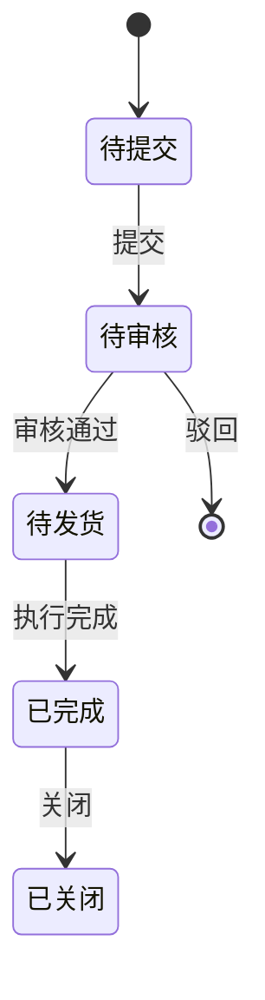
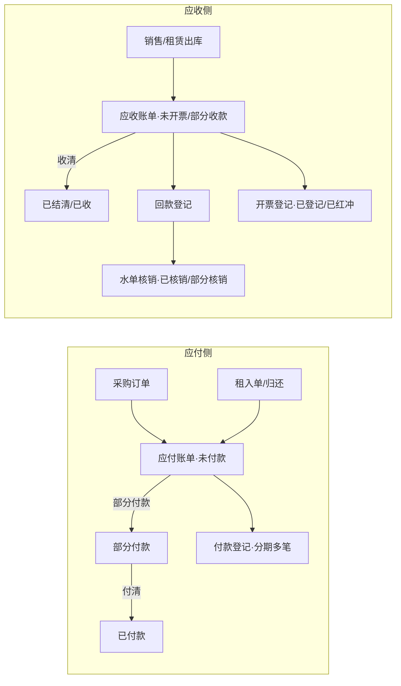
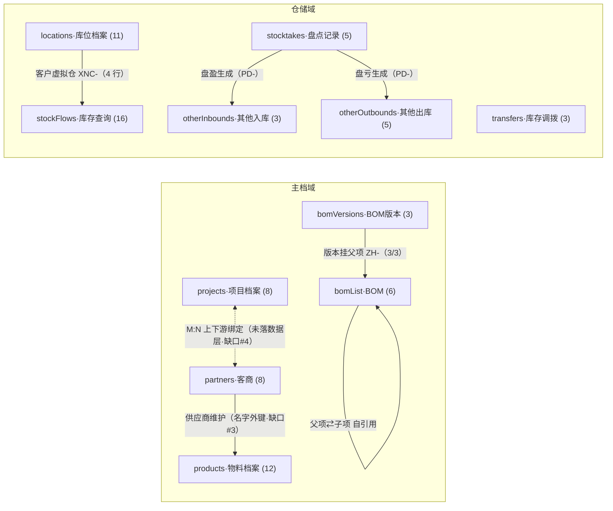
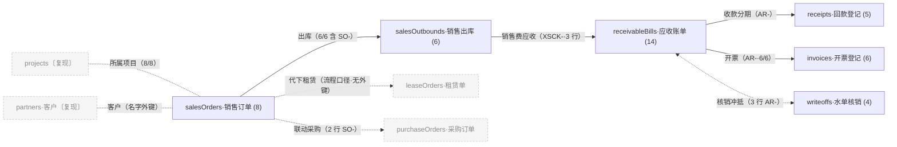
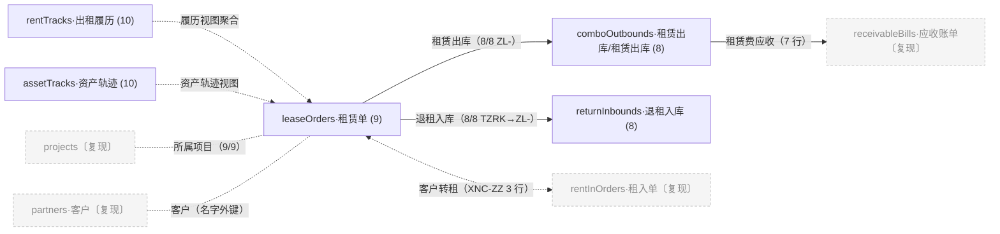
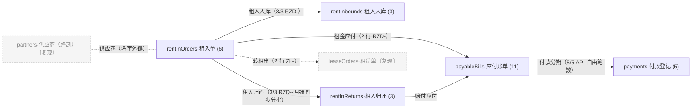

# P3-R01-A06 · 实体关系与状态机

> **版本**：V1.1（2026-09-11 · G16a 拆图版：第 5 节单图拆为 1 底图+4 流程线·道远拍板方案 A·新增同名 HTML 渲染版 7 图）  
> 原版 V1.0（2026-09-11 · G16 生成）  
> **统计**：实体 37（demo-data 全量）｜ 关系 29 条（逐条带证据）｜ 状态机 3 组  
> **来源**：`_data/demo-data.js` dump（`g16_data_dump.json`）互引扫描 + 页面消费关系；生成脚本 `_scan_tmpdir/g16_t3_gen.py`。  
> **姊妹篇**：`P3-R01-A05-字段字典.md`（实体→字段级）；页面层演示见 `系统管理/数据字典.html`（仅 dictItems 子集）。

## 1. 实体分域清单（37 实体）

| 域 | 实体键 | 中文名 | 承载页面 | 行数 |
|---|---|---|---|---|
| 基础资料 | `products` | 物料档案 | 基础数据/产品档案.html | 12 |
| 基础资料 | `partners` | 客商 | 基础数据/客商管理.html | 8 |
| 基础资料 | `locations` | 库位档案 | 基础数据/库位档案.html | 11 |
| 基础资料 | `bomVersions` | BOM 维护 | 基础数据/BOM维护.html | 3 |
| 基础资料 | `bomList` | BOM 列表 | 基础数据/BOM.html | 6 |
| 基础资料 | `dictItems` | 数据字典项 | 系统管理/数据字典.html | 45 |
| 项目管理 | `projects` | 项目档案 | 项目管理/项目档案.html | 8 |
| 项目管理 | `projectDocs` | 项目详情 | 项目管理/项目详情.html | 11 |
| 项目管理 | `boardRows` | 项目看板 | 首页/项目看板.html | 6 |
| 采购 | `purchaseOrders` | 采购订单 | 采购管理/采购订单列表.html | 7 |
| 采购 | `purchaseInbounds` | 采购入库 | 采购管理/采购入库列表.html | 8 |
| 销售 | `salesOrders` | 销售订单 | 销售管理/销售订单列表.html | 8 |
| 销售 | `salesOutbounds` | 销售出库 | 销售管理/销售出库列表.html | 6 |
| 租赁·租出 | `leaseOrders` | 租赁单 | 租赁管理/租赁单列表.html | 9 |
| 租赁·租出 | `comboOutbounds` | 租赁出库(租赁出库) | 租赁管理/租赁出库列表.html | 8 |
| 租赁·租出 | `returnInbounds` | 退租入库 | 租赁管理/退租入库列表.html | 8 |
| 租赁·租出 | `rentTracks` | 出租履历 | 库存查询·出租履历弹窗 | 10 |
| 租赁·租入 | `rentInOrders` | 租入单 | 租赁管理/租入单列表.html | 6 |
| 租赁·租入 | `rentInbounds` | 租入入库 | 租赁管理/租入入库列表.html | 3 |
| 租赁·租入 | `rentInReturns` | 租入归还 | 租赁管理/租入归还列表.html | 3 |
| 仓储 | `otherInbounds` | 其他入库 | 仓储作业/其他入库列表.html | 3 |
| 仓储 | `otherOutbounds` | 其他出库 | 仓储作业/其他出库列表.html | 5 |
| 仓储 | `stocktakes` | 盘点记录 | 仓储作业/盘点列表.html | 5 |
| 仓储 | `transfers` | 库存调拨 | 仓储作业/库存调拨列表.html | 3 |
| 仓储 | `stockFlows` | 库存查询 | 仓储作业/库存查询.html | 16 |
| 仓储 | `assetTracks` | 资产轨迹 | 库存查询·资产轨迹弹窗 | 10 |
| 财务 | `payableBills` | 应付账单 | 财务协同/应付账单.html | 11 |
| 财务 | `receivableBills` | 应收账单 | 财务协同/应收账单.html | 14 |
| 财务 | `payments` | 付款登记 | 财务协同/付款登记.html | 5 |
| 财务 | `receipts` | 回款登记 | 财务协同/回款登记.html | 5 |
| 财务 | `invoices` | 开票登记 | 财务协同/开票登记.html | 6 |
| 财务 | `writeoffs` | 银行水单核销 | 财务协同/银行水单核销.html | 4 |
| 财务 | `profitRows` | 项目损益 | 财务协同/盈亏报表.html | 6 |
| 系统 | `roles` | 角色 | 系统管理/角色管理.html | 9 |
| 系统 | `users` | 用户 | 系统管理/用户权限.html | 12 |
| 系统 | `opLogs` | 操作日志 | 系统管理/操作日志.html | 12 |
| 系统 | `todoItems` | 我的待办 | 首页/我的待办 | 12 |

> 建模约定（demo-data 头注）：**单号即外键**——实体间用单号互引不复制数据；`_key`（记录键）=单号/编码。

## 2. 核心关系表（29 条 · 逐条证据）

> 证据类型：`数据`=dump 记录内单号/编码互引（括注引用记录数）；`页面`=页面列/弹窗/注记；关系方向 A→B=A 持 B 的引用。

| # | 关系 | 类型 | 证据 |
|---|---|---|---|
| 1 | projects ↔ partners（上下游绑定） | M:N | 页面=上下游绑定.html 多选弹窗+项目档案绑定区+新建租入单/采购订单选项目→供应商候选=绑定集合（2026-09-11 落地）；**数据层未落**：projects 无 suppliers 字段（缺口 #4） |
| 2 | partners → products（供应商税率维护区） | 1:N | 数据=products 6/12 行带 supplier 名（苏州联恒/宁波华塑/常州正大）；名字外键（缺口 #3） |
| 3 | partners → purchaseOrders | 1:N | 数据=partners 3 条记录被 PO- 引用；purchaseOrders.fields.supplier=供应商名 |
| 4 | partners → rentInOrders / payableBills | 1:N | 数据=payableBills.fields.supplier（11 行）；rentInOrders 供应商=路凯（A04 流程链 L3） |
| 5 | partners → leaseOrders / receivableBills（客户侧） | 1:N | 数据=leaseOrders.fields.customer=客户名（9 行）；receivableBills 客户维度——名字外键同缺口 #3 |
| 6 | projects → leaseOrders / rentInOrders / purchaseOrders / salesOrders / stockFlows | 1:N | 数据=PRJ- 引用：leaseOrders 9/9、salesOrders 8/8、purchaseInbounds 8/8、payableBills 10/11、stockFlows fields.project、comboOutbounds 8/8、returnInbounds 8/8、salesOutbounds 6/6、assetTracks 8/10、profitRows 6/6（所属项目字段/筛选） |
| 7 | projects → boardRows（看板行=项目键直连） | 1:1 | 数据=boardRows._key=PRJ-2601…（6 行=6 项目） |
| 8 | projects → projectDocs（项目详情档案） | 1:N | 数据=projectDocs 记录按 PRJ- 分组挂项目（11 行） |
| 9 | bomVersions → bomList（版本挂父项） | N:1 | 数据=bomVersions 3/3 条 info.父项编码=ZH-2601-A（V1.0/V2.0/V2.1） |
| 10 | bomList 自引用（父项⇄子项） | 1:N | 数据=组合件行 ZH-2601-A/B/C 子项=WBX-/PLT-/BTC- 编码；BOM 语义=父项由子项按配比组成（术语表第四节） |
| 11 | salesOrders → leaseOrders（代下租赁） | 流程 | 页面/流程=订单唯一来源=项目经理代下销售订单（已拍板）；**数据层无 SO- 外键**（leaseOrders 0 行含 SO-）——流程口径非数据关系 |
| 12 | salesOrders → purchaseOrders | N:M | 数据=purchaseOrders 2 行含 SO-（销售联动采购）；页面=采购订单列表 so 筛选列 |
| 13 | leaseOrders → comboOutbounds（租赁出库） | 1:N | 数据=comboOutbounds 8/8 行含 ZL-（关联租赁单） |
| 14 | leaseOrders → returnInbounds（退租入库） | 1:N | 数据=returnInbounds 8/8 行含 ZL-（TZRK- 单引 ZL-，按单退租） |
| 15 | rentInOrders → rentInbounds（租入入库） | 1:N | 数据=rentInbounds 3/3 行含 RZD- |
| 16 | rentInOrders → rentInReturns（租入归还） | 1:N | 数据=rentInReturns 3/3 行含 RZD-（关联租入单+明细同步+分批） |
| 17 | rentInOrders ↔ leaseOrders（客户转租） | N:M | 数据=leaseOrders 2 行含 RZD-、rentInOrders 2 行含 ZL-；stockFlows XNC-ZZ-* 3 行状态=客户转租出（2026-09-10 转租演示线） |
| 18 | purchaseOrders → purchaseInbounds（采购入库） | 1:N | 数据=purchaseInbounds 8/8 行含 PO-（凭单验收） |
| 19 | salesOrders → salesOutbounds（销售出库） | 1:N | 数据=salesOutbounds 6/6 行含 SO- |
| 20 | purchaseOrders / rentInOrders / rentInReturns → payableBills（应付四来源） | 1:N | 数据=payableBills btype：采购应付 6/租金应付 2/赔付应付 1/对客户应付 1/预付 1；5 行含 PO-、3 行含 RZD- |
| 21 | salesOutbounds / comboOutbounds / 丢损 → receivableBills（应收四来源） | 1:N | 数据=receivableBills btype：租赁费 7/销售费 3（含 XSCK- 引用）/丢损赔偿 1/供应商应收 1/预付款 1/预收 1 |
| 22 | payableBills → payments（付款分期） | 1:N | 数据=payments 5/5 行含 AP-（分期自由笔数） |
| 23 | receivableBills → receipts（收款分期） | 1:N | 数据=receipts 5 行含 AR-（4 记录级） |
| 24 | receivableBills → invoices（开票） | 1:N | 数据=invoices 6/6 行含 AR- |
| 25 | receivableBills / receipts → writeoffs（水单核销） | N:M | 数据=writeoffs 3 行含 AR-；核销=收付款与账单多对多冲抵（银行水单核销页） |
| 26 | stocktakes → otherInbounds / otherOutbounds（盘盈亏生成其他出入库） | 1:N | 数据=otherInbounds 1 行含 PD-、otherOutbounds 1 行含 PD-（2026-09-11 盘点联动；关联单据列） |
| 27 | locations → stockFlows（客户虚拟仓） | 1:N | 数据=stockFlows XNC-* 4 行键=库位编码 XNC-AJZX（客户在租按客户归集 on-hire 口径） |
| 28 | todoItems → 全单据（审核待办） | N:1 | 数据=todoItems 12 行 docNo 弱引用 SO-/PO-/ZL-/RZD-/TZRK- 等单号+auditor 审核人；我的待办审核人筛选（G13） |
| 29 | rentTracks / assetTracks → leaseOrders / projects / products（履历视图） | 视图 | 数据=rentTracks 10 行含 ZL-/PRJ-；assetTracks 8/10 含 PRJ-——聚合视图实体，非独立业务对象 |

## 3. 状态机

### 3.1 单据审核流（全模块统一口径 · 术语表第四节）



> 各单据在统一骨架上有**执行态变体**（数据实测枚举）：

| 实体 | 实测状态枚举（dump 全量） |
|---|---|
| `salesOrders` 销售订单 | 待发货 / 待审核 / 已审核 / 已完成 / 已关闭 |
| `purchaseOrders` 采购订单 | 待审核 / 已审核 / 已完成 / 已关闭 |
| `leaseOrders` 租赁单 | 已退租 / 待审核 / 已审核 / 在租 / 已关闭 |
| `rentInOrders` 租入单 | 履行中 / 部分归还 / 待审核 / 已归还 / 已终止 / 新建(草稿) |
| `comboOutbounds` 租赁出库(租赁出库) | 已出库 / 拣货中 |
| `salesOutbounds` 销售出库 | 待审核 / 已完成 |
| `purchaseInbounds` 采购入库 | 已入库 / 待验收 |
| `rentInbounds` 租入入库 | 已入库 / 待入库 |
| `returnInbounds` 退租入库 | 待审核 / 已入库 |
| `rentInReturns` 租入归还 | 已归还 / 待审核 |
| `otherInbounds` 其他入库 | 待审核 / 已入库 |
| `otherOutbounds` 其他出库 | 已出库 / 待审核 / 已完成 |
| `stocktakes` 盘点记录 | 盘点中 / 待审核 / 已完成 |
| `transfers` 库存调拨 | 待审核 / 已完成 |
| `payments` 付款登记 | 待确认 / 已确认 |
| `receipts` 回款登记 | 待核销 / 部分核销 / 已核销 |
| `invoices` 开票登记 | 已红冲 / 已登记 / 停用 |
| `writeoffs` 银行水单核销 | 部分核销 / 已核销 |
| `payableBills` 应付账单 | 未付款 / 已付款 / 部分付款 |
| `receivableBills` 应收账单 | 未开票 / 已结清 / 已收 / 部分收款 |

> 档案类启停：products/partners/locations/bomList=启用/停用；projects=筹备中/进行中/已暂停/已完结。

### 3.2 库存状态（stockFlows · 口径漂移注记）

| 层 | 枚举 | 出处 |
|---|---|---|
| **数据实测**（16 行） | 在库 / 客户端(租出) / 客户转租出 / 退租待入库 | dump fields.status（ZH-* 组合行 3 行无状态） |
| **页面筛选** | 全部 / 在库 / 客户端(租出) / 客户转租出 / 退租待入库 | 仓储作业/库存查询.html 筛选 select |
| **历史口径**（09-08 五态） | 在库 / 在途(退租未审核) / 客户端(租出) / 退租库存 / 租入 | 会议拍板（已拍板不复议区） |

> **漂移结论**（G16 实测）：①「在途(退租未审核)」在数据层现名「退租待入库」（同义改名未回写会议口径）；②「退租库存」「租入」两态**无演示行**（缺口 #5）；③「客户转租出」为 09-10 转租演示新增态（会议口径之后产生）。09-11 已拍板**去数量词**（四态/五态字样全站清零 016ac01），口径=「库存状态」不带数字。

### 3.3 账单生命周期（四来源 → 分期收付 → 核销）



## 4. 数据缺口（与 A05 末节同源 · 5 条）

1. **采购订单实体无 project 字段**——列表页有「所属项目」筛选+M:N 联动，数据层缺投影字段。
2. **stockFlows 无供应商维度**——租入在库无法按供应商查；路凯对账需补 supplier 字段。
3. **partners 引用为公司名字符串**非 DW-xxx 编码——演示层名字匹配，正式版须改编码外键。
4. **上下游 M:N 绑定未落数据层**（G16 实测）——绑定弹窗 0 处 DEMO_DATA 引用、projects 无 suppliers 字段；正式版须建关系表。
5. **库存「租入」「退租库存」两态无演示行**（G16 实测）——含 3.2 节口径漂移三条。

## 5. 实体关系图（拆分版 · 2026-09-11 道远拍板方案 A：1 底图 + 4 流程线）

> **图例**：- `-->` 实线＝1:N 数据外键（单号互引，括注=引用记录数证据） ｜ `-.->` 虚线＝M:N / 视图 / 流程口径（数据层无外键） ｜ 灰色虚框节点＝跨图复现实体（真身见 5.1 或所属线图）

> **浏览器阅读**：全文渲染版 `P3-R01-A06-实体关系与状态机.html`（原型根目录·双击打开·本档全部章节+表格+7 图·内嵌 mermaid 离线可用·重跑脚本 `_scan_tmpdir/g16a_render.py`·md 仍为真值源）

### 5.1 主档与仓储底图

全站静态结构：主档域 + 仓储库存域。系统域（roles/users/opLogs/todoItems/dictItems）与履历视图（rentTracks/assetTracks/projectDocs/boardRows/profitRows）不入图，见第 1 节分域清单。



### 5.2 销售线

销售订单 → 出库 → 应收 → 收款/开票/核销。灰节点=跨图复现（真身见 5.1 / 5.5）。



### 5.3 租赁线（租出）

租赁单 → 租赁出库 / 退租入库 + 客户转租（与租入线 M:N）。灰节点=跨图复现。



### 5.4 租入线

租入单 → 入库 / 归还 → 应付 → 付款。灰节点=跨图复现。



### 5.5 采购线

采购订单 → 采购入库 → 应付 → 付款（尾段复现 5.4）。灰节点=跨图复现。

```mermaid
flowchart LR
  PO["purchaseOrders·采购订单 (7)"]
  CGR["purchaseInbounds·采购入库 (8)"]
  AP0["payableBills·应付账单〔复现 5.4〕"]
  PM0["payments·付款登记〔复现 5.4〕"]
  SO0["salesOrders·销售订单〔复现 5.2〕"]
  PG["projects〔复现〕"]
  SG["partners·供应商〔复现〕"]
  PO -->|"采购入库（8/8 PO-·凭单验收）"| CGR
  PO -. "采购应付（5 行 PO-）" .-> AP0
  AP0 -. "付款分期" .-> PM0
  PO <-. "联动采购（2 行 SO-）" .- SO0
  PG -. "所属项目（数据缺列·缺口#1）" .- PO
  SG -. "供应商（名字外键）" .- PO
  classDef gray fill:#f5f5f5,stroke:#bfbfbf,stroke-dasharray:4 3,color:#8c8c8c;
  class AP0,PM0,SO0,PG,SG gray;
```

> 跨线关系速查：销售⇄采购（联动采购 2 行 SO-）｜租赁⇄租入（客户转租 XNC-ZZ 3 行）｜盘点⇄其他出入库（盈亏生成）——均为虚线口径，证据详见第 2 节关系表 #12/#17/#24。
