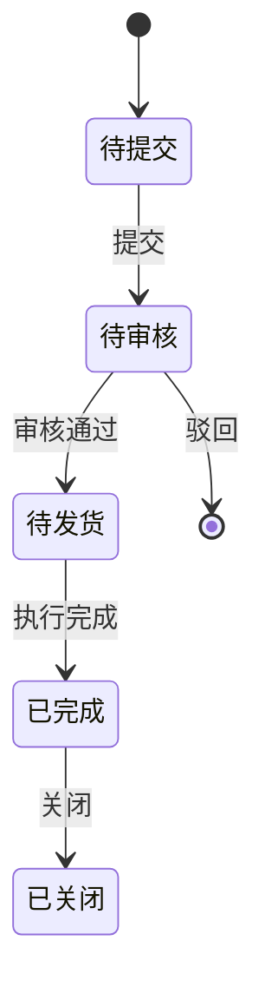
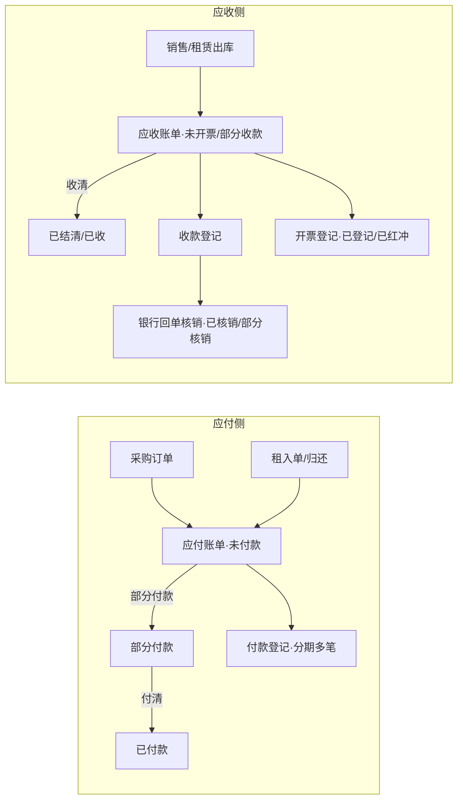
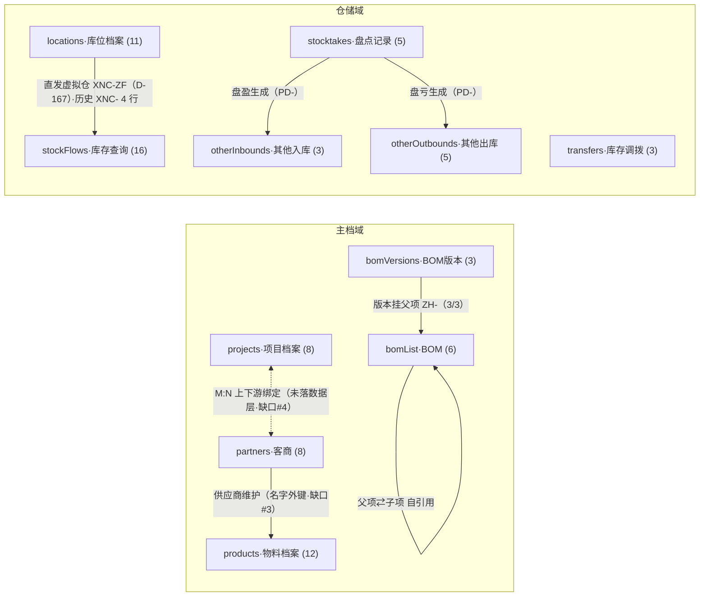
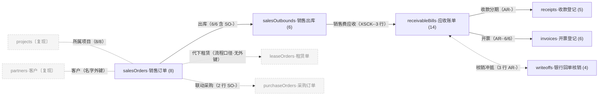
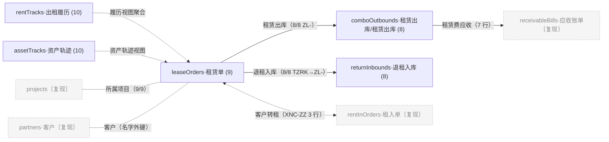
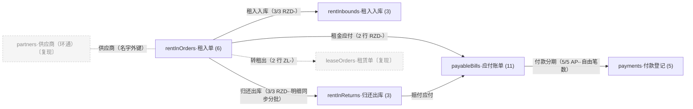

# P3-R01-A06 · 实体关系与状态机

> **版本**：V1.3（2026-09-29 · G78 退租入库显式关联租赁单：#14 关系改写〔两步选单＋关联租赁单号 10/10〕＋勘误 V1.2 初版「3/10 行含 CK-」系 GHCK- 子串误判＋§6 增 G78 条）  
> V1.2（2026-09-28 · G76 文档落后补账：统计实读刷新——**实体 43〔node 实读·记录 493〕**；§1 行数列随版刷新至现值；§2 关系 #14 改证＋新增 #30 直发链；新增 §6 版本演进登记〔G39~G75〕）  
> V1.1（2026-09-11 · G16a 拆图版：第 5 节单图拆为 1 底图+4 流程线·陆鸣拍板方案 A·新增同名 HTML 渲染版 7 图）  
> 原版 V1.0（2026-09-11 · G16 生成）  
> **统计**：实体 43（demo-data 全量·2026-09-28 G76 node 实读·43 实体 493 记录）｜ 关系 30 条（逐条带证据·V1.2：#14 改证退租两步选单＋新增 #30 直发链）｜ 状态机 3 组（V1.2 复核无变化·不重绘）  
> **来源**：`_data/demo-data.js` dump（`g16_data_dump.json`）互引扫描 + 页面消费关系；生成脚本 `_scan_tmpdir/g16_t3_gen.py`。  
> **姊妹篇**：`P3-R01-A05-字段字典.md`（实体→字段级）；页面层演示见 `系统管理/数据字典.html`（仅 dictItems 子集）。

## 1. 实体分域清单（43 实体·G76 复核实测 2026-09-28·node 仲裁〔43 实体 493 记录〕；37＝G16 时点，此后 +productTaxes〔09-11〕+purchaseReturns/salesReturns/refunds〔G33〕+transferOutbounds〔G37〕+stockEvents〔G39〕；**行数列＝V1.2 现值**·逐批次沿革见 §6）

| 域 | 实体键 | 中文名 | 承载页面 | 行数 |
|---|---|---|---|---|
| 基础资料 | `products` | 物料档案 | 基础数据/产品档案.html | 15 |
| 基础资料 | `partners` | 客商 | 基础数据/客商管理.html | 8 |
| 基础资料 | `locations` | 库位档案 | 基础数据/库位档案.html | 11 |
| 基础资料 | `bomVersions` | BOM 维护 | 基础数据/BOM维护.html | 3 |
| 基础资料 | `bomList` | BOM 列表 | 基础数据/BOM.html | 6 |
| 基础资料 | `productTaxes` | 供应商税率 | 基础数据/产品档案.html（税率行编辑器·09-11 增） | 5 |
| 基础资料 | `dictItems` | 数据字典项 | 系统管理/数据字典.html | 151 |
| 项目管理 | `projects` | 项目档案 | 项目管理/项目档案.html | 8 |
| 项目管理 | `projectDocs` | 项目详情 | 项目管理/项目详情.html | 11 |
| 项目管理 | `boardRows` | 项目看板 | 首页/项目看板.html | 6 |
| 采购 | `purchaseOrders` | 采购订单 | 采购管理/采购订单列表.html | 8 |
| 采购 | `purchaseInbounds` | 采购入库 | 采购管理/采购入库列表.html | 8 |
| 采购 | `purchaseReturns` | 采购退货单 | 采购管理/采购退货单列表.html（G33·方案 B） | 4 |
| 销售 | `salesOrders` | 销售订单 | 销售管理/销售订单列表.html | 8 |
| 销售 | `salesOutbounds` | 销售出库 | 销售管理/销售出库列表.html | 7 |
| 销售 | `salesReturns` | 销售退货单 | 销售管理/销售退货单列表.html（G33·方案 B） | 3 |
| 租赁·租出 | `leaseOrders` | 租赁单 | 租赁管理/租赁单列表.html | 9 |
| 租赁·租出 | `comboOutbounds` | 租赁出库(租赁出库) | 租赁管理/租赁出库列表.html | 11 |
| 租赁·租出 | `returnInbounds` | 退租入库 | 租赁管理/退租入库列表.html（**形态变更 0923·D-176**：取消自由新建→两步选单〔先选客户→选原租赁出库单带出明细·退租数量≤原出库〕·关联原出库单·反转 D-106/D-152④；**清洗审核动作 D-177**：清洗完工→待审核→审核通过→转可用库存·列表批量审核〔审核节点非库存状态〕） | 10 |
| 租赁·租出 | `transferOutbounds` | 转移出库单 | 租赁管理/转移出库列表.html（G37·D-146·状态流 待审核→已转移→已终止（D-151 加审）；**0923·D-178**：物料粒度不挂单号·虚拟化仅数据记录·详情「财务口径」=按客户结算口径生成——按租出客户在租赁出库侧/按转移客户在转移出库侧·单一模块生成不拆双账〔口径挂客商档案 partners〕） | 5 |
| 租赁·租出 | `rentTracks` | 出租履历 | 库存查询·出租履历弹窗 | 10 |
| 租赁·租入 | `rentInOrders` | 租入单 | 租入管理/租入单列表.html | 7 |
| 租赁·租入 | `rentInbounds` | 租入入库 | 租入管理/租入入库列表.html | 4 |
| 租赁·租入 | `rentInReturns` | 归还出库 | 租入管理/归还出库列表.html | 3 |
| 仓储 | `otherInbounds` | 其他入库 | 仓储作业/其他入库列表.html | 4 |
| 仓储 | `otherOutbounds` | 其他出库 | 仓储作业/其他出库列表.html | 5 |
| 仓储 | `stocktakes` | 盘点记录 | 仓储作业/盘点列表.html | 5 |
| 仓储 | `transfers` | 库存调拨 | 仓储作业/库存调拨列表.html | 3 |
| 仓储 | `stockFlows` | 库存查询 | 仓储作业/库存查询.html | 18 |
| 仓储 | `stockEvents` | 在租量事件流水 | 派生每日在租量·无独立页面（G39·D-148·不勾稽 D-106） | 23 |
| 仓储 | `assetTracks` | 资产轨迹（现行·开键与块注释同行尾易漏计——G41 检查注记） | 器具出租履历.html（物料详情/库存查询 openTrack·G61 版式统一·G67 器具→物料） | 10 |
| 财务 | `payableBills` | 应付账单 | 财务协同/应付账单.html | 13 |
| 财务 | `receivableBills` | 应收账单 | 财务协同/应收账单.html | 18 |
| 财务 | `payments` | 付款登记 | 财务协同/付款登记.html | 5 |
| 财务 | `receipts` | 收款登记 | 财务协同/收款登记.html | 5 |
| 财务 | `invoices` | 开票登记 | 财务协同/开票登记.html | 6 |
| 财务 | `writeoffs` | 银行回单核销 | 财务协同/银行回单核销.html | 4 |
| 财务 | `refunds` | 退款登记 | 财务协同/退款登记.html（G33·一页双向：应付退款对供应商／应收退款对客户） | 4 |
| 财务 | `profitRows` | 项目损益 | 财务协同/损益报表.html | 6 |
| 系统 | `roles` | 角色 | 系统管理/角色管理.html | 6 |
| 系统 | `users` | 用户 | 系统管理/用户权限.html | 8 |
| 系统 | `opLogs` | 操作日志 | 系统管理/操作日志.html | 10 |
| 系统 | `todoItems` | 我的待办 | 首页/我的待办 | 19 |

> 建模约定（demo-data 头注）：**单号即外键**——实体间用单号互引不复制数据；`_key`（记录键）=单号/编码。

## 2. 核心关系表（30 条 · 逐条证据）

> 证据类型：`数据`=dump 记录内单号/编码互引（括注引用记录数）；`页面`=页面列/弹窗/注记；关系方向 A→B=A 持 B 的引用。

| # | 关系 | 类型 | 证据 |
|---|---|---|---|
| 1 | projects ↔ partners（上下游绑定） | M:N | 页面=上下游绑定.html 多选弹窗+项目档案绑定区+新建租入单/采购订单选项目→供应商候选=绑定集合（2026-09-11 落地）；**数据层未落**：projects 无 suppliers 字段（缺口 #4） |
| 2 | partners → products（供应商税率维护区） | 1:N | 数据=products 6/12 行带 supplier 名（吴越联合/甬城塑业/延陵托盘）；名字外键（缺口 #3） |
| 3 | partners → purchaseOrders | 1:N | 数据=partners 3 条记录被 PO- 引用；purchaseOrders.fields.supplier=供应商名 |
| 4 | partners → rentInOrders / payableBills | 1:N | 数据=payableBills.fields.supplier（11 行）；rentInOrders 供应商=环通（A04 流程链 L3） |
| 5 | partners → leaseOrders / receivableBills（客户侧） | 1:N | 数据=leaseOrders.fields.customer=客户名（9 行）；receivableBills 客户维度——名字外键同缺口 #3 |
| 6 | projects → leaseOrders / rentInOrders / purchaseOrders / salesOrders / stockFlows | 1:N | 数据=PRJ- 引用：leaseOrders 9/9、salesOrders 8/8、purchaseInbounds 8/8、payableBills 10/11、stockFlows fields.project、comboOutbounds 8/8、returnInbounds 8/8、salesOutbounds 6/6、assetTracks 8/10、profitRows 6/6（所属项目字段/筛选） |
| 7 | projects → boardRows（看板行=项目键直连） | 1:1 | 数据=boardRows._key=PRJ-2601…（6 行=6 项目） |
| 8 | projects → projectDocs（项目详情档案） | 1:N | 数据=projectDocs 记录按 PRJ- 分组挂项目（11 行） |
| 9 | bomVersions → bomList（版本挂父项） | N:1 | 数据=bomVersions 3/3 条 info.父项编码=ZH-2601-A（V1.0/V2.0/V2.1） |
| 10 | bomList 自引用（父项⇄子项） | 1:N | 数据=组合件行 ZH-2601-A/B/C 子项=WBX-/PLT-/BTC- 编码；BOM 语义=父项由子项按配比组成（术语表第四节） |
| 11 | salesOrders → leaseOrders（代下租赁） | 流程 | 页面/流程=订单唯一来源=项目经理代下销售订单（已拍板）；**数据层无 SO- 外键**（leaseOrders 0 行含 SO-）——流程口径非数据关系 |
| 12 | salesOrders → purchaseOrders | N:M | 数据=purchaseOrders 2 行含 SO-（销售联动采购）；页面=采购订单列表 so 筛选列 |
| 13 | leaseOrders → comboOutbounds（租赁出库） | 1:N | 数据=comboOutbounds 8/8 行含 ZL-（关联租赁单） |
| 14 | comboOutbounds（→leaseOrders）→ returnInbounds（退租入库·两步选单·显式关联租赁单号） | 1:N | 数据=TZRK-20260908-011 chain 引 CK-20260829-012（D-176 两步选单·先选客户→选单带明细·退租数量≤原出库·反转 D-106）；**G78（0929）起全量显式挂「关联租赁单号」formRows 行 10/10**（9 条按客户挂 ZL-·TZRK-012 转租例外注记·新建页选单由出库单 fields.zl 带出）。**勘误**：V1.2 初版「3/10 行含 CK-」系 GHCK-（归还出库）子串误判——TZRK-010/-009 实引 GHCK-20260903-002/-001·真出库单引用仅 TZRK-011 一条。沿革：G16 时点 leaseOrders→returnInbounds（ZL- 互引）→G39 清退关联租赁单（D-106）→G57 反转挂出库单→G78 复挂租赁单号（经出库单链条·闭环三层显式） |
| 15 | rentInOrders → rentInbounds（租入入库） | 1:N | 数据=rentInbounds 3/3 行含 RZD- |
| 16 | rentInOrders → rentInReturns（归还出库） | 1:N | 数据=rentInReturns 3/3 行含 RZD-（关联租入单+明细同步+分批） |
| 17 | rentInOrders ↔ leaseOrders（客户转租） | N:M | 数据=leaseOrders 2 行含 RZD-、rentInOrders 2 行含 ZL-；stockFlows XNC-ZZ-* 3 行状态=客户转租出（2026-09-10 转租演示线） |
| 18 | purchaseOrders → purchaseInbounds（采购入库） | 1:N | 数据=purchaseInbounds 8/8 行含 PO-（凭单验收） |
| 19 | salesOrders → salesOutbounds（销售出库） | 1:N | 数据=salesOutbounds 6/6 行含 SO- |
| 20 | purchaseOrders / rentInOrders / rentInReturns → payableBills（应付四来源） | 1:N | 数据=payableBills btype：采购应付 6/租金应付 2/赔付应付 1/对客户应付 1/预付 1；5 行含 PO-、3 行含 RZD- |
| 21 | salesOutbounds / comboOutbounds / 丢损 → receivableBills（应收四来源） | 1:N | 数据=receivableBills btype：租赁费 7/销售费 3（含 XSCK- 引用）/丢损赔偿 1/供应商应收 1/预付款 1/预收 1 |
| 22 | payableBills → payments（付款分期） | 1:N | 数据=payments 5/5 行含 AP-（分期自由笔数） |
| 23 | receivableBills → receipts（收款分期） | 1:N | 数据=receipts 5 行含 AR-（4 记录级） |
| 24 | receivableBills → invoices（开票） | 1:N | 数据=invoices 6/6 行含 AR- |
| 25 | receivableBills / receipts → writeoffs（银行回单核销） | N:M | 数据=writeoffs 3 行含 AR-；核销=收付款与账单多对多冲抵（银行回单核销页） |
| 26 | stocktakes → otherInbounds / otherOutbounds（盘损益生成其他出入库） | 1:N | 数据=otherInbounds 1 行含 PD-、otherOutbounds 1 行含 PD-（2026-09-11 盘点联动；关联单据列） |
| 27 | locations → stockFlows（虚拟仓） | 1:N | 数据=stockFlows XNC-* 4 行键=历史客户虚拟仓编码 XNC-AJZX（D-006 前口径·历史流水保留）；**G54 起含系统内置直发虚拟仓 XNC-ZF**（D-167·直发租入入库/退租归还账面枢纽·不占实体库存·区别于 XNC-ZZ 转移物料编码） |
| 28 | todoItems → 全单据（审核待办） | N:1 | 数据=todoItems 12 行 docNo 弱引用 SO-/PO-/ZL-/RZD-/TZRK- 等单号+auditor 审核人；我的待办审核人筛选（G13） |
| 29 | rentTracks / assetTracks → leaseOrders / projects / products（履历视图） | 视图 | 数据=rentTracks 10 行含 ZL-/PRJ-；assetTracks 8/10 含 PRJ-——聚合视图实体，非独立业务对象 |
| 30 | rentInOrders → rentInbounds → comboOutbounds（直发链·系统自动生成） | 流程链 | 数据=CK-20260912-024 chain 引 RZD-20260912-010/RZRK-20260912-024、CK-20260914-023 引 RZD-（D-167·租入单 type=直发 审核后系统自动生成租入入库〔入直发虚拟仓 XNC-ZF〕与租赁出库·终态链三单互联·不经库存实体节点） |

## 3. 状态机

### 3.1 单据审核流（全模块统一口径 · 术语表第四节）

```mermaid
stateDiagram-v2
    [*] --> 待提交
    待提交 --> 待审核: 提交
    待审核 --> 待发货: 审核通过
    待审核 --> [*]: 驳回
    待发货 --> 已完成: 执行完成
    已完成 --> 已关闭: 关闭
```

> 各单据在统一骨架上有**执行态变体**（数据实测枚举）：

| 实体 | 实测状态枚举（dump 全量） |
|---|---|
| `salesOrders` 销售订单 | 待发货 / 待审核 / 已审核 / 已完成 / 已关闭 |
| `purchaseOrders` 采购订单 | 待审核 / 已审核 / 已完成 / 已关闭 |
| `leaseOrders` 租赁单 | 已退租 / 待审核 / 已审核 / 在租 / 已关闭 |
| `rentInOrders` 租入单 | 履行中 / 部分归还 / 待审核 / 已归还 / 已终止 / 新建(草稿) |
| `comboOutbounds` 租赁出库(租赁出库) | 已出库 / 拣货中 |
| `salesOutbounds` 销售出库 | 待审核 / 已完成 |
| `purchaseInbounds` 采购入库 | 已入库 / 待验收 |
| `rentInbounds` 租入入库 | 已入库 / 待入库 |
| `returnInbounds` 退租入库 | 待审核 / 已入库 |
| `rentInReturns` 归还出库 | 已归还 / 待审核 |
| `otherInbounds` 其他入库 | 待审核 / 已入库 |
| `otherOutbounds` 其他出库 | 已出库 / 待审核 / 已完成 |
| `stocktakes` 盘点记录 | 盘点中 / 待审核 / 已完成 |
| `transfers` 库存调拨 | 待审核 / 已完成 |
| `payments` 付款登记 | 待确认 / 已确认 |
| `receipts` 收款登记 | 待核销 / 部分核销 / 已核销 |
| `invoices` 开票登记 | 已红冲 / 已登记 / 停用 |
| `writeoffs` 银行回单核销 | 部分核销 / 已核销 |
| `payableBills` 应付账单 | 未付款 / 已付款 / 部分付款 |
| `receivableBills` 应收账单 | 未开票 / 已结清 / 已收 / 部分收款 |

> 档案类启停：products/partners/locations/bomList=启用/停用；projects=筹备中/进行中/已暂停/已完结。

### 3.2 库存状态（stockFlows · 口径漂移注记）

> **状态驱动方（G41 补·D-146）**：五态之外「客户转租出」由**转移出库单审核驱动**（行内「转移出库」跳转移出库新建·「终止转移」后回「在客户（租出）」）；原「转租登记弹窗/拉表改状态」交互已退场（D-78 被替代）。转移出库不勾稽原租赁单（D-106）·结算两模式见 P2-R01 D-132（按租出＝默认不进财务链路／按终端＝特例·账单主体切终端·历史不回改）。

| 层 | 枚举 | 出处 |
|---|---|---|
| **数据实测**（16 行） | 在库 / 客户端(租出) / 客户转租出 / 退租待入库 | dump fields.status（ZH-* 组合行 3 行无状态） |
| **页面筛选** | 全部 / 在库 / 客户端(租出) / 客户转租出 / 退租待入库 | 仓储作业/库存查询.html 筛选 select |
| **历史口径**（09-08 五态） | 在库 / 在途(退租未审核) / 客户端(租出) / 退租库存 / 租入 | 会议拍板（已拍板不复议区） |

> **漂移结论**（G16 实测）：①「在途(退租未审核)」在数据层现名「退租待入库」（同义改名未回写会议口径）；②「退租库存」「租入」两态**无演示行**（缺口 #5）；③「客户转租出」为 09-10 转租演示新增态（会议口径之后产生）。09-11 已拍板**去数量词**（四态/五态字样全站清零 016ac01），口径=「库存状态」不带数字。

### 3.3 账单生命周期（四来源 → 分期收付 → 核销）

```mermaid
flowchart LR
    subgraph 应付侧
    PO[采购订单] & RZ[租入单/归还] --> AP[应付账单·未付款]
    AP -->|部分付款| AP2[部分付款] -->|付清| AP3[已付款]
    AP --> PM[付款登记·分期多笔]
    end
    subgraph 应收侧
    SO[销售/租赁出库] --> AR[应收账单·未开票/部分收款]
    AR -->|收清| AR2[已结清/已收]
    AR --> RC[收款登记] --> WO[银行回单核销·已核销/部分核销]
    AR --> IV[开票登记·已登记/已红冲]
    end
```

## 4. 数据缺口（与 A05 末节同源 · 5 条）

1. **采购订单实体无 project 字段**——列表页有「所属项目」筛选+M:N 联动，数据层缺投影字段。
2. **stockFlows 无供应商维度**——租入在库无法按供应商查；环通对账需补 supplier 字段。
3. **partners 引用为公司名字符串**非 DW-xxx 编码——演示层名字匹配，正式版须改编码外键。
4. **上下游 M:N 绑定未落数据层**（G16 实测）——绑定弹窗 0 处 DEMO_DATA 引用、projects 无 suppliers 字段；正式版须建关系表。
5. **库存「租入」「退租库存」两态无演示行**（G16 实测）——含 3.2 节口径漂移三条。

## 5. 实体关系图（拆分版 · 2026-09-11 陆鸣拍板方案 A：1 底图 + 4 流程线）

> **图例**：- `-->` 实线＝1:N 数据外键（单号互引，括注=引用记录数证据） ｜ `-.->` 虚线＝M:N / 视图 / 流程口径（数据层无外键） ｜ 灰色虚框节点＝跨图复现实体（真身见 5.1 或所属线图）

> **浏览器阅读**：全文渲染版 `P3-R01-A06-实体关系与状态机.html`（原型根目录·双击打开·本档全部章节+表格+7 图·内嵌 mermaid 离线可用·重跑脚本 `_scan_tmpdir/g16a_render.py`·md 仍为真值源）

> **V1.2 注（2026-09-28）**：本节各图节点括号内计数为 G16 时点快照，未随版逐一回改（避免与 HTML 渲染页放大差异·渲染页自 G37 起滞后已登记）；实体行数现值一律以第 1 节分域清单为准。

### 5.1 主档与仓储底图

全站静态结构：主档域 + 仓储库存域。系统域（roles/users/opLogs/todoItems/dictItems）与履历视图（rentTracks/assetTracks/projectDocs/boardRows/profitRows）不入图，见第 1 节分域清单。

```mermaid
flowchart LR
  subgraph MASTER["主档域"]
    PROJECTS["projects·项目档案 (8)"]
    PARTNERS["partners·客商 (8)"]
    PRODUCTS["products·物料档案 (12)"]
    BOMLIST["bomList·BOM (6)"]
    BOMVER["bomVersions·BOM版本 (3)"]
  end
  subgraph WH["仓储域"]
    LOCATIONS["locations·库位档案 (11)"]
    STOCK["stockFlows·库存查询 (16)"]
    STK["stocktakes·盘点记录 (5)"]
    OIN["otherInbounds·其他入库 (3)"]
    OOUT["otherOutbounds·其他出库 (5)"]
    TRF["transfers·库存调拨 (3)"]
  end
  PROJECTS <-."M:N 上下游绑定（未落数据层·缺口#4）".-> PARTNERS
  PARTNERS -->|"供应商维护（名字外键·缺口#3）"| PRODUCTS
  BOMLIST -->|"父项⇄子项 自引用"| BOMLIST
  BOMVER -->|"版本挂父项 ZH-（3/3）"| BOMLIST
  LOCATIONS -->|"直发虚拟仓 XNC-ZF（D-167）·历史 XNC- 4 行"| STOCK
  STK -->|"盘盈生成（PD-）"| OIN
  STK -->|"盘亏生成（PD-）"| OOUT
  classDef gray fill:#f5f5f5,stroke:#bfbfbf,stroke-dasharray:4 3,color:#8c8c8c;
  class PROJECTS,PARTNERS anchor;
```

### 5.2 销售线

销售订单 → 出库 → 应收 → 收款/开票/核销。灰节点=跨图复现（真身见 5.1 / 5.5）。

```mermaid
flowchart LR
  SO["salesOrders·销售订单 (8)"]
  XSC["salesOutbounds·销售出库 (6)"]
  AR["receivableBills·应收账单 (14)"]
  RC["receipts·收款登记 (5)"]
  IV["invoices·开票登记 (6)"]
  WO["writeoffs·银行回单核销 (4)"]
  ZL0["leaseOrders·租赁单"]
  PO0["purchaseOrders·采购订单"]
  PG["projects〔复现〕"]
  CUG["partners·客户〔复现〕"]
  SO -->|"出库（6/6 含 SO-）"| XSC
  XSC -->|"销售费应收（XSCK-·3 行）"| AR
  AR -->|"收款分期（AR-）"| RC
  AR -->|"开票（AR-·6/6）"| IV
  AR <-."核销冲抵（3 行 AR-）".-> WO
  SO -. "代下租赁（流程口径·无外键）" .-> ZL0
  SO -. "联动采购（2 行 SO-）" .-> PO0
  PG -. "所属项目（8/8）" .- SO
  CUG -. "客户（名字外键）" .- SO
  classDef gray fill:#f5f5f5,stroke:#bfbfbf,stroke-dasharray:4 3,color:#8c8c8c;
  class ZL0,PO0,PG,CUG gray;
```

### 5.3 租赁线（租出）

租赁单 → 租赁出库 / 退租入库 + 客户转租（与租入线 M:N）。灰节点=跨图复现。

```mermaid
flowchart LR
  ZL["leaseOrders·租赁单 (9)"]
  ZUC["comboOutbounds·租赁出库/租赁出库 (8)"]
  TUI["returnInbounds·退租入库 (8)"]
  RT["rentTracks·出租履历 (10)"]
  AT["assetTracks·资产轨迹 (10)"]
  AR0["receivableBills·应收账单〔复现〕"]
  RZD0["rentInOrders·租入单〔复现〕"]
  PG["projects〔复现〕"]
  CUG["partners·客户〔复现〕"]
  ZL -->|"租赁出库（8/8 ZL-）"| ZUC
  ZL -->|"退租入库（8/8 TZRK→ZL-）"| TUI
  ZUC -->|"租赁费应收（7 行）"| AR0
  ZL <-."客户转租（XNC-ZZ 3 行）".-> RZD0
  RT -. "履历视图聚合" .-> ZL
  AT -. "资产轨迹视图" .-> ZL
  PG -. "所属项目（9/9）" .- ZL
  CUG -. "客户（名字外键）" .- ZL
  classDef gray fill:#f5f5f5,stroke:#bfbfbf,stroke-dasharray:4 3,color:#8c8c8c;
  class AR0,RZD0,PG,CUG gray;
```

### 5.4 租入线

租入单 → 入库 / 归还 → 应付 → 付款。灰节点=跨图复现。

```mermaid
flowchart LR
  RZD["rentInOrders·租入单 (6)"]
  ZR["rentInbounds·租入入库 (3)"]
  GH["rentInReturns·归还出库 (3)"]
  AP["payableBills·应付账单 (11)"]
  PM["payments·付款登记 (5)"]
  ZL0["leaseOrders·租赁单〔复现〕"]
  SG["partners·供应商（环通）〔复现〕"]
  RZD -->|"租入入库（3/3 RZD-）"| ZR
  RZD -->|"归还出库（3/3 RZD-·明细同步分批）"| GH
  RZD -->|"租金应付（2 行 RZD-）"| AP
  GH -->|"赔付应付"| AP
  AP -->|"付款分期（5/5 AP-·自由笔数）"| PM
  RZD -. "转租出（2 行 ZL-）" .-> ZL0
  SG -. "供应商（名字外键）" .- RZD
  classDef gray fill:#f5f5f5,stroke:#bfbfbf,stroke-dasharray:4 3,color:#8c8c8c;
  class ZL0,SG gray;
```

### 5.5 采购线

采购订单 → 采购入库 → 应付 → 付款（尾段复现 5.4）。灰节点=跨图复现。

```mermaid
flowchart LR
  PO["purchaseOrders·采购订单 (7)"]
  CGR["purchaseInbounds·采购入库 (8)"]
  AP0["payableBills·应付账单〔复现 5.4〕"]
  PM0["payments·付款登记〔复现 5.4〕"]
  SO0["salesOrders·销售订单〔复现 5.2〕"]
  PG["projects〔复现〕"]
  SG["partners·供应商〔复现〕"]
  PO -->|"采购入库（8/8 PO-·凭单验收）"| CGR
  PO -. "采购应付（5 行 PO-）" .-> AP0
  AP0 -. "付款分期" .-> PM0
  PO <-. "联动采购（2 行 SO-）" .- SO0
  PG -. "所属项目（数据缺列·缺口#1）" .- PO
  SG -. "供应商（名字外键）" .- PO
  classDef gray fill:#f5f5f5,stroke:#bfbfbf,stroke-dasharray:4 3,color:#8c8c8c;
  class AP0,PM0,SO0,PG,SG gray;
```

> 跨线关系速查：销售⇄采购（联动采购 2 行 SO-）｜租赁⇄租入（客户转租 XNC-ZZ 3 行）｜盘点⇄其他出入库（损益生成）——均为虚线口径，证据详见第 2 节关系表 #12/#17/#24。

## 6. 版本演进登记（V1.2 · 2026-09-28 G76 文档补账 · G39~G75 实体/关系/状态演进）

> 增订原则：按证据补登（真值源优先级＝demo-data 实读＞A05 各登记节＞A02 版本行＞拍板登记）；无实体层影响的批次记一句不展开。V1.1 期间（09-11~09-23）正文散落的内嵌小改（如关系 #27 XNC-ZF、returnInbounds/transferOutbounds 行 0923 口径）随本次核对在案·不重复登记。

- **G39（D-148·09-16）**：+`stockEvents` 在租事件流水实体（42→43·实体数自此定格 43）——出库/入库当日计入·退租/归还当日仍计次日起减·派生每日在租量·不动 stockFlows 快照职责；node 实读现值 23 行。
- **G42（D-152·09-16）**：数据补齐——partners +invoiceTaxNo＋开票资料段、refunds 退款类型 TKL 2→4（采购退货退款/销售退货退款/预收退回/多付退回·现 4 行）、dictItems 至 150 项、20 实体详情 info 补差 273 行；实体数不变。
- **G54（D-167·09-19）**：locations +`XNC-ZF` 系统内置直发虚拟仓（10→11 行·ops 置空不可删改）＋字典 KW-05 虚拟仓（dictItems 150→151）＋rentInOrders +`type` 字段（直发/自发·现 7 行）＋直发终态链 3 新单（新增关系 #30）——关系 #27 已内嵌更新（V1.1 期间小改·核对在案）。
- **G57/G58（D-176~D-185·09-23）**：partners +`stype` 供应商类型（多选·多重身份）＋「合作信息」sec 结算口径（按租出/按转移·D-178）＋开票信息协议税点行；四单据外部订单号（供应商订单号/客户订单号·无独立键·formRows+cells 承载·D-179）；**退租两步选单**（returnInbounds 关联原租赁出库单·关系 #14 改证·反转 D-106）；returnInbounds timeline 清洗完工审核节点（D-177·非库存状态）；菜单「退租入库」曾改「退租登记」后回改（G63f）。**G63（09-23）**：全列表创建日期——23 列表页＋demo-data 24 实体 +`createdAt`＋cells 末格（A05 登记口径）。
- **G60（D-186·09-23）**：partners 开票资料/收货信息**多组 sec** 形态——DW-0001 双开票（长春总部 13%＋沈阳分公司 9%）＋双地址（node 实读 sec 组数=2 证实）；**字段随组口径**：开票六要素＋收款账号随组·结算周期/备注客商级不随组（默认决策登记）。**G68（09-24）**：协议税点退场＋发票类型改生成式（专票×供应商税率字典各档＋普票）＋结算周期移入基础信息（客商级）。
- **G64/G64b（09-24）**：purchaseOrders 7→8（+PO-20260910-019 待审核演示单·行内审核入口）、purchaseReturns 3→4（+CGTH-20260915-004）、todoItems 18→19（+采购退货首条演示行）——**记录总数 491→493**（node 实读 2026-09-28 与 A05 末行口径一致）。
- **G70（09-24）**：stocktakes `scope` 显示名「盘点范围」→「盘点库位」·值集来源改**库位档案 11 行**（全区/分区/具体库位两级·不含虚拟仓）——值集来源变化·非结构变化。
- **G73~G75（09-24）**：列表批量审核弹窗（14 页）/「生成XX单」跳转修复（13 处）/盘点列表生成 op 收敛到明细层——纯 UI/ops 层·**实体模型零变化**。
- **G78（09-29）**：returnInbounds 全量 +「关联租赁单号」formRows 行（10/10·道远「退租入库单必须关联租赁单」·新建页候选表加列＋信息卡由出库单 fields.zl 只读带出）；顺修 CK-20260829-012 zl 跨客户瑕疵（ZL-20260301-006〔东海〕→ZL-20260823-033〔华骏〕·记录内 4 处·保新建带出值与详情一致）；实体/记录数 43/493 不变。
- **状态机 3 组**：V1.2 复核——单据审核流/库存状态/账单生命周期骨架与驱动方式无变化（转移出库审核驱动 D-151、退租两步与清洗审核 D-176/D-177 已在 §3.2 注记与 A05 登记·不重绘）。
