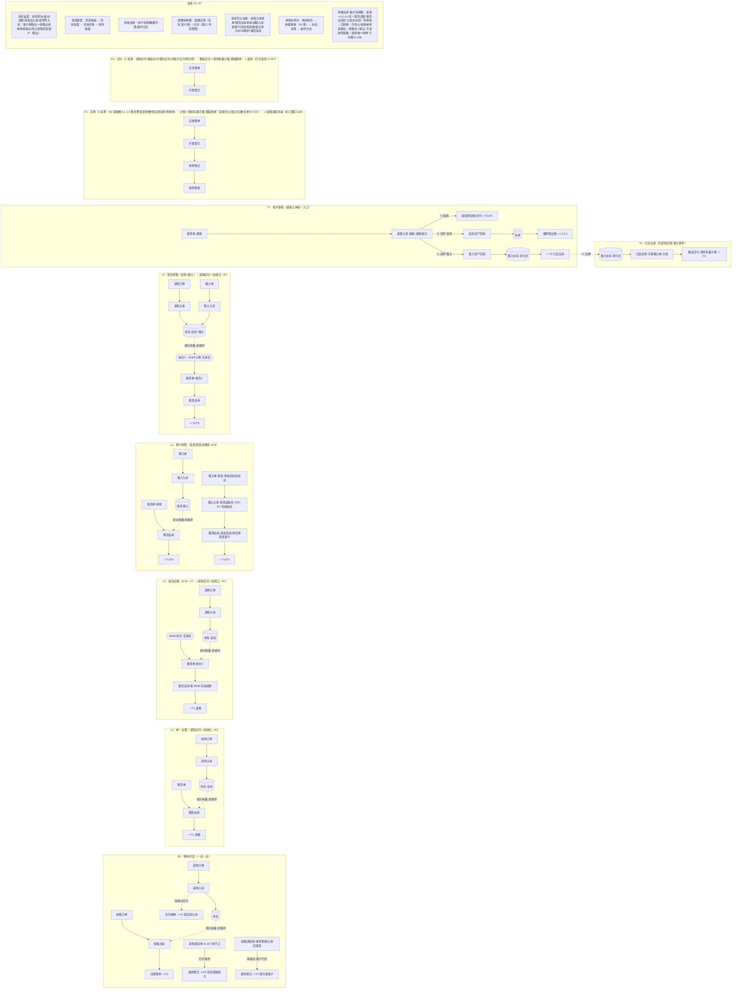

# P3-R01-F01 业务流程导航图 · 流程信息

> **版本**：v4.0（2026-09-21 重绘版正式替代）｜**维护口径**：本文件夹 = F01 全部载体——三张流程图（主线 / 退租归还与财务 / 支线）＋ 三张状态机（转移出库 / 销售订单 / 库存五态）承载**图与跳转**；本 md 承载**图以外的全部信息**（口径、前置资料、会议依据原话、版本沿革、Mermaid 源、图例语义、旧版取回）。
>
> 三张图内不重复本 md 内容，保持干净；改图不改这里、改口径必同步这里。
>
> 旧版单文件导航图（v3.9 及更早 · 含开发规则 md）已于 2026-09-21 归档，取回方式见 §8。

---

## 1. 全图口径与演示建议

- **原型规模**：131 页（PC 126＋mobile 5）。
- **可点页面目标共 49 个**：三张流程图节点直点 43 个＋本 md §3 清单 6 个。
- **弹窗页面化后仅余 3 个确认类弹窗**（付款确认 / 收款核销确认 / 删除二次确认类）。
- **单一管理端**；订单唯一来源：项目经理代下销售订单（客户 PO）。
- **泳道总口径**：7 条主线泳道（B1/L1/L2/L3/L4 全部第一期实现·L3/L4 为 2026-09-04 拍板升级·退租两事件=T1 客户退租＋T2 归还出库·泳道止于出库，退租及后续在 T1/T2）＋ 7 条支线 S1–S7（转移出库自 L1–L4 抽离为独立支线 · 采购应付已并入 F2）。
- **演示建议**：从 L1/L2 租赁线开始（库存查询「客户在租」下钻＋租赁单退回进度为亮点），再走 B1 买卖线（更简单快速）。
- **图间导航**：每张图右下角「导航」菜单可在主线 / 退租归还与财务 / 支线 / 三张状态机 / 本 md 之间互跳。

## 2. 前置基础资料与编号规则（全部主线共用）

| 基础资料 | 页面 | 说明 |
|---|---|---|
| 客商管理 | [`../基础数据/客商管理.html`](../基础数据/客商管理.html) | 客商统一档案（09-08 起客商去供应商分类） |
| 物料档案 | [`../基础数据/产品档案.html`](../基础数据/产品档案.html) | 四参考价 · 三段式计费（参考价与单据单价脱钩·09-15 拍板） |
| 库位档案 | [`../基础数据/库位档案.html`](../基础数据/库位档案.html) | 含直发虚拟仓 XNC-ZF（系统内置不可删改·D-167） |
| BOM组合 | [`../基础数据/BOM.html`](../基础数据/BOM.html) | 组合配方 A+B→C（图上 L2/L4 泳道可直接点入） |

- **编号规则**：B 买卖 · L 租赁（L1 单一 / L2 组合 / L3 租入转租 / L4 混合）· T 退租/归还（T1 客户退租 / T2 归还出库）· F 财务（F1 应收 / F2 应付）· S 支线（S1 库存运营 – S7 转移出库）。
- **入库凭单验收 · 指令来源 4 种**：采购入库←采购订单 ｜ 租入入库←租入单 ｜ 退租入库←客户退回直接录入 ｜ 其他入库←手工（例外）。

## 3. 图上未挂跳转的页面入口（6 个）

以下页面在旧版图中以小字/次要入口出现，重绘版图上未设节点，统一在此登记（合计入 49 目标口径）：

| 页面 | 路径 | 原图位置与说明 |
|---|---|---|
| 上下游绑定 | [`../项目管理/上下游绑定.html`](../项目管理/上下游绑定.html) | S2 项目经营——上下游绑定 · 详情页可查全流程明细 |
| 角色管理 | [`../系统管理/角色管理.html`](../系统管理/角色管理.html) | S3 系统支撑——角色权限矩阵独立页 |
| 付款确认 | [`../财务协同/付款确认.html`](../财务协同/付款确认.html) | F2 应付——付款登记旁确认弹窗（可独立打开） |
| 客商管理 | [`../基础数据/客商管理.html`](../基础数据/客商管理.html) | 前置基础资料（见 §2） |
| 物料档案 | [`../基础数据/产品档案.html`](../基础数据/产品档案.html) | 前置基础资料（见 §2） |
| 库位档案 | [`../基础数据/库位档案.html`](../基础数据/库位档案.html) | 前置基础资料（见 §2） |

另有两处图上节点为**非页面节点**（旧版挂的是近似页面链接，重绘版按语义不再挂跳转）：主线 L4「组合 C·BOM 计算」（虚拟计算·无库存·无独立页面）与退租图「⇢ T2 交棒」（跨图交棒出口·指向退租归还与财务图的 T2 泳道）。

## 4. 会议依据全量（原话只加不改）

> 旧版图内「📎 会议材料」弹窗的 SRC_DATA 全量迁移，8 组逐字保留。

### B1 · 物料买卖 · 会议依据

| 来源 | 原话/决议 |
|---|---|
| 第2次沟通 [音频转写] · 袁丽晶 40:15 | "买卖就是我进来什么我出去什么，我的租赁才会有涉及到组合"——A+B 组合只属于租赁 |
| 第2次沟通 [音频转写] · 袁丽晶 21:46 | "先销售后采购，或者我采购订单先入库之后再生成销售订单，我觉得这个可以互通关系都没问题" |
| 决策变更 · 第3次沟通前内部沟通 [音频转写] · 王琳总 2:18 / 2:36 | "销售和采购不是匹配关系……不是以销定产，肯定不是以销定产。即使它是，也要人为把它拆开"；"这是两条线，销售直接就是销售出入，采购是单独的" |
| 同上 · 王琳总 0:40 / 1:35 / 3:27 | "采购订单分两类，一类是采购零件的……可以公用"；"肯定要入库指令才能入库……知道你要入十个，我还验收，来的是不是十个……信息和物资去匹配才能形成完整的闭环"；"入库的指令来源于4种" |
| v3.0 · 2026-09-08 会议拍板 | 组装/拆卸/退租申请/丢损赔偿单四模块移除——库存结果导向（出库按 BOM 组合扣减·退租按零件入库·赔偿直接建应收/应付）；财务应收应付各 4 来源；器具+零部件合并物料档案；客商去供应商；六角色审核；客户虚拟仓（on-hire）与客户转租最简化 |
| 同上 · 道远 3:49（王琳总确认） | "这个退租入库给它拆出来……主要复杂就在于要退租"——各租赁线退租独立成段；v2.9 泳道内压缩为「退租」占位节点，完整四链路见 T1 专项 |
| D-157 · 2026-09-18 采购退货两守卫（道远拍板） | 入库前已付款→退货退款（退款额≤应付已付额·退款登记提交时校验）；入库前未付款→不立退款单（拒收未入库不挂账自终结／入库后退货冲减在途应付）；应付生成口径＝验收通过的实际入库数量 |
| G33 · 2026-09-15 销售退货与退款闭环（D-123 方案 B） | 采购退货单/销售退货单/退款登记三组页面落地；销售退货→应收退款（客户·我方付款·审核后登记）＋未收部分冲减应收（负数行）；退款类型 TKL 4 值（G42 扩：采购退货退款/销售退货退款/预收退回/多付退回） |

### L1 · 单一出租 · 会议依据

| 来源 | 原话/决议 |
|---|---|
| 第2次沟通 [会后补充] · 袁丽晶 | "采购A，出租A" |
| 第2次沟通 [音频转写] · 王琳总 40:58 | "我有可能直接租给他了"——不经组装的直接出租 |

### L2 · 组合出租 · 会议依据

| 来源 | 原话/决议 |
|---|---|
| 第2次沟通 [音频转写] · 王琳总 48:02 | "A是大箱子，B是隔板。我把A+B，跟客户说这个叫C，我租C给你" |
| 第2次沟通 [会后补充] · 袁丽晶 | "采购A、B、C包材，组装后出租，涉及到系统的组合件（或子母件）"；"退租明细入库，按照ABC单独的包材入库（而不是组合入库）" |

### L3 · 租入转租 · 决策变更（暂缓 → 第一期实现）＋ 直发/自发双路径（D-167）

| 来源 | 原话/决议 |
|---|---|
| 第2次沟通 [音频转写] · 袁丽晶 37:35 | "第三种业务……不是我自投的资产，我租到人家的给客户……但第三种情况可以先等等" |
| 第2次沟通 [音频转写] · 袁丽晶 32:xx | "目前我们可能是以自己的资产为主，先做到这个系统里面……租了人家的东西再转租出去，可能会先放一放" |
| 决策变更 · 2026-09-04 道远拍板 | L3 第一期闭环：租入单 / 租入入库 / 归还出库独立成单（不公用采购入库与其他出库），租金按月生成「租金应付」进应付账单 |
| D-167 · 2026-09-19 背靠背直发与虚拟仓（袁工 09-18 口径·道远 09-19 确认） | 租入单加类型（直发单/自发单·radio）：直发单审核后系统自动生成租入入库（入直发虚拟仓 XNC-ZF·字典 KW-05·系统内置不可删改·不占实体库存）并自动生成租赁出库（终态链 RZD-010→RZRK-024→CK-024）——不经库存实体节点；人工单据不可手选虚拟仓（下拉 filterV 排除） |
| D-167 · 客户报数维护（会后待办 #15） | 客户报数增减经其他入库「报数调整」单人工调整虚拟仓账面（QTRK-004 演示单） |

### L4 · 混合转租 · 会议依据与拍板

| 来源 | 原话/决议 |
|---|---|
| 第2次沟通 [音频转写] · 王琳总 48:02 | "也有买加租的，买买零散的东西。比如说我买一个大箱子……我去买了四个隔板放进去，然后租了个大箱子……这个时候它会形成一个新的零部件" |
| 落实计划 · 拍板 A1 | "第一期统一纳入循环包装管理，不严格区分权属，档案可标记来源" |
| 决策升级 · 2026-09-04 道远拍板 | L4 第一期闭环：自购+租入混合组装；租入单据独立成单，退租拆散按来源分流归还；应付侧＝采购应付＋租金应付双线 |
| 画法修正 · 2026-09-05 道远指出 | 自购与租入为并行来料非串行（v2.9 修正双线画法）；租入入库显式成节点，不再合并隐含于租入单 |
| v3.2 · 2026-09-10（09-08 结果导向落实） | L4 组合环节去流程化：节点改「组合 C·BOM 计算」——出库按 BOM 扣减自有+租入组件，无组装单（09-08 已拍板本项目移除组装/拆卸） |

### T1 · 客户退租（退租入库）· 会议依据与拍板

| 来源 | 原话/决议 |
|---|---|
| 第3次沟通前内部沟通 [音频转写] · 道远 3:49（王琳总确认） | "那这个退租入库给他拆出来……主要复杂就在于要退租"——退租按资产来源×是否拆散分 4 链路：L1 直接回库 / L2 按BOM拆散 / L3 整箱退回 / L4 拆散分流 |
| 第2次沟通 [会后补充] · 袁丽晶 | "退租明细入库，按照ABC单独的包材入库（而不是组合入库）"——L2/L4 拆散入库依据 |
| 决策修正 · 2026-09-05 道远拍板 | 核对二分：要么赔偿（缺损/丢失/严重损坏无差别，同走丢损赔偿——自有→应收 · 租入→应付），要么完好继续归还分流——L1 直接回库 / L2 按BOM拆散（拆卸管理）散件回库再组装 / L3 整箱退回转归还 / L4 拆散分流双线应付；完好回库不单列（②即完好后的去向），报废不再单列支；泳道止于租赁出库，退租后链路全部归 T1 |
| 决策修正 · 2026-09-10 道远拍板 | 退租两事件模型：退租入库＝客户退租统一入口（全部资产·验收+缺损核对·按单一物料/拆后零件记录，是否拆散＝记录粒度非流程分支）；归还出库＝归还供应商独立事件（关联租入单·同步明细·分批）；四路分支取消，L4＝两事件按明细行归属组合；租入未转租可直接归还出库；台账合并＝租出台账并入租赁单列表（退回进度列）·在租台账并入库存查询（客户在租下钻） |
| D-167 · 2026-09-18/19 直发件退租口径 | 直发件退租＝人工录入（客户报数触发）→系统识别直发类型→库位自动带出直发虚拟仓（TZRK-009 演示行） |

### T2 · 归还出库（归还供应商）· 会议依据与拍板

| 来源 | 原话/决议 |
|---|---|
| 决策变更 · 2026-09-04 道远拍板 | L3 第一期闭环：租入单 / 租入入库 / 归还出库独立成单（不公用采购入库与其他出库），租金按月生成「租金应付」进应付账单 |
| 决策修正 · 2026-09-10 道远拍板 | 归还出库＝归还供应商独立事件（关联租入单·同步明细·分批）；双入口：客户退租回库的租入行（先回库再归还）｜ 租入未转租（租入在库）直接归还——不经退租入库（无客户环节） |
| v3.3 · 2026-09-10 拆分 | 退租专项由单条 T1 拆分为 T1 客户退租 / T2 归还出库两条编号流程——两事件方向相反（客户→我方 ｜ 我方→供应商）；T1 止于回库，L4＝T1+T2 按明细行归属组合 |
| D-167 · 2026-09-18 口径（视频纪要两处模糊以录音为准） | 背靠背租入件：系统识别直发类型后自动生成归还出库（GHCK-001 首插 11:05 系统自动生成节点）——退租入库=人工 · 归还出库=系统 |

### 财务通道 F1 应收 / F2 应付 · 会议依据

| 来源 | 原话/决议 |
|---|---|
| 第2次沟通 [音频转写] · 袁丽晶 43:24 | "不管是租赁一单还是销售单，是可以完全绑定起来的。我从销售单/租赁单里面去申请开票对账，同步到财务，财务做开票、发票上传，再是客户回款、水单核销、收款核销" |
| 第2次沟通 [会后补充] · 袁丽晶 | "不管买卖类还是租赁类，后期对账结算，可以同步到财务模块"——v2.9 通道节点化：应收/应付双行具体流程 |
| D-157 / G33 · 退货退款通道（v3.9 补） | B1 两条退货回程线各自链到退款登记（一页双向）：①采购侧已付条件（供应商退我方⇢F2·D-157）②销售侧审核后登记（我方退客户·应收侧⇢F1·G33·未收部分冲减应收） |

## 5. 版本沿革（v3.0 → v4.0）

- **v4.0（09-21 重绘替代）**：原单文件导航图退役归档（取回见 §8）——现行载体＝archify 重绘三图（主线 38 节点 / 退租归还与财务 16 节点 / 支线 30 节点）＋状态机三张＋本 md；会议依据/沿革/口径/前置资料/Mermaid 源全部迁入本 md（图保持干净）；节点→页面跳转层随图（43 目标直点＋§3 清单 6 个＝49 口径不变）；开发规则 md 随旧版归档（archify 图改图走 spec.json）。
- **v3.9（09-20 直发与退货对齐）**：L3 补背靠背直发分叉（租入单直发→系统自动租入入库入直发虚拟仓 XNC-ZF→系统自动租赁出库·不经库存实体节点·D-167）＋T1/T2 退租归还链虚拟仓口径注记＋B1 补采购/销售退货回程两行两链（①采购侧：采购退货单→已付条件→退款登记⇢F2·两守卫 D-157 ②销售侧：销售退货单→审核后→退款登记⇢F1·我方退客户＋未收冲减应收 G33）＋F2/F1 标签同步·F1 补冲减＋页数/弹窗口径刷新（131 页·弹窗余 3）·Mermaid 源同步。
- **复检修正（09-21 全图审计）**：L2 业务线顺序对齐 D-158（租赁单前置·撤「按 BOM 租赁出库」前置节点·语义并入租赁出库副标）＋S6 待办口径 15→20 类（单据审核页）＋物料档案「资产来源标记」退场（库存查询承载）＋「器具」术语退场（WL 字典 10 值·WL-01=围板箱）＋采购线应付补挂（销售线有应收节点而采购线缺应付——B1 采购入库补「应付账单」灰底交棒节点〔验收立应付·⇢F2·按实际入库 D-157〕＋L1/L2/L4 右注补采购应付·Mermaid 同步）。
- **v3.8（09-16 转移出库抽离）**：L1/L3 泳道内「转移出库」节点与跨线注记框全部撤除——转移出库每个租赁流程均可能出现，抽离为独立支线 S7（L1–L4 通用）承载页面节点链＋状态流＋结算两模式＋四点注记，主线 L1–L4 不再出现转移出库 · Mermaid 源同步。
- **v3.7（09-16 转移出库与计租口径同步）**：L1/L3 各补「转移出库」节点＋补给线右侧跨线注记「L1–L4 通用」（四点＝不勾稽原单 D-106／按租出结算＝默认·不进财务链路／按终端结算＝特例·账单主体切终端·历史不回改／终止转移＝回「在客户（租出）」）· 计费文案改「按持有量计租＋期段账单（起租日｜止租日｜天数｜日单价｜小计）」· 状态驱动方 2 处改「转移单审核驱动」 · 虚拟仓注记改「客户虚拟仓不维护」（D-145）· 附 Mermaid 源数据（页尾折叠）。
- **v3.6（09-11 支线核验修正）**：S5 重复节点修正＋补退租入库新建/归还出库新建两入口 · S1 五态命名对齐原型 · S3 角色管理改链独立页 · 应收应付来源改 5 类，库存到出库改蓝色虚线「按可用量·非顺序衔接」· 财务通道 F1/F2 去来源聚合框、统一为标签行＋标准节点链 · 徽章统一「第一期实现」。
- **v3.5（09-10 结构修正）**：前 5 条业务线改双线制——补给线（采购/租入→入库→库存）与业务线（单据→出库→交棒）不串行。
- **v3.4（09-10 规则化样式统一）**：文本 6 级规则·节点 6 类型·蓝底仅库存枢纽·BOM 节点虚线化·交棒 chip 统一收尾·补 T1→T2 跨泳道交棒虚线·决策备注统一虚线框。
- **v3.3（09-10 修正）**：退租专项拆 T1/T2 两条编号流程（T1 客户退租止于回库交棒 T2 · T2 归还出库双入口）·6→7 条主线泳道。
- **v3.2（09-10 修正）**：退租两事件模型·台账合并（租出台账→租赁单列表·在租台账→库存查询）·L4 组合去流程化·40→38 页。
- **v3.1（09-09 修正）**：租赁四线以库存为联系（与买卖线同构）·出库术语与菜单对齐（租赁出库）。
- **v3.0（09-08 会议）**：四模块移除·按 BOM 租赁出库/按零件入库·赔偿直建 4v4·分期互算·物料档案合并·客户虚拟仓/客户转租·六角色审核。
- **v2.9（09-05）**：6 主线（＋T1 退租专项两段式）＋财务 F1/F2 节点化双行＋支线 S1–S6＋编号规则行。
- **v2.8**：B1 拆销售/采购两条独立线＋库存桥（不以销定采，09-04 王琳总拍板）。

## 6. 图例语义对照

重绘三图的图例（3 条）与旧版图例（9 条）的语义对应：

| 重绘图例 | 语义 | 旧版对应 |
|---|---|---|
| 业务单据 / 流程页 | 普通流程节点 · 点击直达 | 流程节点 · 点击直达 |
| 库存枢纽（库存查询） | 蓝底枢纽页 · 各线衔接点 | 枢纽页 · 库存查询（蓝底仅库存枢纽） |
| BOM 计算 · 交棒出口（非页面） | 虚线框非页面节点 | BOM 自动计算 · 无库存 ＋ 入口/出口/交棒（灰底） |

其余旧版图例语义在重绘版中的承载方式：

- **资产分类 · 非页面**（自有/租入小标）→ 泳道标签与节点副标（如「库存 · 自有在库」「租入在库」）。
- **决策备注**（虚线框）→ 图右侧注记卡片（各图的彩色卡片）。
- **库存缓冲 · 非顺序衔接**（蓝色虚线箭头）→ 虚线边＋「按可用量 · 非顺序」边标。
- **跨泳道交棒**（灰底节点＋⇢）→ 灰底节点副标「⇢ T1/T2/F1/F2」＋退租图的「⇢ T2 交棒」出口节点。
- **📎 = 会议依据弹窗** → 本 md §4（原话全量）。

## 7. Mermaid 源数据（信息记录 · 逐字保留自旧版 v3.9）

## 8. 旧版取回（git 归档指引）

- 旧版单文件导航图最后版本＝**v3.9＋09-21 复检修正**（commit `78c211f`），取回：
  - `git show 78c211f:"P3-R01-包装租赁管理后台原型/P3-R01-F01-业务流程导航图.html" > 旧版F01.html`
- 旧版开发规则 md（SVG 施工规则·色板·文本规则）同 commit：`git show 78c211f:"P3-R01-包装租赁管理后台原型/P3-R01-F01-业务流程导航图-开发规则.md" > 旧版F01-开发规则.md`
- 旧版机读绘图规格（坐标格对账）＝`P1-R03/P1-R03-F02-业务流程导航图绘图信息.md`（对象已归档·保留作历史参照）。
- 重绘版自身的结构真值源＝本文件夹三份 `*.spec.json`（改图先改 spec 再同步渲染，或直接改 HTML 后回写 spec）。
